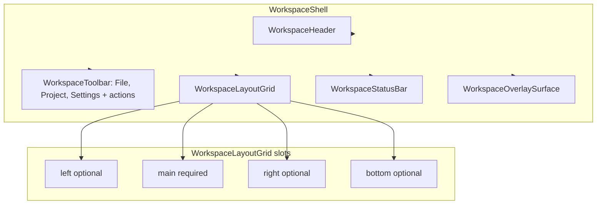

# App layer, declarative workspace, and settings

## Current state (review)

- **WorkspacePanels removed**: [ForgeWorkspace.tsx](components/workspaces/ForgeWorkspace.tsx) still imports `WorkspacePanels` and [workspace index](src/shared/components/workspace/index.ts) still exports it, but **WorkspacePanels.tsx no longer exists** in `panels/`. Build/runtime is broken until fixed.
- **Panels folder** still has: WorkspaceLeftPanel, WorkspaceMain, WorkspaceEditor, WorkspaceInspector, WorkspaceBottomPanel, WorkspaceSidebar, WorkspaceMain, WorkspaceTimeline. User intent: **no WorkspaceTimeline or WorkspaceCanvas as semantic concepts**; we need **layouts and components to build the layout effectively**, not prescribed “canvas”/“timeline” surfaces.
- **WorkspaceLayout**: Simple flex column in [WorkspaceLayout.tsx](src/shared/components/workspace/WorkspaceLayout.tsx). WorkspaceShell wraps children in WorkspaceLayout.
- **Toolbar**: [WorkspaceToolbar](src/shared/components/workspace/toolbar/WorkspaceToolbar.tsx) has Left/Center/Right slots and data-driven `groups`; no standard File / Project / Settings yet.
- **Settings**: No app/workspace/editor settings or inheritance today.

---

## 1. Declarative workspace layout (no WorkspacePanels)

**Goal**: Workspace author declares structure with layout primitives and fills regions with content. No single “WorkspacePanels” component; no semantic “WorkspaceCanvas” or “WorkspaceTimeline” — just layout regions (main, left, right, bottom) that domains fill as they need.

### 1.1 Layout primitive: WorkspaceLayoutGrid

- **New component** `src/shared/components/workspace/layout/WorkspaceLayoutGrid.tsx`.
- **Props**: `left?: ReactNode`, `main: ReactNode`, `right?: ReactNode`, `bottom?: ReactNode`, `className?`.
- **Behavior**: Renders a CSS grid. Columns: if left and right → `[280px 1fr 360px]`; if only left → `[280px 1fr]`; if only right → `[1fr 360px]`; else `1fr`. Rows: if bottom → `1fr auto` (bottom has max-height); else `1fr`. All regions get `min-h-0 overflow-hidden` (or equivalent) so they don’t blow the layout. Use same widths as current WorkspaceLeftPanel/WorkspaceInspector (280–360px).
- **No semantic names**: “main” is the primary content area (graph, timeline, document — domain chooses). “bottom” is a strip (timeline, logs, etc. — domain chooses). Left/right are side panels.

### 1.2 Keep as presentational region components

Keep these as **styled containers** for each region; author can wrap content in them or use raw divs:

- **WorkspaceLeftPanel** — left region chrome (border, scroll).
- **WorkspaceMain** — main region (flex-1 min-w-0 overflow-hidden).
- **WorkspaceInspector** — right region (selection-driven or arbitrary content).
- **WorkspaceBottomPanel** — bottom strip chrome.

WorkspaceLayoutGrid can render these internally when given content, e.g. `<WorkspaceLeftPanel>{left}</WorkspaceLeftPanel>` when `left` is provided, so the look stays consistent. Optional: allow passing raw nodes and wrap in panel chrome inside WorkspaceLayoutGrid, or require author to pass e.g. `<WorkspaceLeftPanel>...</WorkspaceLeftPanel>` — **recommend the latter** so composition is fully declarative and explicit.

### 1.3 Remove or deprecate

- **WorkspacePanels**: Already removed; delete from [index.ts](src/shared/components/workspace/index.ts) and from ForgeWorkspace.
- **WorkspaceCanvas**: Remove from shared (or keep as alias for “main area” only in docs). Do not export as a required surface.
- **WorkspaceTimeline**: Remove from shared; timeline is just content inside WorkspaceBottomPanel. Delete [WorkspaceTimeline.tsx](src/shared/components/workspace/panels/WorkspaceTimeline.tsx) or repurpose as a minimal “bottom strip” chrome only (no timeline semantics). Prefer: delete and use WorkspaceBottomPanel for any bottom content.
- **WorkspaceEditor**: Keep only if needed for copilot metadata (editorId, editorType). If so, use as an optional wrapper around main content; otherwise remove from required slot list.

### 1.4 ForgeWorkspace migration

- Replace `WorkspacePanels` usage with:

```tsx
<WorkspaceLayoutGrid
  main={canvasContent}   // GraphEditor or empty state
  right={inspectorContent}
  bottom={timelineContent}
/>
```

- Where `canvasContent` / `inspectorContent` / `timelineContent` are as today; wrap `canvasContent` in `WorkspaceMain` and `timelineContent` in `WorkspaceBottomPanel` **inside** ForgeWorkspace when passing to WorkspaceLayoutGrid, or have WorkspaceLayoutGrid wrap each slot in the corresponding panel component (design choice: explicit in Forge vs. internal in grid). **Recommend**: WorkspaceLayoutGrid wraps in LeftPanel/Main/Inspector/BottomPanel so Forge just passes content; one place for chrome.

### 1.5 Types and docs

- [types.ts](src/shared/components/workspace/types.ts): Remove “WorkspacePanels” from WorkspaceShellProps comment. WorkspaceSlotKey can keep left/canvas/inspector/bottom for documentation; “canvas” in docs = “main” in code.
- [README.md](src/shared/components/workspace/README.md) and [AGENTS.md](src/shared/components/workspace/AGENTS.md): Describe declarative composition: WorkspaceShell → Header, Toolbar, **WorkspaceLayoutGrid**(left?, main, right?, bottom?), StatusBar, OverlaySurface. No WorkspacePanels. No WorkspaceCanvas/WorkspaceTimeline; use WorkspaceMain and WorkspaceBottomPanel as content wrappers inside the grid slots.

---

## 2. Look and feel: Spotify / Photoshop / modern shadcn

- **All shadcn declarative**: Use only shadcn components (DropdownMenu, Select, Sheet, Card, etc.). No hand-rolled menus or dropdowns.
- **Design**: Clean, modern (Spotify/Photoshop-like): clear hierarchy, muted borders, consistent spacing, toolbar with clear primary/secondary actions.
- **Document** in [docs/design/styling-and-theming.md](docs/design/styling-and-theming.md) (or architecture): “Use shadcn only; Spotify/Photoshop-inspired clarity and density.”

---

## 3. Standard toolbar: File, Project select, Settings

**Goal**: Every workspace (and app toolbar if present) has a consistent structure: **File** (dropdown), **Project** (select/combobox), **Settings** (opens settings UI).

### 3.1 Shared toolbar primitives (shadcn-based)

- **File menu**: Component that renders a shadcn **DropdownMenu** with standard items: New, Open, Save, Save As, Export (and any domain-specific). Name: e.g. `WorkspaceToolbar.FileMenu` or a shared `FileMenu` in workspace controls. Props: `items?: Array<{ id, label, onClick?, disabled? }>`, `trigger?: ReactNode` (default: “File” button). So workspace or app provides the handlers.
- **Project select**: Component that renders current project/workspace document; **Select** or **Combobox** from shadcn. Name: `WorkspaceToolbar.ProjectSelect` or `ProjectSelect`. Props: `value`, `onValueChange`, `options: { value, label }[]`, `placeholder?`. Used in header or toolbar depending on design (often “Select project” in header; can be toolbar for consistency).
- **Settings trigger**: Button that opens the appropriate settings (app vs workspace vs editor). Name: `WorkspaceToolbar.Settings` or `SettingsTrigger`. Props: `scope: 'app' | 'workspace' | 'editor'`, optional `editorId`/`workspaceId` for context. On click: open AppSettingsPanel, WorkspaceSettingsPanel, or EditorSettingsPanel (e.g. in a Sheet).

Implement as compound components on WorkspaceToolbar (e.g. `WorkspaceToolbar.FileMenu`, `WorkspaceToolbar.ProjectSelect`, `WorkspaceToolbar.Settings`) so every workspace composes the same pattern. Use existing WorkspaceButton for triggers where needed (tooltip support).

### 3.2 Placement

- **Workspace**: Toolbar.Left (or start) = File + Project (if workspace-scoped project); Toolbar.Right (or end) = … actions … + Settings. Document in AGENTS: “Workspace toolbar must include File menu, Project select (when applicable), and Settings.”
- **App** (if we add app-level toolbar): Same pattern for app-wide File/Project/Settings.

---

## 4. Settings: app → workspace → editor (inheritance)

**Goal**: Settings at three levels for copilot and app behavior; workspace inherits app; editor inherits workspace. Used to configure copilot agents and editor/workspace preferences.

### 4.1 Model

- **App settings**: Global (e.g. default model, global copilot instructions, theme).
- **Workspace settings**: Per workspaceId; merge with app (workspace overrides only).
- **Editor settings**: Per editorId (and workspaceId); merge with workspace (editor overrides only).
- **Merge rule**: Key present at editor → use editor value; else workspace; else app. Defaults defined at app level.

### 4.2 Storage / context

- **Option A**: Single **SettingsContext** (or store) with:
  - `appSettings: Record<string, unknown>`
  - `workspaceSettings: Record<workspaceId, Record<string, unknown>>`
  - `editorSettings: Record<editorKey, Record<string, unknown>>`
  - `getMerged(scope: 'app' | 'workspace' | 'editor', scopeId?: string): Record<string, unknown>`
- **Option B**: Separate stores/slices (appSettingsStore, workspaceSettingsStore, editorSettingsStore) and a selector that merges. Prefer one place so merge and persistence are clear.
- **Persistence**: Later (localStorage or API). For now in-memory is enough; define the shape and merge API.

### 4.3 Settings components

- **AppSettingsPanel**: Renders app-level keys (form/sections). Can be used in a Sheet opened from app-level Settings trigger. Lives in `components/settings/` or `src/shared/components/settings/`.
- **WorkspaceSettingsPanel**: Renders workspace overrides; shows “inherited from app” for keys not overridden. Props: `workspaceId`. Opens from workspace toolbar Settings when scope is workspace.
- **EditorSettingsPanel**: Renders editor overrides; shows “inherited from workspace” for keys not overridden. Props: `workspaceId`, `editorId`. Opens from workspace toolbar Settings when scope is editor (e.g. “Editor settings” in dropdown).

All three should be **declarative** (sections/fields defined by config or props), so we can add keys for copilot (instructions, model overrides, etc.) without hardcoding in multiple places.

### 4.4 Copilot usage

- Document: “App/workspace/editor settings are the source for copilot agent configuration (instructions, model, etc.). Merged settings at current scope are read by the domain contract or CopilotKit when building context/instructions.”

---

## 5. App layer (from previous plan, kept)

- **App components**: AppLayout, AppTabGroup, AppTab, AppContent in `src/shared/components/app/` for the shell that contains workspace tabs and content.
- **AppShell** refactor: Use AppLayout → AppTabGroup → AppContent; entitlements for locking (e.g. Video workspace).
- **Docs**: unified-workspace.md (app layer, state-managed routing), styling-and-theming.md, AGENTS references.

---

## 6. Implementation order (cautious)

1. **Fix breakage**
  - Add `WorkspaceLayoutGrid` with left/main/right/bottom slots and internal use of WorkspaceLeftPanel, WorkspaceMain, WorkspaceInspector, WorkspaceBottomPanel.
  - ForgeWorkspace: remove WorkspacePanels import; use WorkspaceLayoutGrid with same content as today.
  - index.ts: remove WorkspacePanels export; remove WorkspaceCanvas, WorkspaceTimeline from exports (delete or deprecate the timeline/canvas files as decided).
  - Verify build and Forge workspace render.
2. **Declarative layout docs**
  - Update workspace README and AGENTS: declarative layout only; WorkspaceLayoutGrid; no WorkspacePanels/Canvas/Timeline. Update types.ts.
3. **Standard toolbar**
  - Add FileMenu, ProjectSelect, SettingsTrigger (or WorkspaceToolbar.*) using shadcn; document “File, Project, Settings” in AGENTS. Wire into ForgeWorkspace toolbar as first consumer.
4. **Settings**
  - Add settings store/context (merge app → workspace → editor); add AppSettingsPanel, WorkspaceSettingsPanel, EditorSettingsPanel (shells); wire Settings trigger to open the right panel (e.g. Sheet). Document inheritance and copilot use.
5. **App layer**
  - Add app components; refactor AppShell; entitlements; docs.
6. **Design doc**
  - Add or update styling-and-theming.md with Spotify/Photoshop/shadcn and “all declarative shadcn.”

---

## 7. Diagram (declarative workspace)




---

## 8. Cautions

- **Do not** re-introduce a single monolithic “Panels” component; keep layout declarative and explicit.
- **Do not** add WorkspaceCanvas or WorkspaceTimeline as semantic surfaces; main and bottom are generic regions.
- **Do not** hand-roll dropdowns or selects; use shadcn only.
- **Settings**: Start with a minimal key set and merge API; avoid over-engineering persistence before needed.
- **ForgeWorkspace**: After migration, ensure GraphEditor, inspector sections, and timeline (ForgeTimeline) still work when passed as content to WorkspaceLayoutGrid.

