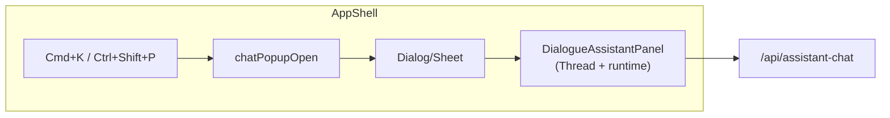

# Assistant UI chat in command popup

## Current state (where things live)

- **Assistant UI chat**: [packages/shared/src/shared/components/assistant-ui/thread.tsx](packages/shared/src/shared/components/assistant-ui/thread.tsx) (`Thread`) + runtime wiring in [apps/studio/components/editors/dialogue/DialogueAssistantPanel.tsx](apps/studio/components/editors/dialogue/DialogueAssistantPanel.tsx) (`AssistantChatTransport` → `/api/assistant-chat`, `useChatRuntime`, `AssistantRuntimeProvider`, `Thread`, `ToolUIRegistry`, `AssistantDevToolsBridge`). Same chat is used in Dialogue bottom drawer (DialogueDrawerContent → DialogueAssistantPanel) and in Strategy editor (CodebaseAgentStrategyEditor).
- **cmdk**: [packages/ui/src/components/ui/command.tsx](packages/ui/src/components/ui/command.tsx) exports `Command`, `CommandDialog` (Dialog + Command shell). Studio only uses `Command` inside [apps/studio/components/model-switcher/ModelSwitcher.tsx](apps/studio/components/model-switcher/ModelSwitcher.tsx) for model search. There is **no global command palette** yet; the plan in [.cursor/plans/single_settings_and_ide_menus.plan.md](.cursor/plans/single_settings_and_ide_menus.plan.md) mentions Help → "Show All Commands" (Ctrl+Shift+P) but it is not implemented.

## Goal

- One global shortcut (e.g. **Cmd+K** or **Ctrl+Shift+P**) opens a **popup that shows the assistant UI chat** so the user can work there from any editor.
- Reuse the existing assistant UI stack; no new API or duplicate runtime logic.

## Recommended approach

**Single popup = chat.** Keep the UX simple: the launcher opens one surface that is the chat (no extra “command list” step unless you want it later).

1. **Trigger**
  - Register a global shortcut (e.g. `Mod+k` / `Ctrl+Shift+p`) in the app shell to open the chat popup.  
  - Optional: wire Help → “Show All Commands” (when EditorHelpMenu exists) to the same open action.
2. **Popup surface**
  - Use a **Dialog** (or **Sheet**) at AppShell level so it’s available in every editor.  
  - Content = the same assistant chat as in Dialogue: **DialogueAssistantPanel** (or an equivalent wrapper that renders `AssistantRuntimeProvider` + `Thread` + `ToolUIRegistry` + `AssistantDevToolsBridge` with `apiUrl="/api/assistant-chat"`).  
  - No new API: continue using `POST /api/assistant-chat`; no raw `fetch` in components (per root AGENTS.md).
3. **State**
  - Hold “chat popup open” in React state at AppShell (or a tiny context), toggled by the shortcut and by closing the dialog/sheet. No need to put this in the app-shell Zustand store unless you later want persistence or cross-component access beyond the launcher.
4. **Layout and styling**
  - Give the dialog/sheet a fixed min/max height (e.g. `min-h-[320px] max-h-[85vh]`) and let the inner `Thread` flex so the composer stays visible.  
  - Use existing tokens (`--panel-padding`, `--control-*`) and follow [styling-and-ui-consistency](docs/agent-artifacts/core/styling-and-ui-consistency.md).  
  - Avoid ad-hoc `px-*`/`py-*` in the new chrome.
5. **Optional: command list first**
  - If you prefer “cmdk popup = command list, then choose Chat”: use **CommandDialog** with `CommandInput` + `CommandList` and a single item “Open Assistant Chat” that sets state to “show chat” and swaps dialog content to `DialogueAssistantPanel` (or the same wrapper). Provide a back/close control to return to the list or close.  
  - Same runtime/API; only the UI flow (list → chat) changes.

## Key files to add or touch

| Purpose                              | Location / file                                                                                                                                                                                                                                      |
| ------------------------------------ | ---------------------------------------------------------------------------------------------------------------------------------------------------------------------------------------------------------------------------------------------------- |
| Chat popup launcher state + shortcut | [apps/studio/components/AppShell.tsx](apps/studio/components/AppShell.tsx) (or a small wrapper/hook used by AppShell)                                                                                                                                |
| Dialog/Sheet that contains the chat  | New component under e.g. `apps/studio/components/command-palette/` or `apps/studio/components/assistant/` — e.g. `AssistantChatPopup.tsx` that renders a Dialog (or Sheet) and uses `DialogueAssistantPanel` (or inlines the same provider + Thread) |
| Keyboard shortcut                    | `useEffect` + `keydown` in AppShell or in a provider that mounts once (e.g. listen for `Mod+k` / `Ctrl+Shift+p`)                                                                                                                                     |
| Optional: Help menu “Show Commands”  | When EditorHelpMenu exists (see [.cursor/plans/single_settings_and_ide_menus.plan.md](.cursor/plans/single_settings_and_ide_menus.plan.md)), add an item that opens the same chat popup                                                              |

**Reuse:**  

- [DialogueAssistantPanel](apps/studio/components/editors/dialogue/DialogueAssistantPanel.tsx) already has the correct runtime + Thread + tools + devtools. The new popup can render `<DialogueAssistantPanel className="..." />` inside the dialog/sheet.  
- If you want the popup to be independent of “Dialogue” naming, introduce a thin wrapper in Studio (e.g. `AssistantChatPanel`) that accepts `apiUrl` and `className` and renders the same runtime + Thread + ToolUIRegistry + AssistantDevToolsBridge, and use that in both Dialogue drawer and the popup.

## Codebase agent strategy

- **Before:** Read [STATUS](docs/agent-artifacts/core/STATUS.md), [packages/shared AGENTS.md](packages/shared/src/shared/AGENTS.md), and [errors-and-attempts](docs/agent-artifacts/core/errors-and-attempts.md) if touching shared or retrying a pattern.  
- **After:** Update STATUS (Ralph Wiggum Done), any affected AGENTS/README, and errors-and-attempts if you fix a specific bug.  
- **Styling:** Follow [styling-and-ui-consistency](docs/agent-artifacts/core/styling-and-ui-consistency.md); no screenshot automation.  
- **Scope:** All edits in repo (apps/studio, packages as needed, docs); no changes under `.tmp/`.  
- **API:** Use existing `/api/assistant-chat`; extend API client only if needed; no raw `fetch` in UI.

## Implementation order (slices)

1. **Slice 1 – Popup + chat content**
  Add `AssistantChatPopup` (or similar) component: Dialog or Sheet that renders `DialogueAssistantPanel` (or shared wrapper) with appropriate height/constraints and tokens. Render it from AppShell; add local state `chatPopupOpen` and a close handler. No shortcut yet.
2. **Slice 2 – Global shortcut**
  In AppShell (or a dedicated hook), register `Mod+k` (and optionally `Ctrl+Shift+p`) to set `chatPopupOpen` to true. Ensure shortcut does not fire when an input/textarea is focused if that’s desired (optional).
3. **Slice 3 – Optional command list**
  If you want “command palette then chat”: replace the simple dialog with CommandDialog; show CommandInput + CommandList with “Open Assistant Chat”; on select, switch content to the same chat panel and add back/close to return.
4. **Slice 4 – Docs and STATUS**
  Update STATUS (Ralph Wiggum), editor or dev-kit README if the launcher is part of the standard menu/shortcuts, and errors-and-attempts if any fix is recorded.

## Optional diagram (flow)

## Summary

- **Where the chat lives:** Same as today — `Thread` + runtime in shared; Studio uses it in `DialogueAssistantPanel` and (after this) in a global popup.
- **What you’re adding:** A global shortcut and a Dialog/Sheet at AppShell that renders the existing assistant UI chat so users can “launch and work there” from anywhere, following the codebase agent strategy and reusing `/api/assistant-chat` and current runtime wiring.

