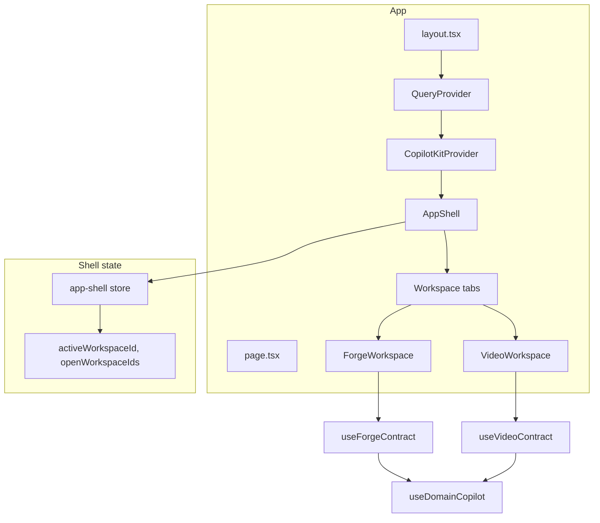

# App/Workspace and CopilotKit Architecture + Feature Roadmap

## 1. Architecture breakdown

### 1.1 App and workspace hierarchy




- **Single Next.js app** ([apps/studio](apps/studio)): one layout, one CopilotKit provider, one App Shell.
- **App Shell** ([apps/studio/components/AppShell.tsx](apps/studio/components/AppShell.tsx)): owns workspace tabs and active workspace; only the active workspace is mounted.
- **Workspaces**: Forge (primary, graph editor) and Video (showcase, timeline). Each uses [WorkspaceShell](packages/shared/src/shared/components/workspace) from shared and implements a **domain contract** (context + actions + suggestions + highlights).
- **No URL for workspace**: route is in-memory (Zustand) and persisted to localStorage (`forge:app-shell:v1`).

### 1.2 CopilotKit flow (client → runtime → model)

```mermaid
sequenceDiagram
  participant User
  participant Sidebar as CopilotSidebar
  participant CopilotKit as CopilotKit client
  participant API as POST /api/copilotkit
  participant Runtime as CopilotRuntime
  participant OpenRouter as OpenRouter

  User->>Sidebar: Message / suggestion
  Sidebar->>CopilotKit: Chat + context + actions
  CopilotKit->>API: Request (headers: workspace, model, tools)
  API->>Runtime: handleRequest
  Runtime->>OpenRouter: LLM call (with tools)
  OpenRouter-->>Runtime: Response / tool calls
  Runtime->>CopilotKit: Stream + tool invocations
  CopilotKit->>Sidebar: Render message; run action handlers
  Note over CopilotKit: Actions run in client; results sent back to agent
```


- **Provider** ([apps/studio/components/providers/CopilotKitProvider.tsx](apps/studio/components/providers/CopilotKitProvider.tsx)): `CopilotKit` + `CopilotSidebar`; `runtimeUrl="/api/copilotkit"`; headers include `x-forge-workspace-id`, `x-forge-editor-id`, `x-forge-model`, `x-forge-tools-enabled`; instructions come from settings + domain.
- **Runtime** ([apps/studio/app/api/copilotkit/route.ts](apps/studio/app/api/copilotkit/route.ts)): one **BuiltInAgent** (OpenRouter model); model resolved per request via model router or `x-forge-model` override; 429/5xx trigger auto-switch cooldown.
- **Single agent today**: no co-agents or multi-agent in use; one “default” agent handles all tool calls.

### 1.3 Context (what the agent sees)


| Layer      | Where registered                                                                                  | Content                                                                                                                                                                   |
| ---------- | ------------------------------------------------------------------------------------------------- | ------------------------------------------------------------------------------------------------------------------------------------------------------------------------- |
| **Shell**  | [AppShell.tsx](apps/studio/components/AppShell.tsx)                                               | `useCopilotReadable`: `activeWorkspaceId`, `openWorkspaceIds`, `WORKSPACE_LABELS`, `editorSummary` (Forge/Video).                                                         |
| **Domain** | [use-domain-copilot-context.ts](packages/shared/src/shared/copilot/use-domain-copilot-context.ts) | `contract.getContextSnapshot()` → `useCopilotReadable`. Snapshot shape: `domain`, `workspaceId`, `selection`, `selectionSummary`, `domainState` (e.g. node count, dirty). |


- Forge context: [buildForgeContext](packages/domain-forge/src/copilot/context.ts) (graph summary, selection, isDirty).
- Video context: [buildVideoContext](apps/studio/lib/domains/video/copilot/context.ts) (doc summary, tracks, selection).
- **Additional instructions**: `useCopilotAdditionalInstructions` with `contract.getInstructions()` (domain-specific prompt: node types, action names, when to call getGraph).

### 1.4 Actions (what the agent can do)


| Layer      | Where                                                                                             | Actions                                                                               |
| ---------- | ------------------------------------------------------------------------------------------------- | ------------------------------------------------------------------------------------- |
| **Shell**  | AppShell                                                                                          | `switchWorkspace`, `openWorkspace`, `closeWorkspace` (no prefix).                     |
| **Domain** | [use-domain-copilot-actions.ts](packages/shared/src/shared/copilot/use-domain-copilot-actions.ts) | All actions from `contract.createActions()`; each registered with `useCopilotAction`. |


- **Forge** ([packages/domain-forge/src/copilot/actions.ts](packages/domain-forge/src/copilot/actions.ts)): `forge_createNode`, `forge_updateNode`, `forge_deleteNode`, `forge_createEdge`, `forge_getGraph`, `forge_openCreateNodeModal`, `forge_revealSelection`. Handlers call `applyOperations` (Zustand draft); optional `render` for generative UI in chat (e.g. [generative-ui.tsx](packages/domain-forge/src/copilot/generative-ui.tsx)).
- **Video** ([apps/studio/lib/domains/video/copilot/actions.ts](apps/studio/lib/domains/video/copilot/actions.ts)): `video_*` (addTrack, addElement, setSceneOverride, etc.); same pattern: handler → `applyOperations` → optional `onAIHighlight`.

Constraint: **same number of actions every render**; use `available: 'disabled'` for contextually inactive ones. Actions are **immediate**: agent calls tool → handler runs in client → draft updates; no “plan” step or “commit” step.

### 1.5 Highlights (what the AI changed)

- **Contract**: [types.ts](packages/shared/src/shared/copilot/types.ts) requires `onAIHighlight(payload)`, `clearAIHighlights()`.
- **Hook**: [use-ai-highlight.ts](packages/shared/src/shared/copilot/use-ai-highlight.ts): `highlights` state (entityType → ids), `onAIHighlight` (merge + auto-clear after ~5s), `isHighlighted(entityType, id)`.
- **Wiring**: Forge/Video action handlers call `onAIHighlight({ entities: { 'forge.node': [id] } })`; [GraphEditor](apps/studio/components/GraphEditor.tsx) uses `isHighlighted` to add ring/edge classes. No “review” step: highlights are transient feedback only.

### 1.6 Suggestions and entitlements

- **Suggestions**: `contract.getSuggestions()` → [use-domain-copilot-suggestions.ts](packages/shared/src/shared/copilot/use-domain-copilot-suggestions.ts) → `useCopilotChatSuggestions` (chips in chat).
- **Tools on/off**: `toolsEnabled` = settings + [entitlements](apps/studio/lib/entitlements/store.ts) (e.g. `CAPABILITIES.STUDIO_AI_TOOLS`). When disabled, all domain actions are registered with `available: 'disabled'`.

---

## 2. What exists vs what is missing


| Capability                             | Status                   | Notes                                                                                                    |
| -------------------------------------- | ------------------------ | -------------------------------------------------------------------------------------------------------- |
| Shell context + actions                | Done                     | Workspace switch/open/close.                                                                             |
| Domain context + actions + suggestions | Done                     | Forge and Video contracts; prefix `forge_` / `video_`.                                                   |
| AI highlights                          | Done                     | Transient highlight after action; no “review” UI.                                                        |
| Generative UI in chat                  | Done                     | Optional `render` on actions (e.g. ConfirmationCard, “Created node”).                                    |
| Image generation in chat               | **Missing**              | No action or tool for image gen; no image model in registry; no chat UI for displaying generated images. |
| Structured output                      | **Missing**              | No schema/JSON-mode for agent responses; no dedicated “extract” or “format” flow.                        |
| Plan → execute                         | **Missing**              | Agent calls actions directly; no “plan” step that produces a list then “execute” step.                   |
| Review with highlights                 | **Partial**              | Highlights show what changed; no explicit “review” step or “revert/accept” per change.                   |
| Commit (persist draft)                 | **Partial**              | User clicks Save (or shortcut); no “commit if I like it” flow tied to AI or review.                      |
| Co-agents / multi-agent                | **Documented, not used** | [co-agents-and-multi-agent.md](docs/co-agents-and-multi-agent.md); no `useCoAgent`/`useAgent` in app.    |
| Vision / image input                   | **Missing**              | Model registry has no `supportsVision`; no image upload in chat.                                         |


---

## 3. How everything should work (target behavior)

- **Context**: Agent always sees current workspace, selection, and domain state so it can reason and choose actions.
- **Actions**: All edits go through domain actions; actions update **draft** (Zustand); no direct DB writes from the agent.
- **Highlights**: After an action, affected entities are highlighted for a short time so the user sees what changed.
- **Save**: User (or a future “commit” action) persists draft to server (e.g. PATCH graph/video-doc); TanStack Query invalidates cache.
- **Plan–execute–review–commit (desired)**:
  - **Plan**: User asks for a change; agent (or a dedicated planning agent) produces a **plan** (list of steps or patch ops) without applying them.
  - **Execute**: User or agent runs “execute plan”; actions run (or a batch action applies the plan); highlights show what changed.
  - **Review**: User sees highlights and can **revert** (undo draft) or **accept** (keep).
  - **Commit**: User (or “commit” action) saves draft to server.
- **Image generation**: User asks for an image in chat; agent calls an action (e.g. `generateImage(prompt)`) → backend calls image API → image URL or blob returned → action `render` (or chat) displays it in the thread.
- **Structured output**: For “extract” or “fill form” flows, agent response should conform to a JSON schema (e.g. via OpenRouter/structured output or a dedicated tool that returns JSON); UI can then bind to that structure.

---

## 4. Roadmap (prioritized, implementable slices)

### 4.1 Document current behavior and gaps (docs)

- Add **docs/architecture/copilotkit-and-agents.md**: one place that describes the flow in §1, the contract (context, actions, suggestions, highlights), and the single-agent + OpenRouter runtime.
- In **docs/ai-workspace-integration.md** (or the new doc): add a “Missing / roadmap” section pointing to image gen, structured output, plan–execute–review–commit.

### 4.2 Image generation in chat

- **Backend**: New API route (e.g. `POST /api/image-generate`) that calls an image provider (OpenRouter image model, or Replicate/Stability, etc.); return URL or base64.
- **Model registry**: Extend [ModelDef](apps/studio/lib/model-router/types.ts) with optional `supportsImages: boolean` (or separate image-model list) and document which model is used for image gen.
- **Action**: New CopilotKit action, e.g. `generateImage` (prompt, optional size/style). Handler calls `/api/image-generate`, then returns image URL/data.
- **Chat UI**: Use action `render` to display the image in the thread (or rely on CopilotKit’s handling of image content in messages if the runtime returns image parts). Ensure sidebar can show inline images.
- **Entitlements**: Gate behind a capability (e.g. `IMAGE_GENERATION`) if needed.

### 4.3 Structured output

- **Use cases**: Extract data from user message (e.g. “list of characters”), fill a structured object (e.g. scene overrides), or “reply in JSON with schema X”.
- **Options**: (A) OpenRouter / provider structured output (response_format) if supported; (B) dedicated “structured” tool: agent calls `respondWithStructure(schema, prompt)` and the backend does an LLM call with JSON schema, returns parsed JSON; (C) instructions + parsing: agent responds in a markdown code block and client parses. Prefer (A) or (B) for reliability.
- **Contract**: Add an optional “structured response” action or a separate flow (e.g. “extract characters”) that returns typed JSON; UI or other actions can consume it.

### 4.4 Plan → execute → review → commit

- **Plan step**: Introduce a “planning” action, e.g. `createPlan(goal)` that does **not** mutate the draft. Handler calls LLM (or the same agent with a tool that returns a plan description + list of operations). Return plan as structured data (e.g. list of { action, args }) and show it in chat (generative UI).
- **Execute step**: New action `executePlan(planId)` or `executeSteps(steps)`: run the planned actions in order (same as current action handlers); after each, call `onAIHighlight`. Optionally batch in one “transaction” so a single “revert” can undo the whole batch.
- **Review**: Keep current highlights; add optional “Review” panel or chat block that lists “Pending changes (from last execute)” with **Revert** (reset draft to last saved/server state) and **Accept** (keep draft, clear “pending” state). Revert can call a new store method “reset to server state” (e.g. refetch graph by id and setGraph).
- **Commit**: Already exists (Save button / `useSaveGraph` mutation). In “review” flow, “Accept” then “Save” = commit. Optionally add a CopilotKit action `commit` that triggers save and then clears pending state.

Organization:

- **Plan/execute state**: New small store or slice (e.g. `planStore`: currentPlanId, steps, status, executedStepIds). Or keep plan as ephemeral in chat and “execute” just runs the steps without persisting the plan in app state (simpler).
- **Review state**: Either extend draft (e.g. “lastExecutedPlanId” + “pendingHighlights”) or a separate `reviewStore` (pendingRevert, list of affected ids). Prefer minimal: “pending” = “draft is dirty and last change came from execute plan”; Revert = load from server, Accept = clear “pending” flag.

### 4.5 Stay organized: conventions

- **One contract per domain**: Keep using `DomainCopilotContract`; all context/actions/suggestions/highlights go through it. New capabilities (image, structured, plan) can be **cross-cutting** (new actions in shell or a shared “tools” contract) or domain-specific (e.g. `forge_createPlan`).
- **Actions naming**: Keep `domain_actionName` for domain actions; use a neutral prefix for app-level (e.g. `app_generateImage`, `app_respondWithStructure`) so they don’t collide with Forge/Video.
- **New features as slices**: Each roadmap item = one slice: docs → backend (if any) → action + handler → UI (render/panel) → entitlements/gates. Update [docs/STATUS.md](docs/STATUS.md) and [docs/ai-workspace-integration.md](docs/ai-workspace-integration.md) (or the new architecture doc) per slice.
- **Highlights**: Keep the same `AIHighlightPayload` and `useAIHighlight`; “review” only adds UI that uses existing highlight state plus “pending” flag and Revert/Accept.

---

## 5. Summary

- **Architecture**: Single app, App Shell, workspace-scoped domain contracts (Forge, Video). CopilotKit: one provider, one runtime agent (OpenRouter), context from shell + domain, actions from shell + `contract.createActions()`, suggestions and highlights wired per contract.
- **Missing**: Image generation, structured output, explicit plan→execute, review (revert/accept), and commit tied to that flow. Co-agents are documented but unused.
- **Roadmap**: (1) Document architecture and gaps; (2) Image gen: API + action + chat display; (3) Structured output: schema-based tool or response format; (4) Plan–execute–review–commit: planning action, execute action, review UI with revert/accept, then existing Save as commit.
- **Organization**: One contract per domain; app-level actions with a clear prefix; implement in small slices and keep docs/STATUS and architecture docs updated.

