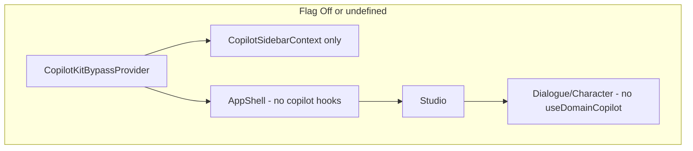

# CopilotKit Feature Flag Plan (PostHog)

## Goal
Get past the "Agent 'default' not found" and 401 errors by feature-flagging CopilotKit off via PostHog. Use Assistant UI only for now. Flag allows re-enabling when migration or fixes are ready.

## Approach

Use PostHog feature flag `copilotkit-enabled`. When disabled (flag off or not yet loaded):
- No CopilotKit provider or runtime (no network calls)
- Bypass provider supplies `CopilotSidebarContext` only
- All CopilotKit hooks are guarded so they never run when disabled

**PostHog integration**: Studio already initializes PostHog in `instrumentation-client.ts`. Per PostHog Next.js docs, `useFeatureFlagEnabled` from `posthog-js/react` works **without** PostHogProvider when init is via instrumentation. No provider changes needed.

**Flag semantics**: Treat `undefined`/`false` as disabled (default) to avoid CopilotKit sync on initial load before flags load.

## Architecture (when flag off)

## Implementation

### 1. Feature flag constant and hook
- In [apps/studio/lib/feature-flags.ts](apps/studio/lib/feature-flags.ts):
  - Add flag key constant: `COPILOTKIT_FLAG_KEY = 'copilotkit-enabled'`
  - Export `useCopilotKitEnabled()`: wraps `useFeatureFlagEnabled(COPILOTKIT_FLAG_KEY)` from `posthog-js/react`; returns `true` only when explicitly enabled, else `false` (treat `undefined` as disabled to avoid CopilotKit load before flags ready)
- Create PostHog flag `copilotkit-enabled` in PostHog dashboard (boolean, default off)

### 2. CopilotKitBypassProvider
- Create [apps/studio/components/providers/CopilotKitBypassProvider.tsx](apps/studio/components/providers/CopilotKitBypassProvider.tsx)
- Provides `CopilotSidebarContext` with `{ isOpen: false, setIsOpen: () => {} }`
- Renders `children` only (no CopilotKit, no CopilotSidebar)
- No `CopilotKitEnabledContext` needed—components use `useCopilotKitEnabled()` from feature-flags.ts directly

### 3. CopilotKitProvider
- No changes to provider internals
- CopilotKitProvider is only mounted when flag is on (see AppProviders)

### 4. AppProviders conditional
- In [apps/studio/components/AppProviders.tsx](apps/studio/components/AppProviders.tsx):
  - Use `useCopilotKitEnabled()` inside AppProviders (client component)
  - When `!copilotEnabled`: render `CopilotKitBypassProvider` instead of `CopilotKitProvider`
  - When `copilotEnabled`: render `CopilotKitProvider` (unchanged)
- **Note**: `useCopilotKitEnabled()` may be `false` initially (before PostHog loads). That is correct—we want bypass until flag is known. Optional: add brief loading state if flicker is unacceptable; for "get past error" goal, default disabled is fine.

### 5. AppShell Copilot registrations
- In [apps/studio/components/AppShell.tsx](apps/studio/components/AppShell.tsx):
  - Extract `useCopilotReadable`, `useCopilotAction` calls into `AppShellCopilotRegistrations` (renders `null`)
  - Render only when `useCopilotKitEnabled()`: `{copilotEnabled && <AppShellCopilotRegistrations />}`

### 6. Editor domain copilot registration
- Create [packages/shared/src/shared/copilot/DomainCopilotRegistration.tsx](packages/shared/src/shared/copilot/DomainCopilotRegistration.tsx):
  - `DomainCopilotRegistration({ contract, toolsEnabled })` calls `useDomainCopilot` and returns `null`
- In [apps/studio/components/editors/DialogueEditor.tsx](apps/studio/components/editors/DialogueEditor.tsx):
  - Replace `useDomainCopilot(...)` with `{copilotEnabled && <DomainCopilotRegistration contract={forgeContract} toolsEnabled={toolsEnabled} />}`
- In [apps/studio/components/editors/CharacterEditor.tsx](apps/studio/components/editors/CharacterEditor.tsx):
  - Same pattern
- Both use `useCopilotKitEnabled()` from `@/lib/feature-flags` (Studio import)

### 7. CopilotKit devtools tab
- In [apps/studio/components/editors/dialogue/DialogueDrawerContent.tsx](apps/studio/components/editors/dialogue/DialogueDrawerContent.tsx):
  - When `!copilotEnabled`, hide the "CopilotKit" tab (filter from tabs array)

### 8. Doc updates
- [docs/agent-artifacts/core/STATUS.md](docs/agent-artifacts/core/STATUS.md): note CopilotKit behind PostHog flag `copilotkit-enabled`; Assistant UI primary
- [docs/agent-artifacts/core/errors-and-attempts.md](docs/agent-artifacts/core/errors-and-attempts.md): add "CopilotKit feature flag" entry—cause (401, agent sync), fix (PostHog `copilotkit-enabled` off; Assistant UI primary until migration)
- [docs/agent-artifacts/core/decisions.md](docs/agent-artifacts/core/decisions.md): reference CopilotKit flag in Analytics and feature flags section

## Files to create
- `apps/studio/components/providers/CopilotKitBypassProvider.tsx`
- `packages/shared/src/shared/copilot/DomainCopilotRegistration.tsx`

## Files to modify
- `apps/studio/lib/feature-flags.ts` (add `COPILOTKIT_FLAG_KEY`, `useCopilotKitEnabled`)
- `apps/studio/components/AppProviders.tsx`
- `apps/studio/components/AppShell.tsx`
- `apps/studio/components/providers/CopilotKitProvider.tsx` (no logic change; conditional in AppProviders)
- `apps/studio/components/editors/DialogueEditor.tsx`
- `apps/studio/components/editors/CharacterEditor.tsx`
- `apps/studio/components/editors/dialogue/DialogueDrawerContent.tsx`
- `docs/agent-artifacts/core/STATUS.md`
- `docs/agent-artifacts/core/errors-and-attempts.md`
- `docs/agent-artifacts/core/decisions.md`

## PostHog setup (manual)
- Create boolean feature flag `copilotkit-enabled` in PostHog project
- Leave default **off** so app loads without CopilotKit until you explicitly enable

## Dependency order
1. feature-flags.ts (flag key + useCopilotKitEnabled)
2. CopilotKitBypassProvider
3. AppProviders conditional
4. AppShell extraction + conditional
5. DomainCopilotRegistration + editor changes
6. DialogueDrawerContent tab hide
7. Docs
