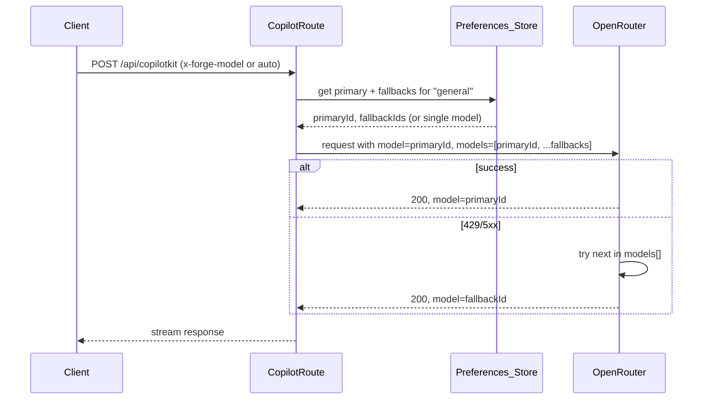

# Docs review + OpenRouter model strategy (remove custom auto-switch, fallbacks, per-use selection)

---

## Part 1: Documentation review

### Two doc audiences and where they live

| Audience                  | Location                                                                                                       | How displayed                                                                                                                                                                                           |
| ------------------------- | -------------------------------------------------------------------------------------------------------------- | ------------------------------------------------------------------------------------------------------------------------------------------------------------------------------------------------------- |
| **Contributors / in-app** | `docs/` (root), `docs/how-to/`, `docs/architecture/`, `docs/design/`, `docs/roadmap/`, `docs/agent-artifacts/` | Studio app at `/docs` via fumadocs-style source (`.source`); [docs-config.ts](apps/studio/app/docs/docs-config.ts) defines sidebar slugs.                                                               |
| **Consumers (marketing)** | `apps/marketing/content/docs/`                                                                                 | Marketing site at `/docs` (Overview, Getting started, **Features**, Pricing); [docs-config.ts](apps/marketing/content/docs/docs-config.ts) lists slugs; simple MD rendering (no MDX in marketing docs). |

### What features.md is for

**features.md** is the **consumer-facing Features page** on the **marketing** site (`/docs/features`). It answers “What can I do with Forge?” for signups and evaluators: unified workspace, AI in context, type-safe persistence, billing, and upcoming Codebase Strategy. It should stay focused on benefits and capabilities, not implementation. Overlap with the landing page “Features” section is intentional (same themes); avoid duplicating **in-app** or **contributor** docs (those live under root `docs/`).

### Issues and gaps found

- **Duplicate / outdated STATUS:** [docs/STATUS.md](docs/STATUS.md) exists alongside [docs/agent-artifacts/core/STATUS.md](docs/agent-artifacts/core/STATUS.md). The former says “Single app… There is no platform/marketing app” and links to `agent-artifacts.md` (wrong). The canonical living STATUS is `docs/agent-artifacts/core/STATUS.md`. **Recommendation:** Remove or deprecate `docs/STATUS.md` and point any links to `docs/agent-artifacts/core/STATUS.md` (and 18-agent-artifacts-index).
- **Broken link in docs/STATUS.md:** “See [Agent artifacts index](agent-artifacts.md)” — that path is wrong; should be [18-agent-artifacts-index.mdx](docs/18-agent-artifacts-index.mdx).
- **In-app docs sidebar:** [DOC_ENTRIES](apps/studio/app/docs/docs-config.ts) does not include the new roadmap, architecture/00-index, or design/00-index as top-level sidebar items; they are reachable via [00-docs-index.mdx](docs/00-docs-index.mdx) links. If you want roadmap/architecture/design in the sidebar, add their slugs to DOC_ENTRIES (or document that “Start here” is the main entry and indexes are linked from there).
- **Model routing not documented for consumers:** Marketing docs do not mention how model selection or OpenRouter works. Optional: one short “AI and models” subsection under features or getting-started (e.g. “We use OpenRouter; you can pick a model or use automatic switching with fallbacks”). Defer until after Part 2 is implemented so the copy matches behavior.
- **Architecture doc (03) still describes custom auto-switch:** [docs/architecture/03-copilotkit-and-agents.mdx](docs/architecture/03-copilotkit-and-agents.mdx) Section 7 says “429/5xx trigger auto-switch cooldown.” After Part 2, update to “OpenRouter model fallbacks and optional app-level preferences (general/image/video/audio).”

### Summary of doc actions (Part 1)

1. Resolve duplicate STATUS: deprecate or remove [docs/STATUS.md](docs/STATUS.md); fix any references to point to [docs/agent-artifacts/core/STATUS.md](docs/agent-artifacts/core/STATUS.md) and [18-agent-artifacts-index.mdx](docs/18-agent-artifacts-index.mdx).
2. Clarify in repo (e.g. in [00-docs-index.mdx](docs/00-docs-index.mdx) or a short README in `docs/`) that root `docs/` is for contributors and in-app docs; marketing `content/docs/` is for consumer-facing docs.
3. After Part 2: Update [03-copilotkit-and-agents.mdx](docs/architecture/03-copilotkit-and-agents.mdx) (and any how-to that mentions model routing) to describe OpenRouter fallbacks and per-use model selection instead of custom cooldown/auto-switch.

---

## Part 2: Model routing — remove custom auto-switch, use OpenRouter fallbacks, per-use selection

### Current behavior (to remove or replace)

- **Custom auto-switcher:** [apps/studio/lib/model-router/auto-switch.ts](apps/studio/lib/model-router/auto-switch.ts) implements cooldown + exponential backoff; [server-state.ts](apps/studio/lib/model-router/server-state.ts) uses it in `resolveModel()`. CopilotKit route calls `resolveModel()`, builds runtime with **one** model ID, then on 429/5xx calls `reportModelError`/`reportModelSuccess` so the **next** request may pick a different model. There is no in-request retry or fallback.
- **Registry in use:** [apps/studio/lib/model-router/registry.ts](apps/studio/lib/model-router/registry.ts) (and [root lib/model-router/registry.ts](lib/model-router/registry.ts) — duplicate) defines `FULL_MODEL_REGISTRY` / `FREE_MODEL_REGISTRY` and `MODEL_REGISTRY`. Studio uses it for: store default state, model-settings API, ModelSwitcher UI, CopilotKit route (`getModelDef`), forge/plan and structured-output (`resolveModel`). So the **full** and **free** registries are in use for UI and server resolution; the “not seeing full model registry” may mean FREE_ONLY is true so only free models appear, or the UI only shows a subset.
- **Image/video/audio:** Image uses env `OPENROUTER_IMAGE_MODEL` (or default) in [image-generate route](apps/studio/app/api/image-generate/route.ts). Video and audio do not have dedicated model settings yet (video hook shows “not yet available”; audio is ElevenLabs, not OpenRouter).

### Desired behavior

- **No custom auto-switcher:** Remove cooldown/health logic and `autoSelectModel`; stop calling `reportModelError`/`reportModelSuccess` for request-level switching.
- **OpenRouter model fallbacks:** Use OpenRouter’s [model fallbacks](https://openrouter.ai/docs/guides/routing/model-fallbacks): send a **primary model** plus a **list of fallback model IDs** so OpenRouter retries with the next model on error (rate limit, 5xx, etc.) within the same request. Pricing is based on the model actually used (returned in response).
- **Static settings + user choice:** Keep a small, **static** set of options (and/or env) for “which models we allow” and “default order for fallbacks,” without maintaining a full custom catalog. Allow users to:
  - **General (chat/copilot):** Choose a specific model or “auto” (and optionally “free-only”).
  - **Image / Video / Audio (when supported):** Choose a specific model per modality if the backend supports it; otherwise use a single default + fallbacks.
- **Auto and “auto free”:** “Auto” = use a configured ordered list (primary + fallbacks). “Auto free” = same but restrict list to free-tier models (from env or a small static list).
- **Use OpenRouter SDK more:** Prefer [OpenRouter SDK](https://openrouter.ai/docs) (e.g. `@openrouter/ai-sdk-provider` or their REST with `models: [id1, id2, ...]`) where it simplifies fallbacks and future features. Today we use `createOpenAI` from `@ai-sdk/openai` with baseURL + apiKey; fallbacks require passing `models` array (e.g. via `extra_body` or the SDK). Adopting the SDK is optional but aligns with “utilize OpenRouter SDK more.”

### High-level flow (after change)

### Implementation outline

1. **Fallbacks in CopilotKit route**
  - In [apps/studio/app/api/copilotkit/route.ts](apps/studio/app/api/copilotkit/route.ts): Instead of `resolveModel()` returning one ID and then calling reportModelError/Success:
    - Resolve “primary” and “fallback” list from preferences (see below). Build `models: [primary, ...fallbacks]`.
    - When using OpenAI-compatible client: pass `models` in the request body (OpenRouter accepts this). With `@ai-sdk/openai`, this may require `extra_body: { models: [...] }` or similar (see [OpenRouter model fallbacks](https://openrouter.ai/docs/guides/routing/model-fallbacks)). If we switch to OpenRouter SDK, use its API for chat completions with `models` array.
  - Remove all calls to `reportModelError` and `reportModelSuccess` from the CopilotKit route. Remove any health/cooldown from the response or client.
2. **Preferences / static config (replace current “registry + health”)**
  - **Keep:** User choice of “manual” (one model) vs “auto” (primary + fallbacks). Persist in existing model-settings API/store (or equivalent).
  - **Replace:** Remove `auto-switch.ts`, `createHealth`, `recordError`, `recordSuccess`, `autoSelectModel`, and server-state health map and cooldown. Remove `getHealthSnapshot` (and health from model-settings response) or replace with a simple “last used model” from response if desired.
  - **Static list:** Define a small ordered list of model IDs for “default fallback chain” (e.g. in env or a tiny config module). Optionally separate “free-only” default chain. User’s “enabled” list can filter this or define a custom order; “auto” = use default chain (or user-ordered list), “manual” = single model (no fallbacks if you want, or one-element `models`).
  - **Per-use (general / image / video / audio):** Extend preferences (or settings) so the UI can store:
    - **General (chat):** primary + fallbacks (or “auto” = use default chain).
    - **Image:** optional model ID override (else use env/default for image).
    - **Video / Audio:** same pattern when those backends exist; for now only image and general need wiring.
  - Image route [apps/studio/app/api/image-generate/route.ts](apps/studio/app/api/image-generate/route.ts): Today it uses one model from env. Add optional support for a fallback list (e.g. env `OPENROUTER_IMAGE_MODEL_FALLBACKS` or from settings) and call OpenRouter with `models: [primary, ...fallbacks]` when the API supports it.
3. **Registry / catalog**
  - **Option A (minimal):** Drop the large static registry; use a **short** list of allowed model IDs (for validation and UI dropdown) from env or a small config file. Fallback order comes from this list or from user preference. No “full catalog” in code.
  - **Option B (keep but slim):** Keep a small curated list (e.g. free models + a few paid) only for “allowed” models and for building default fallback chains; do not rely on it for health or cooldown. User’s selection still sends `models: [primary, ...fallbacks]` to OpenRouter.
  - Recommendation: Prefer **Option A** or a **slim Option B** so we “have some static setting and not solely rely on the openrouter model switcher” without maintaining a full catalog. Document where the list comes from (env vs static file).
4. **ModelSwitcher UI**
  - Remove health dots and cooldown display (no more per-model health). Show: mode (auto vs manual), primary model, and optionally “fallback chain” (e.g. “Primary: X, then Y, Z”). For “auto,” show the current default chain or “Auto (free)” / “Auto (all).”
  - If we keep a small list of models for dropdowns, ModelSwitcher and settings can still show a dropdown for “primary” and optionally “add/remove/reorder fallbacks.”
5. **Other call sites**
  - [apps/studio/app/api/forge/plan/route.ts](apps/studio/app/api/forge/plan/route.ts) and [apps/studio/app/api/structured-output/route.ts](apps/studio/app/api/structured-output/route.ts) use `resolveModel()`. Change them to use the new “get primary + fallbacks for general” and call OpenRouter with `models: [primary, ...fallbacks]` (or single model if that’s all the API supports). Remove dependency on server-state health/cooldown.
  - [apps/studio/app/api/model-settings/route.ts](apps/studio/app/api/model-settings/route.ts): Return preferences (mode, primary, fallbacks, per-use overrides); remove health from response. Adjust client store to match.
6. **OpenRouter SDK**
  - Evaluate `@openrouter/ai-sdk-provider` (or official OpenRouter SDK) for chat and image: do they support `models` array and streaming? If yes, use them in the CopilotKit route and image route so we “utilize the openroutersdk more.” If not, keep current client but pass `models` via the existing OpenAI-compatible API as documented by OpenRouter.
7. **Tests and cleanup**
  - Remove or rewrite **[tests**/model-router/auto-switch.test.ts](__tests__/model-router/auto-switch.test.ts) (no more auto-switch algorithm). Update **[tests**/model-router/server-state.test.ts](__tests__/model-router/server-state.test.ts) to test “resolve primary + fallbacks” instead of health/cooldown.
  - Delete [apps/studio/lib/model-router/auto-switch.ts](apps/studio/lib/model-router/auto-switch.ts). Trim [server-state.ts](apps/studio/lib/model-router/server-state.ts) to preferences + “get primary and fallback list.” Optionally remove or slim [registry.ts](apps/studio/lib/model-router/registry.ts) per Option A/B above.
  - If root [lib/model-router/registry.ts](lib/model-router/registry.ts) is unused, remove it or document that only studio’s copy is canonical.
8. **Docs and errors-and-attempts**
  - Update [docs/architecture/03-copilotkit-and-agents.mdx](docs/architecture/03-copilotkit-and-agents.mdx) (and related how-to): “Model selection and fallbacks” — we use OpenRouter’s `models` array for automatic failover; app stores user preference for primary + fallbacks (and per-use for image/video/audio). No custom cooldown.
  - Add an entry to [docs/agent-artifacts/core/errors-and-attempts.md](docs/agent-artifacts/core/errors-and-attempts.md) if we remove a previously documented “429/5xx cooldown” behavior (so agents don’t expect it). Update [docs/agent-artifacts/core/STATUS.md](docs/agent-artifacts/core/STATUS.md) “Done” when this is shipped.

---

## Part 3: Order of work

1. **Docs (Part 1):** Fix duplicate STATUS and links; add brief note on doc audiences; defer 03-copilotkit wording until after model changes.
2. **Model (Part 2):** Implement fallbacks in CopilotKit route (and optionally image/forge/structured-output); introduce preferences for primary + fallbacks and per-use (general, image); remove auto-switch and health; simplify registry or replace with static config; update ModelSwitcher; then update 03 and errors-and-attempts.

No codebase search or “analyze codebase” implementation is in scope; this plan is documentation and model-routing only.