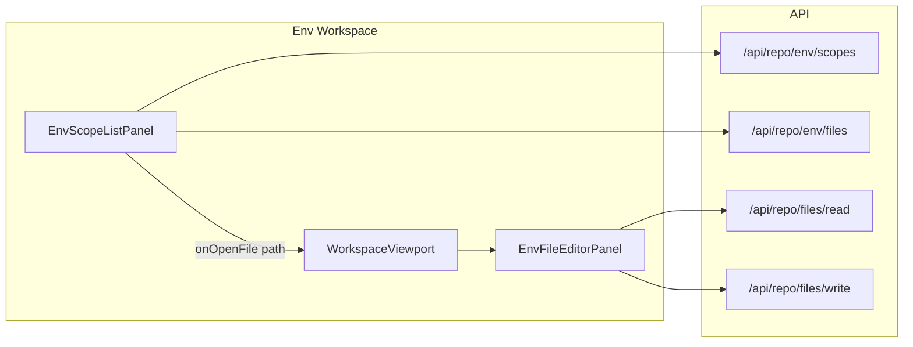

# Env workspace redesign

## Current state

- [EnvWorkspace](apps/repo-studio/src/components/workspaces/EnvWorkspace.tsx): Main = Planning panel, Right = Env panel.
- [EnvPanel](apps/repo-studio/src/components/features/env/EnvPanel.tsx): Manifest/target-based (forge-env), Doctor, Reconcile, key table, target selector. Uses `fetchEnvTarget` / `saveEnvTarget` (manifest-driven).
- Planning pattern: [PlanningWorkspace](apps/repo-studio/src/components/workspaces/PlanningWorkspace.tsx) has Left (Phases, Tasks, Documents tree), Main = [WorkspaceViewport](apps/repo-studio/src/components/viewport/WorkspaceViewport.tsx) with doc tabs, [PlanningDocListPanel](apps/repo-studio/src/components/features/planning/PlanningDocListPanel.tsx) uses headless-tree + [Tree](packages/ui or repo-studio components/ui/tree).
- Repo file APIs: [fetchRepoFilesTree](apps/repo-studio/src/lib/api/services/files.ts), [fetchRepoFile](apps/repo-studio/src/lib/api/services/files.ts), [writeRepoFile](apps/repo-studio/src/lib/api/services/files.ts). Read/write routes in [app/api/repo/files/](apps/repo-studio/app/api/repo/files/).

## Target UX

- **Scope** = repo root (`.`) + each app under `apps/` (e.g. `repo-studio`, `studio`). No manifest as source of truth.
- **Left**: File-tree (like Planning Documents): select scope → show `.env*` files in that scope; click file → open in main viewport.
- **Main**: Viewport with tabs; each tab = one env file, edited with Monaco (read + write via existing repo file APIs). Dirty state and save confirmation on close.
- **Encryption (later)**: Optional encrypted file per scope (e.g. `.env.secret.enc`) in the same folder; key from env or key file; decrypt on open, encrypt on save.

---

## 1. Backend: env scopes and file list

**Add two lightweight APIs** so the Env workspace does not depend on the full file tree.

- `**GET /api/repo/env/scopes**`  
Returns `{ ok, scopes: [ { id, dir, label } ] }` where:
  - One scope with `dir: '.'`, `label: 'Root'`, `id: 'root'`.
  - One scope per directory under `apps/` (read `apps/` with `readdir`; only directories; `id` = dir name, `dir` = `apps/<name>`, `label` = name).
  - Resolve repo root via existing [resolveActiveProjectRoot](apps/repo-studio/src/lib/project-root.ts); reuse [normalizeRelPath](apps/repo-studio/src/lib/repo-files.ts) and safe-path checks.
- `**GET /api/repo/env/files?dir=<dir>**`  
Query param `dir` = repo-relative dir (e.g. `.` or `apps/repo-studio`). Returns `{ ok, files: [ { path, name } ] }` for direct children whose name matches `/^\.env/i` (e.g. `.env`, `.env.local`, `.env.example`). Use `readdir` in that directory; validate `dir` with [isPathWithinRoots](apps/repo-studio/src/lib/repo-files.ts) / safe path so only repo root and `apps/*` are allowed. Return full repo-relative `path` and basename `name`.

Implement in `apps/repo-studio/app/api/repo/env/scopes/route.ts` and `apps/repo-studio/app/api/repo/env/files/route.ts`. Add corresponding client helpers in [lib/api/services](apps/repo-studio/src/lib/api/services/) and types in [lib/api/types](apps/repo-studio/src/lib/api/types.ts).

---

## 2. Env workspace layout (Planning-style)

- **Remove** Planning from Env workspace Main and Env from Right. Env workspace becomes Env-only.
- **Layout**:
  - **Left**: Single panel “Env” with a tree:
    - Top level: scopes (Root, then each app from `/api/repo/env/scopes`).
    - Second level: for selected scope, list of `.env*` files from `/api/repo/env/files?dir=...`. Reuse the same tree component pattern as Planning (headless-tree + TreeItem/TreeItemLabel). Clicking a file opens it in the main viewport.
  - **Main**: One panel hosting `WorkspaceViewport` with tabs; each tab = one env file (path as id). Empty state: “Select an env file from the tree.”
- **Viewport state**: Persist open tab ids and active tab by a key like `env::${layoutId}` in [useRepoStudioShellStore](apps/repo-studio/src/lib/app-shell/store.ts) `viewportState`, same pattern as Planning’s `viewportStateKey` and `openPanelIds` / `activePanelId`.
- **Data flow**: On workspace mount (or when scope is selected), fetch scopes then for each scope fetch file list (or fetch file list on expand to avoid N+1). When user clicks a file, add it to viewport open ids and set active; load content via `fetchRepoFile(path)` when the tab is first opened.

---

## 3. Env file editor panel (viewport tab content)

- New component (e.g. `EnvFilePanel` or `EnvFileEditorPanel`) used as viewport tab content:
  - Receives `filePath` (repo-relative). On mount, call `fetchRepoFile(filePath)`; show loading until done.
  - Render Monaco editor (reuse pattern from [CodePanel](apps/repo-studio/src/components/features/code/CodePanel.tsx) / [PlanningDocPagePanel](apps/repo-studio/src/components/features/planning/PlanningDocPagePanel.tsx)) with `language: 'properties'` or plaintext, **editable** (not read-only).
  - Track dirty state (current content vs baseline from server). Toolbar: Save button (calls `writeRepoFile`), optional “Revert”. On “Save”, update baseline and clear dirty.
  - **Before-close**: Use viewport’s `onBeforeCloseTab`: if dirty, confirm “Unsaved changes. Close anyway?” (or save then close). Reuse [resolveViewportCloseState](apps/repo-studio/src/components/viewport/WorkspaceViewport.tsx) pattern.
- File path and “scope” are read-only context from the tree; no manifest or Doctor/Reconcile in this view unless we add a minimal toolbar action later.

---

## 4. Left panel: scope + file tree

- **Data**: Fetch `GET /api/repo/env/scopes`. For each scope, fetch `GET /api/repo/env/files?dir=<scope.dir>` (can be on expand or upfront). Build a tree: root node “Env” or “Scopes” → scope nodes → file nodes. File node id = repo-relative path (so viewport can use path as panel id).
- **Tree component**: Same as [PlanningDocListPanel](apps/repo-studio/src/components/features/planning/PlanningDocListPanel.tsx): [Tree](apps/repo-studio/src/components/ui/tree) + headless-tree. Create `EnvScopeTreeData` (or similar) that implements `getItem`, `getChildren`: folders = scopes, leaves = files. On leaf click, call `onOpenFile(path)` which the workspace uses to open the file in the viewport.
- **Selection**: Highlight the file node that matches the viewport’s active id (path). Optional: when opening a file from viewport tab, ensure the tree selection follows.

---

## 5. Panel context and shell

- **Panel context**: Env workspace can stop passing planning-related props to panels. It may still receive `panelContext` from [RepoStudioRoot](apps/repo-studio/src/components/RepoStudioRoot.tsx); we only need `onCopyText` and possibly nothing else for the new Env UI. Doctor/Reconcile/manifest can be dropped from the Env workspace UI or left for a future “tools” menu.
- **Types**: [RepoStudioPanelContext](apps/repo-studio/src/components/workspaces/types.ts) stays as-is for now; Env workspace simply does not use most of it. No need to add new context fields for env scopes; scope and file list are local state fetched by the Env workspace.

---

## 6. Encryption (phase 2 – in-repo only)

- **Goal**: Optional encrypted backup of “secret” env in the same scope folder (e.g. `.env.secret.enc`), so secrets are in the repo but not plaintext.
- **Convention**: One encrypted file per scope, e.g. `apps/repo-studio/.env.secret.enc`. Format: encrypted blob (IV + ciphertext) or use a small header (e.g. “FORGE_ENCRYPTED_V1” + base64 payload). Key from env var (e.g. `FORGE_ENV_KEY`) or from a key file path (e.g. `~/.forge-env-key`); never commit the key.
- **Crypto**: Node `crypto`: AES-256-GCM; key = 32 bytes (from env or derived from password via `scrypt`/`pbkdf2`). Encrypt on “Save encrypted” / “Export to .env.secret.enc”, decrypt on “Open .env.secret.enc” (or when opening that file in the tree). Decrypted content is shown in the same Monaco editor; saving writes back encrypted.
- **UI**: Either list `.env.secret.enc` like any other file (if present) in the tree and open/decrypt on demand, or add toolbar actions “Export to encrypted” / “Import from encrypted” for the current scope. Prefer listing the file in the tree so one flow fits all .env* files.

---

## Implementation order

1. **API**: Add `/api/repo/env/scopes` and `/api/repo/env/files` + client helpers and types.
2. **Tree data + left panel**: Implement env scope/file tree data and `EnvScopeListPanel` (or `EnvTreePanel`) with headless-tree; wire `onOpenFile`.
3. **Env workspace layout**: Change [EnvWorkspace](apps/repo-studio/src/components/workspaces/EnvWorkspace.tsx) to Left = env tree, Main = viewport; remove Planning and old Env right panel; wire viewport state (openIds, activeId) to store.
4. **Env file editor**: Implement `EnvFileEditorPanel` (fetch, Monaco, dirty, save, revert); plug into viewport as tab content; add `onBeforeCloseTab` for dirty check.
5. **Polish**: Empty state, loading states, error toasts for read/write failures.
6. **Phase 2**: Encryption helper (encrypt/decrypt in a shared lib), then “.env.secret.enc” in tree + decrypt on open / encrypt on save, key from env or key file.

---

## Files to add

- `apps/repo-studio/app/api/repo/env/scopes/route.ts`
- `apps/repo-studio/app/api/repo/env/files/route.ts`
- `apps/repo-studio/src/lib/api/services/env.ts` (or add to existing services; export from index)
- `apps/repo-studio/src/components/features/env/EnvScopeListPanel.tsx` (tree)
- `apps/repo-studio/src/components/features/env/env-scope-tree-data.ts` (tree data builder)
- `apps/repo-studio/src/components/features/env/EnvFileEditorPanel.tsx` (Monaco + save)

## Files to modify

- [EnvWorkspace.tsx](apps/repo-studio/src/components/workspaces/EnvWorkspace.tsx): New layout (Left tree, Main viewport); remove Planning and Env right panel.
- [lib/api/types.ts](apps/repo-studio/src/lib/api/types.ts): Add response types for env scopes and env files.
- [lib/api/services/index.ts](apps/repo-studio/src/lib/api/services/index.ts): Export new env API.
- Optionally deprecate or simplify [EnvPanel](apps/repo-studio/src/components/features/env/EnvPanel.tsx) (e.g. keep for a different workspace or remove once Env workspace is self-contained).

---

## Diagram (data flow)

