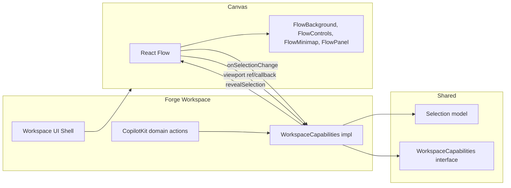

# Forge Workspace + React Flow Capabilities + Unified Editor API

## 1. Current state

- **GraphEditor** ([components/GraphEditor.tsx](components/GraphEditor.tsx)): React Flow with `Background` and `Controls` only; nodes/edges wired to store via `applyOperations`. No MiniMap, Panel, or viewport/selection exposure.
- **Workspace** ([components/Workspace.tsx](components/Workspace.tsx)): Uses WorkspaceShell, Header, Toolbar, Panels (canvas slot), StatusBar, OverlaySurface. No inspector, no left panel, no selection or viewport integration.
- **CopilotKit** ([lib/copilot-actions.ts](lib/copilot-actions.ts)): Forge-specific actions (createNode, updateNode, deleteNode, createEdge, getGraph). No shared capability layer; no `revealSelection` or selection in context.
- **Shared** ([src/shared/workspace/](src/shared/workspace/)): Selection model (entity/textRange/canvasObject), WorkspaceCapabilities (getSelection, getContextSnapshot, navigateTo, openModal, closeModal, revealSelection?), InspectorSection pattern. No editor adapter interface yet.

## 2. Goals

- Expose React Flow capabilities (MiniMap, Controls, Background, Panel) through **workspace-owned wrapper components** so the same “canvas chrome” pattern can apply to other editors (JointJS, Lexical, Twick).
- Wire **selection** (nodes/edges) and **viewport** (fitView, zoom to node) into shared Selection and `WorkspaceCapabilities.revealSelection` so inspector and Copilot can use them.
- Define a **higher-level API** so the Copilot agent can operate on different editor domains in a consistent way where possible, and clearly where it cannot.

## 3. Is a unified higher-level API possible?

**Yes, in a bounded way.**

- **Unified (same across domains):**
  - **Selection** — Already shared (entity / textRange / canvasObject). Every workspace exposes `getSelection()` and `getContextSnapshot()` with that shape.
  - **Reveal** — `revealSelection()`: Forge fits view to node/edge; Writer scrolls to range; Joint/Twick center or highlight. Same intent, domain implements it.
  - **Overlays** — `openModal` / overlay by id; same pattern everywhere.
  - **Navigation** — Deep links; host routes; workspaces just emit `navigateTo`.
- **Domain-specific (same *pattern*, different actions):**
  - Forge: createNode, updateNode, deleteNode, createEdge, deleteEdge, getGraph.
  - Writer: insertText, replaceRange, formatSelection, getDocument (or similar).
  - Characters: createElement, updateElement, createLink, etc.
  - Twick: addLayer, updateElement, etc.

So the agent sees: (1) **common capabilities** (context, selection, reveal, open overlay) and (2) **per-workspace actions** registered when that workspace is active. No single “createEntity” that works for all; instead, each workspace implements the same **capability contract** and registers its own actions. The agent uses context (e.g. `workspaceId`, `editorType`) to choose which actions to call. This is **good and sufficient**: consistent mental model, one selection shape, one reveal intent, and explicit domain actions.

## 4. Architecture: Editor bridge + capability implementation




- **Forge workspace** implements `WorkspaceCapabilities`: `getSelection()` (from React Flow selection state), `getContextSnapshot()` (workspaceId, selection, graph summary), `revealSelection()` (fitView / zoom to selected node or edge).
- **Viewport handle**: GraphEditor (inside React Flow tree) uses `useReactFlow()` and passes a **viewport handle** up to the workspace (callback or ref), e.g. `{ fitView, setCenter, getNode }` so the workspace can call `fitView({ nodes: [nodeId] })` or equivalent when `revealSelection()` is invoked.
- **Selection**: React Flow `onSelectionChange` → workspace (or small Forge state) → `Selection` entity (forge.node / forge.edge). Inspector and `useCopilotReadable` receive this selection.

## 5. Implementation plan

### Phase A: React Flow wrappers (workspace-style “canvas tools”)

- **Location**: New folder under `components/` or `src/shared/components/workspace/` for **editor-agnostic canvas chrome** vs Forge-specific. Recommendation: `**components/forge/**` for Forge-specific pieces (Flow wrappers, Forge inspector sections); keep shared workspace UI in `src/shared/components/workspace/`.
- **Components** (thin wrappers around [React Flow built-ins](https://reactflow.dev/learn/concepts/built-in-components)):
  - **FlowBackground** — Wraps `Background`; optional props (variant, gap, size) to match our design.
  - **FlowControls** — Wraps `Controls`; optional showZoom, showFitView, showLock.
  - **FlowMiniMap** — Wraps `MiniMap`; optional nodeColor, maskColor.
  - **FlowPanel** — Wraps `Panel`; props position, children; used for canvas-level overlays (e.g. “Add node” button or filters).
- **Usage**: Compose inside the same `<ReactFlow>` as children (React Flow requires these as children of ReactFlow). So GraphEditor becomes:
  ```tsx
  <ReactFlow ...>
    <FlowBackground />
    <FlowControls />
    <FlowMiniMap />
    <FlowPanel position="top-left">...</FlowPanel>
    {/* optional */}
  </ReactFlow>
  ```
- **Design pattern**: Same idea as shadcn ContextMenu (Trigger + Content): we own the component names and props; implementation delegates to React Flow. For JointJS/Lexical/Twick we’d have different components (e.g. JointMiniMap or no minimap for Lexical), but the **slot** is “canvas chrome” and we document that each workspace declares what it needs.

### Phase B: Selection and viewport wiring

- **Selection state**: Add Forge selection state (e.g. in Workspace or a small `useForgeSelection` / Zustand slice): selected node ids, selected edge ids. Map to shared `Selection`:
  - One node selected → `{ type: 'entity', entityType: 'forge.node', id, meta: { label?, ... } }`
  - One edge selected → `{ type: 'entity', entityType: 'forge.edge', id, meta: { source, target } }`
  - Multiple or none → `{ type: 'none' }` (or first selected for simplicity; document the rule).
- **React Flow**: Use `onSelectionChange` and controlled `nodes`/`edges` with `selected: true` so selection is driven by store + onSelectionChange sync (or derive selected from React Flow’s selection and push into Forge selection state).
- **Viewport handle**: In GraphEditor, use `useReactFlow()` (requires `ReactFlowProvider` wrapping the flow). Expose to parent via callback, e.g. `onViewportReady({ fitView, getNode, setCenter })`. Workspace stores this and implements `revealSelection()`: if selection is forge.node/forge.edge, call `fitView({ nodes: [id] })` or getNode bounds and setCenter.
- **ReactFlowProvider**: Wrap the ReactFlow tree in `ReactFlowProvider` (in GraphEditor or in Workspace around the canvas slot) so `useReactFlow()` is available inside GraphEditor and any child (e.g. a small hook that registers the viewport with the workspace).

### Phase C: Forge workspace implements capabilities and exposes selection in context

- **WorkspaceCapabilities** implementation (in Workspace or a small hook/store):
  - `getSelection()`: Return current Forge selection as shared `Selection`.
  - `getContextSnapshot()`: workspaceId, selection, openDocumentId (graph id), context (e.g. selected node label, type).
  - `revealSelection()`: Call viewport handle’s fitView for current selection.
  - `openModal`/`closeModal`: Already have overlay surface; map to `openOverlay`/`dismissOverlay`.
- **useCopilotReadable**: Extend context to include **selection** (shared shape) and, if present, selected node/edge summary (id, type, label) so the agent can say “change the selected node” or “zoom to the start node”.
- **CopilotKit actions**: Add a **revealSelection** (or “fitViewToSelection”) action that calls `revealSelection()`. Optionally “selectNode”/“selectEdge” if we want the agent to change selection (then Forge would update selection state and React Flow nodes/edges).

### Phase D: Inspector for Forge

- Use **WorkspaceInspector** with **sections**:
  - Section “Node” when `selection.type === 'entity' && selection.entityType === 'forge.node'`: show node fields (label, content, speaker, type) and allow edit (call `applyOperations(updateNode)`).
  - Section “Edge” when `selection.entityType === 'forge.edge'`: show source/target, optional metadata.
- Pass **selection** and **sections** from Workspace into WorkspacePanels’ inspector slot. Selection comes from the same Forge selection state used by capabilities.

### Phase E: Unified API documentation and adapter contract

- **Shared contract** ([src/shared/workspace/capabilities.ts](src/shared/workspace/capabilities.ts)): Keep `WorkspaceCapabilities` as the interface. Optionally add a short **EditorViewportHandle** type (e.g. `{ fitView?: (opts?) => void; setCenter?: (x, y, zoom?) => void }`) for documentation; Forge implements it via React Flow’s API.
- **Doc** (e.g. `docs/architecture/chat-first-workspaces.md` or extend [docs/architecture/workspace-editor-architecture.md](docs/architecture/workspace-editor-architecture.md)):
  - **Common capabilities**: getSelection, getContextSnapshot, revealSelection, openModal/overlay. All workspaces implement these.
  - **Domain actions**: Each workspace registers its own CopilotKit actions (createNode/updateNode for Forge; insertText/replaceRange for Writer; etc.). Agent uses `workspaceId` / `editorType` from context to choose actions.
  - **Selection**: Single shape (entity / textRange / canvasObject); each editor maps into it.
  - **Reveal**: Same intent; each editor implements (fitView, scroll to range, center cell, etc.).
- **Future**: When adding Writer, Characters, Twick, each implements the same capability interface and exposes its own actions; no single “createEntity” abstraction required.

## 6. File and structure changes


| Area         | Change                                                                                                                                                                                                                                                                                                                                        |
| ------------ | --------------------------------------------------------------------------------------------------------------------------------------------------------------------------------------------------------------------------------------------------------------------------------------------------------------------------------------------- |
| **New**      | `components/forge/FlowBackground.tsx`, `FlowControls.tsx`, `FlowMiniMap.tsx`, `FlowPanel.tsx` — thin wrappers around React Flow’s Background, Controls, MiniMap, Panel.                                                                                                                                                                       |
| **New**      | `components/forge/ForgeInspectorSections.tsx` (or inline in Workspace) — InspectorSection[] for node/edge; uses selection + applyOperations.                                                                                                                                                                                                  |
| **Modify**   | `components/GraphEditor.tsx` — Use ReactFlowProvider; add onSelectionChange → callback to parent; expose onViewportReady (fitView, getNode); compose FlowBackground, FlowControls, FlowMiniMap, FlowPanel.                                                                                                                                    |
| **Modify**   | `components/Workspace.tsx` — Forge selection state; viewport handle ref/callback; implement getSelection, getContextSnapshot, revealSelection (or pass to a small useForgeCapabilities hook); add inspector slot with selection + sections; extend useCopilotReadable with selection; add revealSelection (and optionally selectNode) action. |
| **Optional** | `lib/forge-viewport.ts` or `hooks/useForgeViewport.ts` — Centralize viewport handle type and registration if it gets more complex.                                                                                                                                                                                                            |
| **Doc**      | Update [docs/architecture/workspace-editor-architecture.md](docs/architecture/workspace-editor-architecture.md) (or add chat-first doc) with “Unified API: common capabilities + per-workspace actions” and “Editor viewport and selection”.                                                                                                  |


## 7. Definition of done

- Forge canvas uses workspace-style components: FlowBackground, FlowControls, FlowMiniMap, FlowPanel (composable, our names).
- Selection from React Flow is reflected in shared Selection and in Copilot context; inspector shows node/edge sections based on selection.
- revealSelection() is implemented and callable (e.g. via CopilotKit action “fitViewToSelection” or “revealSelection”).
- Docs describe the unified pattern: same capabilities everywhere, domain-specific actions per workspace; no over-abstracted single “createEntity” API.

## 8. Out of scope for this plan

- JointJS, Lexical, or Twick implementations (only the contract and docs so they can be added later).
- Command palette or chat surface integration (mentioned as “later” in your workspace UI plan).
- Persisting viewport (e.g. in graph.flow.viewport) — can be added later; current types already have optional viewport.

