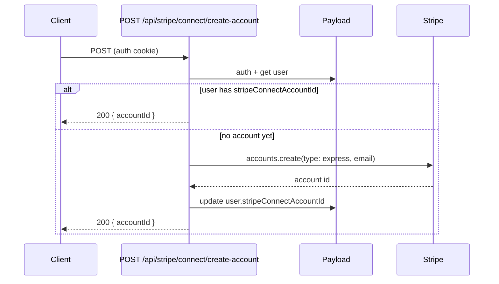

# pay-1a: Stripe Connect account (create + store)

## What you need to do (one-time)

1. **Enable Stripe Connect** in the Stripe Dashboard:
  - Go to [Stripe Dashboard → Connect](https://dashboard.stripe.com/connect/accounts/overview) (or **Connect → Get started**).
  - Complete the one-time platform onboarding and accept the Connect platform agreement.
  - Without this, `accounts.create` will not be available for your platform.
2. **Platform account id:** You already have the platform’s Stripe account id in env as **STRIPE_ACCOUNT_ID** (`acct_1Lp1yRHb5azKYmYy`). We will document it in `.env.example` and in business/docs so agents and future work (e.g. support, invoicing) can reference it. No code changes use it for pay-1a (Connect uses the secret key); it’s for reference and Stripe Dashboard parity.
3. **Customer support, legal URLs, address (for Connect and product):** Stripe Connect and many app stores require:
  - **Customer support email** and **support URL**
  - **Privacy policy URL** and **Terms of service URL**
  - **Business address** (yours is not final yet; plan to update in Stripe later)
   We will add these to the plan as **platform requirements**: document where they will live (env or app settings), add placeholders to `.env.example` or a small “Platform / Stripe Connect” section in docs (e.g. `STRIPE_SUPPORT_EMAIL`, `STRIPE_SUPPORT_URL`, `PRIVACY_POLICY_URL`, `TERMS_OF_SERVICE_URL`), and note in the business roadmap that the real values (and address update in Stripe) are to be filled when legal and support are in place.

---

## Implementation (agent)

### 1. Store Connect account id on users

- **File:** [apps/studio/payload/collections/users.ts](apps/studio/payload/collections/users.ts)
- Add an optional field so we can persist the Stripe Connect account id:
  - `stripeConnectAccountId` — `type: 'text'`, optional, `admin: { description: 'Stripe Connect Express account id (acct_xxx)' }`.
- Run `**pnpm payload:types**` from repo root so `User` in `packages/types/src/payload-types.ts` includes the new field.

### 2. API route: create Connect account (idempotent)

- **New file:** `apps/studio/app/api/stripe/connect/create-account/route.ts`
- **Method:** POST. Auth required (same pattern as [apps/studio/app/api/stripe/create-checkout-session/route.ts](apps/studio/app/api/stripe/create-checkout-session/route.ts): `getPayload` + `payload.auth({ headers: req.headers })`).
- **Logic:**
  - If `!process.env.STRIPE_SECRET_KEY` → 503 "Stripe is not configured".
  - Load current user (from auth). If no user → 401.
  - If user already has `stripeConnectAccountId` → return `{ accountId: user.stripeConnectAccountId }` (idempotent).
  - Otherwise call Stripe: `stripe.accounts.create({ type: 'express', email: user.email })`. Use the user’s `email` from the Payload user (Payload auth adds `email` to the user object).
  - Update the user: `payload.update({ collection: 'users', id: user.id, data: { stripeConnectAccountId: account.id } })`.
  - Return `{ accountId: account.id }`.
- Handle errors (e.g. Stripe API errors) with 500 and a safe message.

### 3. Docs and task tracking (including optional)

- **Business doc:** In [docs/business/revenue-and-stripe.mdx](docs/business/revenue-and-stripe.mdx), under “Stripe Connect (day one)”, add that we store the connected account id on the **users** collection (`stripeConnectAccountId`) and mention the create-account API path (`POST /api/stripe/connect/create-account`).
  - Add a short **Platform Stripe account** line: platform account id is in env as `STRIPE_ACCOUNT_ID` (e.g. `acct_1Lp1yRHb5azKYmYy`) for reference and Stripe Dashboard parity.
  - Add a **Platform requirements (Connect and product)** subsection: customer support (email + URL), privacy policy URL, terms of service URL, and business address (to update in Stripe when final). Document that these can live in env (e.g. `STRIPE_SUPPORT_EMAIL`, `STRIPE_SUPPORT_URL`, `PRIVACY_POLICY_URL`, `TERMS_OF_SERVICE_URL`) or app settings; link to a single place (e.g. `.env.example` or a small "Stripe Connect platform" doc) where we list them.
- **Env example:** In [apps/studio/.env.example](apps/studio/.env.example), add commented entries for `STRIPE_ACCOUNT_ID` (platform account id), and optionally `STRIPE_SUPPORT_EMAIL`, `STRIPE_SUPPORT_URL`, `PRIVACY_POLICY_URL`, `TERMS_OF_SERVICE_URL`, with a one-line note that support/legal URLs and address are required for Connect and product and to be updated when legal/support are in place.
- **Payouts and splits:** In [docs/business/revenue-and-stripe.mdx](docs/business/revenue-and-stripe.mdx) or [docs/agent-artifacts/core/decisions.md](docs/agent-artifacts/core/decisions.md), add a short note: **Single seller per listing for now.** Splits between multiple sellers (music-industry style) and IP/licensing (e.g. Beatstars-style) are to be figured out later when we have more features and creatable content that could justify splits.
- **Business roadmap backlog:** Add a small **Business / operations backlog** section (e.g. in [docs/roadmap/product.mdx](docs/roadmap/product.mdx) or [docs/agent-artifacts/core/enhanced-features-backlog.md](docs/agent-artifacts/core/enhanced-features-backlog.md)) listing items to figure out later (not implemented in pay-1a): legal, incorporation, shares, equity, fundraising strategy and tools, bootstrapping, revenue and projections, marketing campaigns and ideas, how to use/install tech and keep it lean with coding agents, and offerings centered around the core product and platform. Keep it as a short bullet list with "to figure out" / "backlog" framing.
- **Task breakdown:** In [docs/agent-artifacts/core/task-breakdown-platform-monetization.md](docs/agent-artifacts/core/task-breakdown-platform-monetization.md), set **platform-mono-pay-1a** status to **done** and add a short “Done: …” line in the Ralph Wiggum section of [docs/agent-artifacts/core/STATUS.md](docs/agent-artifacts/core/STATUS.md).

---

## Flow (reference)

---

## Payouts: single seller now; splits later

- **Now:** One seller (creator) per listing. Payment goes to that creator’s Connect account; platform takes an application fee. No split payouts.
- **Later:** Splits between multiple sellers (music-industry style) and IP/licensing (e.g. Beatstars-style) are to be figured out when we have more features and creatable content that could justify splits. Document as backlog / "to figure out" in business docs and decisions.

---

## Out of scope (pay-1b / pay-1c)

- **Onboarding link** (so the creator can complete identity/bank details) → pay-1b.
- **Checkout session** for a listing (payment to that Connect account + platform fee) → pay-1c.

After pay-1a, the frontend or pay-1b can call this route when a creator opts in to “Receive payouts”; we then have `stripeConnectAccountId` for use in checkout (pay-1c).

we are using their hosted components, we have completed the onboarding for connect.  execute this plan with that in mind.