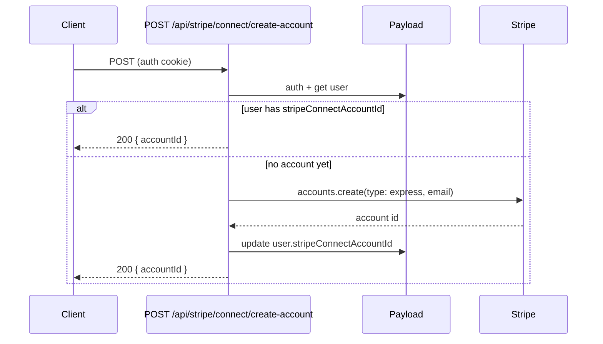

# pay-1a: Stripe Connect account (create + store)

## What you need to do (one-time)

1. **Enable Stripe Connect** in the Stripe Dashboard:
  - Go to [Stripe Dashboard → Connect](https://dashboard.stripe.com/connect/accounts/overview) (or **Connect → Get started**).
  - Complete the one-time platform onboarding and accept the Connect platform agreement.
  - Without this, `accounts.create` will not be available for your platform.

No new env vars are required for pay-1a; the existing **STRIPE_SECRET_KEY** is the platform key and is used for all Connect API calls (create account, later onboarding links and checkout).

---

## Implementation (agent)

### 1. Store Connect account id on users

- **File:** [apps/studio/payload/collections/users.ts](apps/studio/payload/collections/users.ts)
- Add an optional field so we can persist the Stripe Connect account id:
  - `stripeConnectAccountId` — `type: 'text'`, optional, `admin: { description: 'Stripe Connect Express account id (acct_xxx)' }`.
- Run `**pnpm payload:types**` from repo root so `User` in `packages/types/src/payload-types.ts` includes the new field.

### 2. API route: create Connect account (idempotent)

- **New file:** `apps/studio/app/api/stripe/connect/create-account/route.ts`
- **Method:** POST. Auth required (same pattern as [apps/studio/app/api/stripe/create-checkout-session/route.ts](apps/studio/app/api/stripe/create-checkout-session/route.ts): `getPayload` + `payload.auth({ headers: req.headers })`).
- **Logic:**
  - If `!process.env.STRIPE_SECRET_KEY` → 503 "Stripe is not configured".
  - Load current user (from auth). If no user → 401.
  - If user already has `stripeConnectAccountId` → return `{ accountId: user.stripeConnectAccountId }` (idempotent).
  - Otherwise call Stripe: `stripe.accounts.create({ type: 'express', email: user.email })`. Use the user’s `email` from the Payload user (Payload auth adds `email` to the user object).
  - Update the user: `payload.update({ collection: 'users', id: user.id, data: { stripeConnectAccountId: account.id } })`.
  - Return `{ accountId: account.id }`.
- Handle errors (e.g. Stripe API errors) with 500 and a safe message.

### 3. Docs and task tracking

- **Business doc:** In [docs/business/revenue-and-stripe.mdx](docs/business/revenue-and-stripe.mdx), under “Stripe Connect (day one)”, add one line that we store the connected account id on the **users** collection (`stripeConnectAccountId`). Optionally mention the create-account API path.
- **Task breakdown:** In [docs/agent-artifacts/core/task-breakdown-platform-monetization.md](docs/agent-artifacts/core/task-breakdown-platform-monetization.md), set **platform-mono-pay-1a** status to **done** and add a short “Done: …” line in the Ralph Wiggum section of [docs/agent-artifacts/core/STATUS.md](docs/agent-artifacts/core/STATUS.md).

---

## Flow (reference)

---

## Out of scope (pay-1b / pay-1c)

- **Onboarding link** (so the creator can complete identity/bank details) → pay-1b.
- **Checkout session** for a listing (payment to that Connect account + platform fee) → pay-1c.

After pay-1a, the frontend or pay-1b can call this route when a creator opts in to “Receive payouts”; we then have `stripeConnectAccountId` for use in checkout (pay-1c).