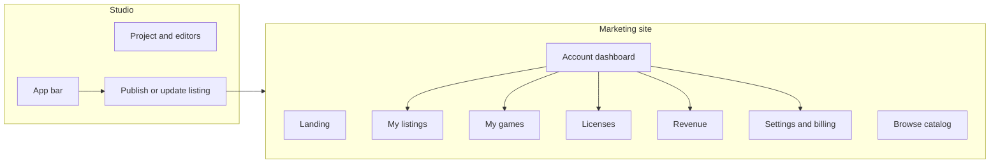

# Platform dashboard, Studio minimal platform, import strategy, and potential ideas process

## 1. Direction summary

- **Marketing site** = full customer-facing surface: landing, browse catalog, **manage own account** (dashboard: my games/listings, licenses, revenue, settings, billing). Should feel "fleshed out" and use a **prebuilt shadcn-based dashboard template**.
- **Studio** = authoring only. **Minimal platform surface:** project + editors; in the **app bar** only: publish (create listing from current project) and update an existing listing. No listings management, no catalog, no revenue UI in Studio.
- **Playable builds:** PixiVN produces builds we can embed so people play games in the browser; publish-and-host is MVP (already in roadmap).
- **Vision:** Roblox-like but for narrative game authoring: content/data that can translate to AAA engines and speed up dev workflows; PixiVN + adapters (Yarn, Ink, Twine, Ren'Py) so imported projects can play immediately; optional **AI-assisted import** to ingest varied formats into our system.
- **Potential ideas:** One place and process for ideas that are **not yet committed** (may be abandoned); easy to find, update, and drive "what's next" for issues, tasks, business, technical.

---

## 2. Shadcn dashboard templates (candidates)

Research suggests these **prebuilt** options (Next.js App Router + shadcn):

| Template                                                          | Stack                                               | Pros                                                                        | Cons                                                          |
| ----------------------------------------------------------------- | --------------------------------------------------- | --------------------------------------------------------------------------- | ------------------------------------------------------------- |
| **Kiranism Next Shadcn Dashboard Starter**                        | Next 15, TypeScript, shadcn, Clerk, Sentry, Zustand | Data tables, analytics, settings, user management, Kanban; production-ready | Heavier (Clerk/Sentry); may need to swap auth to Payload      |
| **Vercel "Next.js and shadcn/ui Admin Dashboard"** (Studio Admin) | Next 16, shadcn, Tailwind v4                        | Multiple dashboard variants (Default, CRM, Finance), theme presets, RBAC    | Newer; verify compatibility with our Next 15 / Tailwind setup |
| **Metafora** (GitHub: yogiyendri/metafora-template)               | Next App Router, shadcn                             | Minimal, MIT; good for admin/CMS-style panels                               | Less out-of-the-box (no auth/data tables)                     |
| **shadcn-nextjs-dashboard** (Beautiful Dashboard)                 | Next 14, shadcn                                     | Auth, roles, free, fast                                                     | Next 14 (we may be on 15)                                     |

**Recommendation:** Evaluate **Kiranism** (feature-rich, closest to "creator dashboard" needs) and **Vercel Studio Admin** (multiple dashboards, modern). Pick one as the base for the **marketing account/dashboard area** (sidebar layout, data tables, settings pattern). If marketing app is already Next 15 and uses Payload for auth, prefer a template that allows **replacing Clerk with Payload/cookie auth** without rewriting the whole layout.

**Action:** Add a **small research spike** (or doc-only task) to the task registry: "Evaluate shadcn dashboard templates for marketing creator dashboard (Kiranism vs Vercel Studio Admin); document choice and migration steps (auth, layout, tables)."

---

## 3. Platform vs Studio (what lives where)

- **Studio:** Keep CreateListingSheet (or equivalent) **only** as triggered from app bar: "Publish" (create new listing from current project) and "Update listing" (if current project is already linked to a listing). Remove or avoid any in-Studio listing list/catalog/revenue UI.
- **Marketing:** Add dashboard section under `/account`: **My listings** (CRUD list, link "Edit in Studio" or deep-link to project), **My games** (projects that are or can be listed), **Licenses** (existing), **Revenue** (consume `GET /api/me/revenue`), **Settings / Billing** (existing). Implement using the chosen shadcn dashboard template structure (sidebar, tables, forms).

**Backend:** Studio already has Payload `listings` (with `creator`), `GET /api/catalog` (public), and `GET /api/me/revenue`. Add **GET /api/me/listings** (or document using Payload REST `GET /api/listings?where[creator][equals]=currentUser`) so marketing can fetch current user's listings. Same API boundary: marketing calls Studio API routes with credentials.

---

## 4. Import system and adapters (and optional AI import)

- **Order:** Yarn Spinner first (MVP), then Ink, Twine, Ren'Py per [ecosystem-and-import-strategy.mdx](docs/business/ecosystem-and-import-strategy.mdx) and [10-gameplayer.mdx](docs/architecture/10-gameplayer.mdx).
- **Difficulty:** Format differences (Yarn vs Ren'Py vs Ink vs Twine) are non-trivial; mapping each into our project/graph + PixiVN Json will require per-adapter work.
- **AI-assisted import:** Idea: an **import pipeline** where the user uploads or pastes external project content, and an **AI step** helps parse and map it into our schema (nodes, variables, dialogue lines). Document as a **potential/exploratory** idea: "AI-assisted import for Yarn/Ink/Twine/Ren'Py to normalize into our project format." No commitment; difficulty and scope TBD. Place in the new "potential ideas" doc (below).

**Roadmap:** Keep "Ecosystem adapters" and "Publish and host builds" in product roadmap; add a short subsection **Import and AI-assisted ingest** under platform or GamePlayer: "Adapters (Yarn, then Ink, Twine, Ren'Py); optional future: AI-assisted import to map external formats into our project/graph." Reference the potential-ideas doc for the AI-import idea.

---

## 5. Process and place for potential ideas

**Goal:** One place to capture ideas that are **not yet decisions** (might be abandoned); easy to find and update; support "what's next" for issues, tasks, business docs, technical.

**Proposal:**

- **New doc:** [docs/roadmap/potential-ideas.md](docs/roadmap/potential-ideas.md) (or [docs/business/potential-ideas.md](docs/business/potential-ideas.md)). **Content:** Short intro ("Ideas under consideration; not committed. We may adopt, defer, or drop them."), then a **process** and a **table** of ideas.
- **Process:**
  1. Anyone adds an idea with **status**: `exploratory` | `under_review` | `accepted` | `deferred` | `rejected`.
  2. **Exploratory** = just captured; no decision. **Under review** = being evaluated. **Accepted** = we commit; move to STATUS § Next, task-registry, or enhanced-features backlog with impact. **Deferred** = not now; revisit later. **Rejected** = we gave it up (short reason).
  3. When accepted, add to the appropriate place (STATUS, task-registry, roadmap, or enhanced-features-backlog) and set status here to `accepted` with a link.
  4. "What's next" for ideas: link from [docs/roadmap/00-roadmap-index.mdx](docs/roadmap/00-roadmap-index.mdx) and [docs/18-agent-artifacts-index.mdx](docs/18-agent-artifacts-index.mdx) (and STATUS "What you can do next" for business/strategy) to this doc so agents and humans can "see potential ideas" and "update or triage."
- **Why roadmap (or business)?** Roadmap = product/initiative-style ideas; business = go-to-market, ops, monetization. Either works; **roadmap** keeps "potential roadmap" in one folder. Alternative: **docs/agent-artifacts/core/potential-ideas.md** so agents have it in core and it's next to enhanced-features-backlog (ideas that are triaged vs ideas that are not yet). **Recommendation:** `docs/roadmap/potential-ideas.md` so it sits with product roadmap and roadmap index; 18-index and STATUS can link to it for "what's next (ideas)."

**Format per idea (in the doc):**

- **Id** (short slug)
- **Title**
- **Context** (area: platform, import, business, technical, etc.)
- **Suggestion** (1–3 sentences)
- **Status** (exploratory | under_review | accepted | deferred | rejected)
- **Date added**
- **Note** (optional: "Not a committed decision; we may drop this.")

Seed the doc with a few entries from this plan: e.g. **Creator dashboard (marketing)** (accepted once we add the initiative), **AI-assisted import** (exploratory), **Shadcn dashboard template for marketing** (under_review or exploratory).

---

## 6. Concrete changes to tasks, issues, roadmap

**ISSUES.md**

- Add a short section: **Creator dashboard and Studio minimal platform** — Platform account/listings/revenue management belongs on the marketing site; Studio should only expose publish/update listing in the app bar. Until the marketing dashboard exists, creators have no in-app place to manage listings (current gap). Link to this plan or to the creator-dashboard initiative once added.

**Task registry / breakdown**

- Add **initiative:** `creator-dashboard` (or `platform-creator-dashboard`): Marketing site creator dashboard (my listings, my games, licenses, revenue) using a shadcn-based template; Studio reduced to publish/update in app bar only. **Lanes:** (1) Template evaluation and adoption, (2) API for "my listings" (or use Payload REST), (3) Dashboard pages (listings, games, revenue), (4) Studio: remove or hide any listing list/catalog; keep only app bar publish/update.
- Add **initiative or tasks** for **import/adapters:** Yarn (MVP), then Ink, Twine, Ren'Py; optional AI-assisted import as a potential idea (link to potential-ideas.md).

**Roadmap**

- [docs/roadmap/product.mdx](docs/roadmap/product.mdx): In **Platform** (or new subsection), add **Creator dashboard:** Full account management on marketing site (dashboard: my listings, my games, licenses, revenue); Studio minimal (publish/update in app bar only). Add **Import and play:** Adapters (Yarn first, then Ink, Twine, Ren'Py); optional AI-assisted import (see potential-ideas).
- [docs/roadmap/00-roadmap-index.mdx](docs/roadmap/00-roadmap-index.mdx): Add row for **Potential ideas** linking to `potential-ideas.md` and describe one-line purpose.

**New doc**

- Create **docs/roadmap/potential-ideas.md** (or docs/business/potential-ideas.md) with process above and seed ideas: Creator dashboard (accepted → initiative), AI-assisted import (exploratory), Shadcn dashboard template choice (exploratory/under_review).

**18-agent-artifacts-index and STATUS**

- In STATUS § "What you can do next," add a bullet: **Ideas and potential roadmap:** See [potential-ideas](roadmap/potential-ideas.md) to triage or add ideas; when accepted, add to STATUS/task-registry/backlog. In 18-index, under Documentation or "What's next," add a link to potential-ideas for exploratory ideas.

---

## 7. Summary

| Area                   | Action                                                                                                                                                         |
| ---------------------- | -------------------------------------------------------------------------------------------------------------------------------------------------------------- |
| **Dashboard template** | Evaluate Kiranism vs Vercel Studio Admin; document choice; adopt for marketing account/dashboard area.                                                         |
| **Studio**             | Keep only app bar publish/update listing; no listings management or catalog in Studio.                                                                         |
| **Marketing**          | Add creator dashboard (my listings, my games, licenses, revenue) using chosen template; ensure GET my-listings API (or Payload REST) is available.             |
| **Import**             | Document adapters (Yarn → Ink, Twine, Ren'Py) and optional AI-assisted import as potential idea.                                                               |
| **Potential ideas**    | New doc `docs/roadmap/potential-ideas.md` with process (exploratory → accepted/deferred/rejected) and seed ideas; link from roadmap index and STATUS/18-index. |
| **Tasks / issues**     | Add creator-dashboard initiative; add ISSUES entry for dashboard + Studio minimal; add import/adapters to roadmap and optional AI import to potential-ideas.   |

This plan does not implement code; it defines the direction, template choice path, process for potential ideas, and the doc/task/issue updates to apply when you execute.