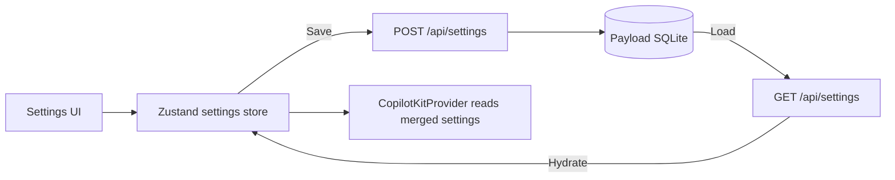

# Settings overrides: persistence and codebase plan (updated)

## 1. What a "settings snapshot" actually is

In the store you have:

- **Defaults** from `SETTINGS_CONFIG` (app, workspace, editor defaults).
- **Overrides** at three scopes: **app**, **workspace** (by workspaceId), **editor** (by workspaceId:editorId).

A persisted "settings snapshot" is simply a **persisted record of overrides at a given scope**. It is not time-travel or versioning unless you explicitly add that. So the correct mental model is **SettingsOverride** (one current record per scope+scopeId), not "snapshot."

**Verdict:** Keep the model (scope inheritance + overrides stored as JSON). Rename to **settings-overrides** and treat as overrides, not snapshots. Finish the wiring (load/save) so it is not dead weight.

---

## 2. Is this pattern good for this repo?

**Yes**, because:

- You have **scope inheritance** (app → workspace → editor). "One override record per scope/scopeId" fits.
- You want **data-driven apps** (Studio and Platform) with consistent settings behavior.
- Client store stays simple: store holds **overrides** in memory; Payload stores **persisted overrides**; hydration applies overrides on boot.

**Gotcha:** The name "snapshot" implies history. If you are not doing versioning, use **SettingsOverride** / **settings-overrides** everywhere so agents and humans are not confused.

---

## 3. Two apps, two Payloads: where settings live

- **Studio** app has its own Payload (local-first). Studio settings (app/workspace/editor) live in **Studio Payload only**.
- **Platform** app has its own Payload (marketing/site). Platform has **site config** (theme, nav, footer, feature flags) in **Platform Payload** — e.g. `site-settings` collection. Not the same as Studio settings.

**Do not share the settings collection between apps.** Shared branding/tokens belong in `packages/shared` or build-time config, not a shared DB.

---

## 4. Recommended: overrides collection (single current record per scope)

**Use when:** persistence only, no history.

- **Collection:** `settings-overrides` (rename from `settings-snapshots`).
- **Unique key:** `(scope, scopeId)` where `scopeId` is `null` for app scope.
- **Field:** `settings` (JSON) — only overridden keys.

Pros: minimal writes, deterministic merge, easy to reason about. No history (can add later if needed).

---

## 5. Repo structure (relevant parts)

```
apps/
  studio/
    app/api/
      settings/
        route.ts                    # GET /api/settings, POST /api/settings
    payload/collections/
      settings-overrides.ts         # renamed from settings-snapshots
  platform/
    payload/collections/
      site-settings.ts              # platform-only site config (future)

packages/
  shared/
    src/
      settings/                     # (optional) shared types/helpers for settings keys
  domain-forge/
  domain-video/
```

---

## 6. Architecture: Studio settings lifecycle



---

## 7. API design (simple, deterministic)

### Collection shape (Studio): `settings-overrides`

- `scope`: `app` | `workspace` | `editor`
- `scopeId`: `null` (app) | `workspaceId` | `workspaceId:editorId`
- `settings`: JSON object of **only overridden keys**
- `label?`: optional
- `updatedAt`: automatic

### Routes

**GET `/api/settings`**

- Returns all override records.
- Client hydrates store via `hydrateFromOverrides(records)` (renamed from `hydrateFromSnapshots`).

**POST `/api/settings`**

- Body: `{ scope, scopeId, settings }`
- Upserts **one** record for that (scope, scopeId).

Start with one scope at a time. Optional later: "save all" with `{ overrides: Array<{scope, scopeId, settings}> }`.

---

## 8. Store and type renames (reduce confusion)

| Current | New |
|--------|-----|
| `hydrateFromSnapshots` | `hydrateFromOverrides` |
| `SettingsSnapshot` (Payload type) | `SettingsOverrideRecord` (or keep Payload-generated name but document as "override") |
| Collection `settings-snapshots` | `settings-overrides` |

**Store representation (unchanged):**

- `appSettings` — app overrides
- `workspaceSettings[workspaceId]` — workspace overrides
- `editorSettings[workspaceId:editorId]` — editor overrides

Merge order and defaults from config stay the same.

---

## 9. Typed keys (do it)

- Add a **SettingsKey** union type from a central registry (e.g. in `apps/studio/lib/settings/config.ts` or `packages/shared/src/settings/`).
- Use it in store methods and UI so invalid keys are caught at compile time and agents see a single source of truth.

---

## 10. Task plan (slices)

### Slice 1 — Make persistence real (highest value)

**Goal:** Settings survive refresh.

1. Rename collection and types:
   - File: `settings-snapshots.ts` → `settings-overrides.ts`; slug `settings-overrides`.
   - Payload types: regenerate after rename; use type alias `SettingsOverrideRecord` in app code if helpful.
2. Implement Studio API:
   - **GET /api/settings**: fetch all `settings-overrides`, return array.
   - **POST /api/settings**: body `{ scope, scopeId, settings }`; upsert one record.
3. Rename in store: `hydrateFromSnapshots` → `hydrateFromOverrides`; accept same shape (scope, scopeId, settings).
4. Add **SettingsHydration** (component or logic in layout/provider): on mount, `fetch('/api/settings')`, then `hydrateFromOverrides(data)`.
5. **Explicit Save**: Add "Save" in settings UI that POSTs current overrides for the active scope (app, workspace, or editor). One scope at a time is enough for Slice 1.
6. Update docs: PROJECT-OVERVIEW, STATUS, AGENTS — "settings-overrides" and "hydration on init; save via POST /api/settings."

**Done criteria:** Change a setting → click Save → refresh → setting remains.

### Slice 2 — Explicit Save vs auto-save (decision)

**Recommendation:** Keep **explicit Save** per scope for now (fewer writes, fewer races, easier to debug). Add debounced auto-save later if needed.

### Slice 3 — Typed keys + refactor safety

- Introduce `SettingsKey` and registry.
- Update store and all settings UI to use `SettingsKey`.

**Done criteria:** TypeScript prevents invalid keys in code.

### Slice 4 — Platform site config (separate)

- When Platform app exists: add `site-settings` collection in platform Payload.
- Add fetcher for platform layout/header/footer.

**Done criteria:** Platform pages render config from Payload. No sharing of Studio settings collection.

---

## 11. Doc updates (Ralph Wiggum loop)

### Root `AGENTS.md`

- Add: "Studio settings persistence uses `settings-overrides` collection and `/api/settings`. Hydration happens on app init. Do not claim persistence is wired unless it is."
- Add: "Update `docs/STATUS.md` after each slice."

### `docs/STATUS.md`

- Current state: "Settings overrides persisted? yes/no" (update to yes when Slice 1 is done).
- Next slice: single active task (e.g. "Slice 1: settings-overrides + GET/POST + hydration + explicit Save").

### `docs/PROJECT-OVERVIEW.md`

- Replace "overrides applied from stored snapshots" with accurate text: "Overrides loaded from Payload (`settings-overrides`) on init via GET /api/settings; saved via POST /api/settings (explicit Save)." Only after Slice 1 is done.

---

## 12. Bottom line

- The **idea** is solid: persisting scope overrides is correct for this architecture.
- The **name** "snapshot" is misleading without versioning; use **settings-overrides** and **hydrateFromOverrides**.
- The **implementation** is incomplete; finish it (rename + GET/POST + hydration + explicit Save) or remove the persistence path to avoid doc drift and confusion.

**Recommendation:** Keep the model, rename to **settings-overrides**, wire GET/POST + hydration, and start with explicit Save. Then add typed keys (Slice 3) and Platform site config (Slice 4) when relevant.
