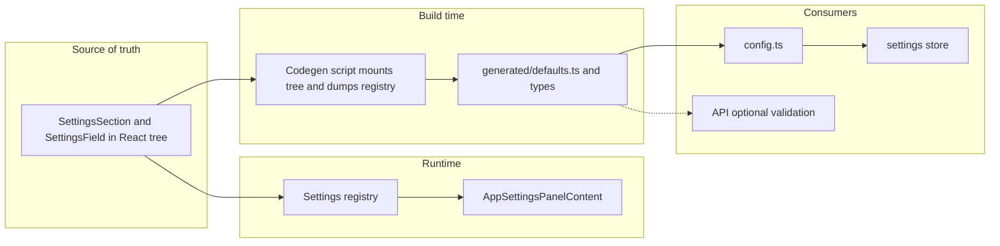

# Settings: tree-as-source refactor

## Goals

- **Single source of truth:** The React tree (SettingsSection + SettingsField) defines every setting: key, type, label, default, scope. No separate hand-maintained schema file.
- **Generated contract:** A build-time step mounts the same tree, reads the settings registry, and emits generated artifacts (defaults, TypeScript types) used by the store and optionally API. Payload collection stays unchanged (single `settings` JSON field).
- **Heavy documentation:** Decisions and rationale documented first (ADR + dedicated doc). Scope is explicit: this pattern applies to **settings only**; menus, toolbars, and rich collections remain schema-first or registry-only.

## Execution order (per coding agent strategy)

1. **Documentation first** – Add ADR and settings codegen doc; update STATUS and index. No code changes until docs are in place.
2. **Tree and registry** – Add `default` (and optional `scope` where needed) to SettingsField; extend types and registry so registered sections include defaults; ensure all current settings are represented in the tree with defaults.
3. **Codegen** – Script or test that mounts the settings registration tree, reads the registry, writes generated defaults and types; wire into build or a dedicated pnpm script.
4. **Store and config** – Switch store and config to consume generated artifacts; remove hand-written schema as the source of defaults and sections.
5. **Panel and cleanup** – AppSettingsPanelContent uses only registry sections (no static merge with schema-derived sections); remove or archive old schema; tests and doc scan.

---

## Phase 1: Documentation (do first)

### 1.1 ADR in decisions.md

Add a new section **"Settings: tree-as-source and generated contract"** to [docs/agent-artifacts/core/decisions.md](docs/agent-artifacts/core/decisions.md) that states:

- **Decision:** Settings are defined in the React tree (SettingsSection + SettingsField with a `default` prop). The settings registry stores section/field metadata including defaults. A codegen step (run at build or via `pnpm settings:generate`) mounts the same registration tree, reads the registry, and writes generated modules (defaults per scope, TypeScript types). The store and config import these generated artifacts for initial state and `getOverridesForScope`. Payload continues to store settings as a single JSON field; no collection schema change when adding settings.
- **Out of scope:** Menus and toolbars use the registry/tree pattern but do **not** persist a "contract" (no codegen). Rich collections (projects, forge-graphs) remain schema-first; types come from Payload config. Only settings use "tree as source → generate contract."
- **Rationale:** Single place to add a setting (the tree); no duplicate schema; generated contract keeps store and API in sync; aligns with "build the frontend quickly" and third-party studios.

### 1.2 Dedicated settings codegen doc

Create **docs/architecture/settings-tree-as-source-and-codegen.mdx** (or under **docs/agent-artifacts/** if preferred for agent-only). Include:

- **What is in scope:** Settings only. Definition in tree (SettingsSection/SettingsField), registration at runtime, codegen produces defaults + types.
- **What is not in scope:** Menus, toolbars (registry only, no generated contract). Rich collections (schema-first, Payload-generated types).
- **Current vs new flow:** Current: SETTINGS_SCHEMA (hand-written) → getAppDefaults/buildSectionsForScope → config + store + static sections. New: Tree (with default) → registry at runtime; codegen reads registry → generated/defaults.ts and types; store/config import generated; panel uses only registry sections.
- **How to add a setting:** Add or edit a SettingsField in the tree (under the right provider); set `default`; run codegen; no schema file to edit.
- **Codegen trigger:** When it runs (e.g. `pnpm settings:generate` and/or as part of build), where generated files live, and what consumes them.

### 1.3 Index and STATUS

- In [docs/18-agent-artifacts-index.mdx](docs/18-agent-artifacts-index.mdx) (or the docs index), add a pointer to the new settings codegen doc if it lives under architecture.
- In [docs/agent-artifacts/core/STATUS.md](docs/agent-artifacts/core/STATUS.md), add an "In progress" or "Next" line for the settings tree-as-source refactor and reference the plan so agents know the order (docs first, then implementation).

---

## Phase 2: Tree and registry

### 2.1 Types and components

- **[apps/studio/components/settings/types.ts](apps/studio/components/settings/types.ts):** Add `default?: unknown` to `SettingsField`. Optionally add a `scope` hint on the section type if needed for codegen (scope is already provided by `useSettingsRegistration()` when registering).
- **[apps/studio/components/settings/SettingsField.tsx](apps/studio/components/settings/SettingsField.tsx):** Add `default` to `SettingsFieldProps` and pass it through (parent already collects child props into `fields`).
- **[apps/studio/components/settings/SettingsSection.tsx](apps/studio/components/settings/SettingsSection.tsx):** In `collectFields`, include `default` from each SettingsField child so the registered section's `fields` have `default`.

### 2.2 Registry

- **[apps/studio/lib/editor-registry/settings-registry.ts](apps/studio/lib/editor-registry/settings-registry.ts):** No structural change; it already stores `SettingsSection[]` per scope+scopeId. Once `SettingsField` and `SettingsSection` collect `default`, the registry will hold it.

### 2.3 Tree completeness (defaults in tree)

- **[apps/studio/components/settings/AppSettingsRegistrations.tsx](apps/studio/components/settings/AppSettingsRegistrations.tsx):** Add `default` to every `SettingsField` so app-scope defaults live in the tree. Match current schema defaults (e.g. ai.agentName default "Forge Assistant", ai.responsesCompatOnly true, etc.) so behavior is unchanged.
- **Viewport settings:** The viewport section (graph-viewport with graph.showMiniMap, graph.animatedEdges, graph.layoutAlgorithm) lives in [apps/studio/components/editors/DialogueEditor.tsx](apps/studio/components/editors/DialogueEditor.tsx) under ViewportSettingsProvider. Add `default` to each of those SettingsFields. Optionally extract a small component (e.g. `GraphViewportSettingsRegistration`) that renders that SettingsSection so the same tree can be mounted in codegen without pulling in all of DialogueEditor.
- **Editor scope:** Currently [apps/studio/lib/settings/config.ts](apps/studio/lib/settings/config.ts) has hand-written `editorDefaults` (e.g. dialogue/video/character/strategy with ai.agentName). There is no editor-scoped SettingsSection in the tree today. For v1, either (a) add minimal editor-scoped registration in the tree and include it in codegen, or (b) keep editor defaults as a small override in config that merges with or supplements generated app/viewport defaults. Plan should pick one; (b) is less scope creep.

### 2.4 Project scope

- Project defaults today come from schema; there is no project-scoped SettingsSection in the tree. Same as editor: either add project registration in tree or keep a small project-defaults override in config for v1.

---

## Phase 3: Codegen

### 3.1 Approach: runtime dump via Jest

- Use **Jest + @testing-library/react** (already in [apps/studio/package.json](apps/studio/package.json)) to mount the settings registration tree with the correct providers (AppSettingsProvider for app; ViewportSettingsProvider for each viewport key we care about: dialogue:narrative, dialogue:storylet, character:main).
- After mount, wait for effects (e.g. `act` + one microtask or `waitFor`) so `registerSection` has run.
- Read `useSettingsRegistryStore.getState().sections`.
- From `sections`, build:
  - **App defaults:** scope `app`, scopeId `null` → flatten all fields (key, default) into one object.
  - **Viewport defaults:** each key like `viewport:dialogue:narrative` → object of key→default.
  - **Editor defaults (if tree-driven):** same idea per editor scopeId.
- Write to **apps/studio/lib/settings/generated/** (create directory, add to .gitignore or commit generated files per team preference):
  - `defaults.ts`: exported constants or functions (e.g. `APP_DEFAULTS`, `getViewportDefaults(editorId, viewportId)`) so [apps/studio/lib/settings/config.ts](apps/studio/lib/settings/config.ts) and store can import.
  - Optionally `settings-keys.ts`: union type of known setting keys for typed `getSettingValue`.

### 3.2 Mountable tree for codegen

- Ensure the codegen test can render:
  - App: `AppSettingsProvider` → `AppSettingsRegistrations`.
  - Viewport: For each of `dialogue:narrative`, `dialogue:storylet`, `character:main`, render `ViewportSettingsProvider(editorId, viewportId)` with the same SettingsSection(s) that DialogueEditor (and any other editor) use. Extracting `GraphViewportSettingsRegistration` (or a single `ViewportSettingsRegistrations` component that renders all viewport sections we care about) avoids importing the full DialogueEditor in the test.

### 3.3 Script and trigger

- Add a test file (e.g. **apps/studio/tests/settings-codegen.test.tsx**) that performs the mount, read, and file write. Use Jest's `afterAll` or a single test that runs the codegen and writes to `generated/`. Alternatively, a small script (Node) that programmatically runs Jest for that test so it can be invoked as `pnpm settings:generate`.
- Add **pnpm settings:generate** (or similar) in apps/studio and/or root that runs the codegen. Optionally run it in `pnpm build` so generated files are always fresh.

---

## Phase 4: Store and config

### 4.1 Config

- **[apps/studio/lib/settings/config.ts](apps/studio/lib/settings/config.ts):** Replace imports from [apps/studio/lib/settings/schema.ts](apps/studio/lib/settings/schema.ts) (`getAppDefaults`, `getProjectDefaults`, `getViewportDefaultsFromSchema`) with imports from `./generated/defaults` (or equivalent). Keep `editorDefaults` and `projectDefaults` as minimal overrides if they are not yet in the tree; otherwise derive from generated data.

### 4.2 Store

- **[apps/studio/lib/settings/store.ts](apps/studio/lib/settings/store.ts):** Keep using `SETTINGS_CONFIG` for initial state and for `getOverridesForScope`; no change to store logic once config reads from generated.

### 4.3 Remove schema as source of defaults and sections

- **[apps/studio/lib/settings/schema.ts](apps/studio/lib/settings/schema.ts):** Remove or refactor: delete `getAppDefaults`, `getProjectDefaults`, `getViewportDefaultsFromSchema`, `buildSectionsForScope`, and exports like `APP_SETTINGS_SECTIONS`. If any part of the schema (e.g. section metadata like SECTION_META) is still needed for the panel, move it to a small shared module or derive from the registry. Do not leave a duplicate source of defaults.

---

## Phase 5: Panel and cleanup

### 5.1 AppSettingsPanelContent and static sections

- **[apps/studio/components/settings/AppSettingsPanelContent.tsx](apps/studio/components/settings/AppSettingsPanelContent.tsx):** Stop merging with `APP_SETTINGS_SECTIONS` and `VIEWPORT_SETTINGS_SECTIONS` from the schema. Use only registry sections (app registry + viewport registry) so the tree is the single source for what appears in the panel. If section ordering or metadata (title/description) came from schema, ensure the tree provides them via SettingsSection props.

### 5.2 Other consumers of schema

- **[apps/studio/components/settings/ai-settings.tsx](apps/studio/components/settings/ai-settings.tsx)** and **[apps/studio/components/settings/AppSettingsPanel.tsx](apps/studio/components/settings/AppSettingsPanel.tsx):** Remove or update any imports of `APP_SETTINGS_SECTIONS` from schema; use registry or generated data as needed.

### 5.3 Tests and doc scan

- Add or adjust tests so that (a) the codegen test is stable and (b) store/config tests use generated defaults or mocks.
- Run doc scan per [docs/19-coding-agent-strategy.mdx](docs/19-coding-agent-strategy.mdx): update any design/architecture/how-to or AGENTS that reference the old schema or "settings schema" as source of truth. Update [docs/agent-artifacts/core/STATUS.md](docs/agent-artifacts/core/STATUS.md) (Ralph Wiggum Done) and [packages/shared/src/shared/components/editor/README.md](packages/shared/src/shared/components/editor/README.md) if they mention settings.

---

## Data flow (after refactor)

---

## File summary

| Area             | Files to add                                                                                                                      | Files to change                                                                                                                                                                                                    | Files to remove or archive                                    |
| ---------------- | --------------------------------------------------------------------------------------------------------------------------------- | ------------------------------------------------------------------------------------------------------------------------------------------------------------------------------------------------------------------ | ------------------------------------------------------------- |
| Docs             | decisions.md ADR, settings-tree-as-source-and-codegen.mdx, STATUS/index updates                                                   | 18-agent-artifacts-index if new doc is listed                                                                                                                                                                      | —                                                             |
| Types/components | —                                                                                                                                 | types.ts (default on SettingsField), SettingsField.tsx, SettingsSection.tsx (collect default), AppSettingsRegistrations (add defaults), DialogueEditor viewport section (add defaults; optional extract component) | —                                                             |
| Codegen          | **tests**/settings-codegen.test.tsx (or scripts/settings-codegen), lib/settings/generated/defaults.ts + optional settings-keys.ts | package.json script                                                                                                                                                                                                | —                                                             |
| Config/store     | —                                                                                                                                 | config.ts (import from generated), store.ts (unchanged if config is the only change)                                                                                                                               | schema.ts as source of defaults/sections (refactor or remove) |
| Panel            | —                                                                                                                                 | AppSettingsPanelContent.tsx, ai-settings.tsx, AppSettingsPanel.tsx                                                                                                                                                 | —                                                             |

---

## Risks and mitigations

- **Codegen depends on tree:** If the tree is not mounted (e.g. missing provider or wrong scopeId), generated defaults may be incomplete. Mitigation: codegen test asserts expected keys exist; CI runs codegen and fails if tree structure changes without updating codegen.
- **Editor/project defaults:** If we defer editor and project defaults to a small override in config, document that and add a follow-up task to move them into the tree if desired.

This plan is the execution order: Phase 1 (documentation) first, then Phases 2–5 in sequence, with doc scan and STATUS updates after implementation.

keep in mind we got this.

## Error Type
Console Error

## Error Message
The result of getSnapshot should be cached to avoid an infinite loop

    at useMenuRegistry (lib/editor-registry/menu-registry.ts:105:10)
    at UnifiedMenubar (components/Studio.tsx:53:38)
    at Studio (components/Studio.tsx:164:19)
    at AppShell (components/AppShell.tsx:240:10)
    at Home (app/page.tsx:8:7)

## Code Frame
  103 | /** Subscribe to merged menus for a target and active editor. */
  104 | export function useMenuRegistry(target: string | undefined, activeEditorId: string | null): EditorMenubarMenu[] {
> 105 |   return useMenuRegistryStore((s) => s.getMenusForTarget(target, activeEditorId));
      |          ^
  106 | }
  107 |

Next.js version: 15.5.9 (Turbopack), need to fix