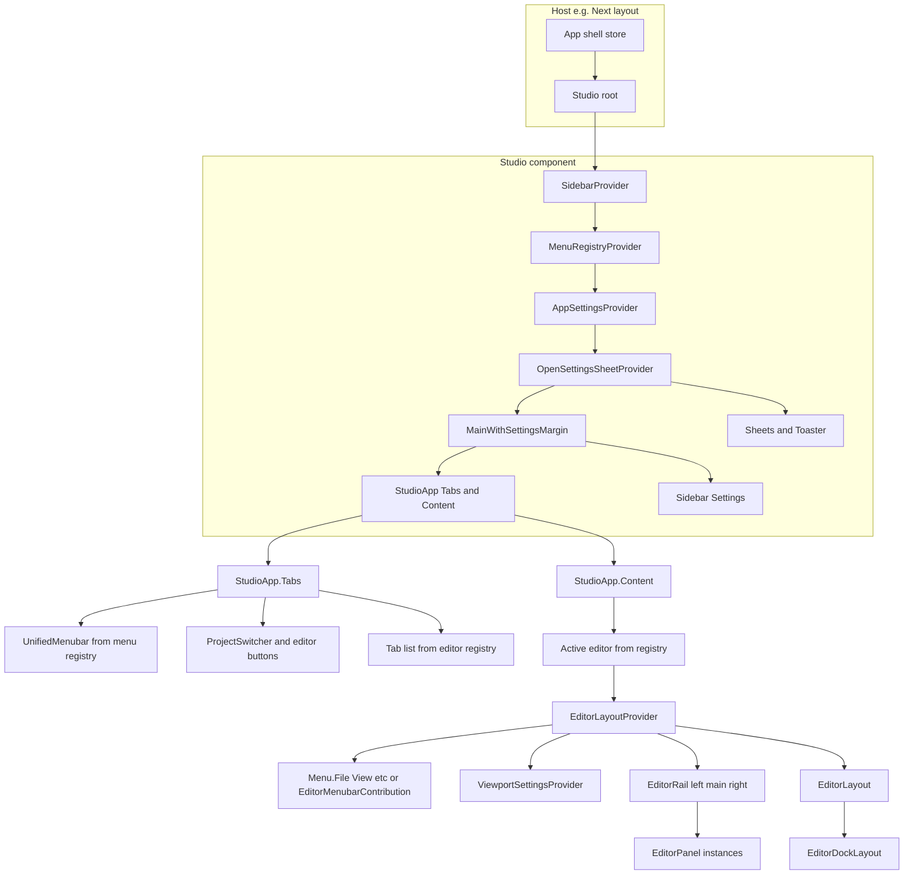

# Studio and unified registry refactor

## Goals

- **Single Studio entrypoint**: Import `Studio` and get layout, sidebar, all providers, tabs, and content. No host-owned SidebarProvider or menubar/settings providers.
- **Consistent registry pattern**: Menus, settings, panels, and editors use the same mental model: **place components in the tree under a scope provider; they register on mount and unregister on unmount**; consumers (menubar, settings sidebar, dock layout) read from registries and filter by **scope** and **context** (and optional **target** for shared controls).
- **Opinionated data flow**: The host (or Studio root) owns **canonical state** (route, activeProjectId, settings sidebar open, etc.); Studio and editors consume it via one path (store or StudioContext). No duplicate sources of truth.
- **Rails stay declarative**: Editor rails remain "place `EditorRail` + `EditorPanel` and they register"; align naming and scope so the same pattern applies to menus and any nested menubar/toolbar (target: `studio-menubar` vs `panel-toolbar`).
- **Rename for clarity**: "Studio" is the concept and the component (replace EditorApp as the semantic root); "App" naming for host-level pieces becomes "Studio" where it denotes the host that editors register with.

---

## Current state (brief)


| Area         | Current mechanism                                                                                                                                                                                                                                                                                                                                                                     | Scope/key                                                                                   | Consumer                                                                                                                                                |
| ------------ | ------------------------------------------------------------------------------------------------------------------------------------------------------------------------------------------------------------------------------------------------------------------------------------------------------------------------------------------------------------------------------------- | ------------------------------------------------------------------------------------------- | ------------------------------------------------------------------------------------------------------------------------------------------------------- |
| **Panels**   | [EditorRail](packages/shared/src/shared/components/editor/EditorRail.tsx) + [EditorPanel](packages/shared/src/shared/components/editor/EditorPanel.tsx) under [EditorLayoutProvider](apps/studio/components/editor-layout/EditorLayoutProvider.tsx); effect calls `setRailPanels(editorId, side, descriptors)`                                                                        | editorId, side                                                                              | [EditorLayout](apps/studio/components/editor-layout/EditorLayout.tsx) → [EditorDockLayout](packages/shared/src/shared/components/editor/DockLayout.tsx) |
| **Settings** | [SettingsSection](apps/studio/components/settings/SettingsSection.tsx) / [SettingsField](apps/studio/components/settings/SettingsField.tsx) under [AppSettingsProvider](apps/studio/components/settings/AppSettingsProvider.tsx) or [ViewportSettingsProvider](apps/studio/components/settings/ViewportSettingsProvider.tsx); effect calls `registerSection(scope, scopeId, section)` | scope + scopeId ([settings-registry](apps/studio/lib/editor-registry/settings-registry.ts)) | [AppSettingsPanelContent](apps/studio/components/settings/AppSettingsPanelContent.tsx) (merge registry + static)                                        |
| **Menus**    | [EditorMenubarContribution](apps/studio/components/editor-layout/EditorMenubarContribution.tsx) + [EditorMenubarMenuSlot](apps/studio/components/editor-layout/EditorMenubarContribution.tsx) build array and call `setEditorMenus(menus)` via [AppMenubarContext](apps/studio/lib/contexts/AppMenubarContext.tsx)                                                                    | Implicit: only active editor (replace entire array on mount/unmount)                        | [UnifiedMenubar](apps/studio/components/AppShell.tsx) in AppShell                                                                                       |
| **Editors**  | Hardcoded: [EDITOR_IDS](apps/studio/lib/app-shell/store.ts), [EDITOR_LABELS](apps/studio/lib/app-shell/editor-metadata.ts); [AppShell](apps/studio/components/AppShell.tsx) imports DialogueEditor/CharacterEditor and switches on `activeWorkspaceId`                                                                                                                                | None (constant list)                                                                        | AppShell tabs + content                                                                                                                                 |


Panel and settings use a **store-backed registry** (Zustand); menus use **React state** in context (single "current editor menus" array). Editors have no registry.

---

## Unified registry design

### Scope and context

- **Scope**: `app` | `editor` | `viewport` | `panel`. Determines "who" the contribution belongs to.
- **Context**: `{ editorId?, viewportId?, panelId? }`. Resolved from the provider tree (e.g. EditorLayoutProvider sets editorId; ViewportSettingsProvider sets editorId + viewportId).
- **Target** (optional): e.g. `studio-menubar` | `panel-toolbar`. Allows one contribution to appear in multiple consumers (main Studio bar and a nested panel bar).

Consumers (menubar, settings sidebar, dock, panel toolbar) **subscribe to the registry** and **filter** by current context and target. Example: Studio menubar shows items with `scope in [app, editor]` and `context.editorId === activeEditorId` (and target includes `studio-menubar` or unset).

### Descriptor shape (conceptual)

Each registry entry is keyed and has:

- **Id** (stable)
- **Scope** + **context** (and optional **target** for menus/toolbars)
- **Payload**: menu (menuId, label, items), section (title, fields), panel (id, title, iconKey, content), editor (id, label, icon, component)

Registries can stay in Zustand (like panel and settings today) for reactivity and so multiple consumers can subscribe. Menus would move from "single array in context" to a **menu registry store** keyed by scope+context (and optionally target), with merge semantics for app + current editor + current viewport.

---

## Component structure after refactor

### 1. Studio as single entrypoint

**Location**: New component in shared or in `apps/studio` that is the **only** public root for "the Studio app." If in shared, it lives under `packages/shared/src/shared/components/studio/` (or `app/` renamed to `studio/`); if Studio-specific (store, Copilot, etc.), it lives in `apps/studio/components/Studio.tsx` (or `StudioApp.tsx`).

**Behavior**:

- Renders **all** providers that today are in AppShell: SidebarProvider, menubar provider (or menu registry provider), settings provider, OpenSettingsSheetProvider, and any store subscription at the top.
- Renders **layout**: main area (with margin for Settings sidebar) + right Settings sidebar (Sidebar, SidebarHeader, SidebarContent, Settings consumer).
- Renders **editor chrome**: tabs row (menubar slot + actions slot + tab list from **editor registry**) + content area (active editor from registry).
- Renders **sheets and toaster** (CreateListingSheet, AppSettingsSheet, Toaster) inside its tree.
- **Does not** accept host-owned SidebarProvider or menubar wrapper; it owns them. The host only renders `<Studio />` (and optionally passes a store ref or config if we need injectable canonical state).

**Host (e.g. Next layout)** after refactor:

- Renders `<Studio />` and possibly framework-level providers (QueryClient, Auth, Theme). No `AppShell` that composes 5+ providers; either AppShell becomes a thin wrapper that only renders `<Studio />`, or the layout renders `<Studio />` directly.

### 2. Provider hierarchy and naming

**Rename for clarity** (conceptual; can be done incrementally):

- **EditorApp** → **StudioApp** (or **Studio** compound: `Studio.Tabs`, `Studio.Content`). This is the "tabs + content" shell; it lives **inside** the new Studio root and is fed by registries.
- **AppMenubarProvider** → **StudioMenubarProvider** (or keep one provider that backs a **menu registry** and rename to **MenuRegistryProvider**).
- **AppSettingsProvider** / **AppSettingsPanelContent** → **StudioSettingsProvider** / **StudioSettingsPanelContent** (or keep "Settings" and only rename the concept to "Studio's settings" in docs). Same for **OpenSettingsSheetProvider** if it becomes **StudioOpenSettingsSheetProvider**.

**Provider order** (inside Studio root):

1. Store (Zustand) or StudioContext that provides canonical state (route, activeProjectId, setters). If store is global, no wrapper; otherwise StudioProvider.
2. OpenSettingsSheetProvider (or Studio equivalent).
3. MenuRegistryProvider (or StudioMenubarProvider) — provides menu registry + current context.
4. SettingsRegistryProvider — already exists via AppSettingsProvider + ViewportSettingsProvider; keep scope-based registration.
5. SidebarProvider (for Settings sidebar).
6. Layout: MainWithSettingsMargin + StudioApp (tabs + content) and Sidebar (settings).
7. AppSettingsProvider wrapping the tree so SettingsSection anywhere can register (app scope); editors wrap their viewport-specific sections in ViewportSettingsProvider.

Panel registry is already keyed by editorId and does not need to sit "under" Studio; it is consumed by EditorLayout which is inside each editor. So: **Studio** wraps everything that is "host" level; **each editor** still mounts EditorLayoutProvider and EditorRail/EditorPanel (they register per editorId).

### 3. Editor registry

**New store**: e.g. `apps/studio/lib/editor-registry/editor-registry.ts` (Zustand) or a context that holds `EditorDescriptor[]` with `{ id, label, summary?, icon?, component, order? }`.

**Registration**: Either (A) a **static manifest** (array of descriptors) that Studio reads at startup and that lists id, label, icon, component (lazy or direct), or (B) editors **register on mount** via a provider (e.g. when an editor component mounts, it calls `registerEditor(descriptor)` and unregisters on unmount). Option (A) is simpler for tabs (no need to mount all editors to show tabs); option (B) aligns with panels/settings. Hybrid: **manifest** for tab labels/icons and default order; **optional runtime registration** for dynamic editors. For this plan, **manifest** is enough: one place (e.g. `apps/studio/lib/editor-registry/editor-manifest.ts`) that imports DialogueEditor and CharacterEditor and exports `EDITOR_REGISTRY` or `getEditorRegistry()`. Studio reads it and builds tabs + content from it. Route state (activeWorkspaceId, openWorkspaceIds) stays in the existing app-shell store; Studio and Copilot actions use the store and the manifest (so EDITOR_IDS can be derived from the manifest).

**Consumption**: StudioApp.Tabs maps over `openWorkspaceIds` (from store) and for each id looks up label/icon in the manifest. StudioApp.Content resolves `activeWorkspaceId` to a component from the manifest and renders it. No more hardcoded `activeWorkspaceId === 'dialogue' && <DialogueEditor />` in the host.

**Files to add/change**:

- Add [apps/studio/lib/editor-registry/editor-manifest.ts](apps/studio/lib/editor-registry/editor-manifest.ts) (or editor-registry.ts with a store): list of `{ id, label, summary?, icon, component }`. Export `getEditors()` or `useEditorRegistry()`.
- [apps/studio/components/AppShell.tsx](apps/studio/components/AppShell.tsx): Remove direct imports of DialogueEditor and CharacterEditor. Either AppShell becomes a thin wrapper that renders `<Studio />`, or the new Studio component (see below) is rendered here and it imports the manifest and renders tabs/content from it.
- [apps/studio/lib/app-shell/store.ts](apps/studio/lib/app-shell/store.ts): Keep EDITOR_IDS for persistence/migration (derive from manifest) or replace with a getter that reads from the manifest. Copilot actions and labels use the manifest so a single source of truth.

### 4. Menu registry (tree-based, like settings)

**Goal**: Menu items register by **being in the tree** under a scope provider (e.g. under EditorLayoutProvider for editor scope). No more "editor builds an array and calls setEditorMenus"; instead, **menu components** (e.g. `Menu.File`, `Menu.Item`, `Menu.View`) mount under a provider and call `registerMenuItem(scope, context, menuId, item)` (or register a whole menu). The Studio menubar (and any panel menubar) **subscribes to the menu registry** and merges by scope + context + target.

**New pieces**:

- **Menu registry store** ([apps/studio/lib/editor-registry/menu-registry.ts](apps/studio/lib/editor-registry/menu-registry.ts)): Zustand store with `entries: MenuEntry[]` where each entry has `scope`, `context`, `target?`, `menuId` (e.g. 'file', 'view'), `items: EditorMenubarItem[]`. `registerMenu(scope, context, target, menuId, items)` and `unregisterMenu(scope, context, menuId)` (or key by scope+context+menuId).
- **MenuRegistrationContext**: Provides `scope` and `context` (and optional `target`) from the provider tree (e.g. under EditorLayoutProvider we have editorId; under a hypothetical PanelMenubarProvider we have panelId and target 'panel-toolbar').
- **Menu components**: e.g. `Menu.File`, `Menu.Item`, `Menu.View` (or `StudioMenu.File`, etc.) that read context and call `registerMenu` in an effect with the current scope/context/target and the menu id and items. Children can be `Menu.Item` elements that contribute to the same menu. So the editor tree would look like:
  ```tsx
  <MenuRegistrationProvider scope="editor" context={{ editorId: 'dialogue' }} target="studio-menubar">
    <Menu.File>
      <Menu.Item id="save" label="Save" onSelect={...} />
      ...
    </Menu.File>
    <Menu.View>
      <Menu.Item id="layout" ... />
      ...
    </Menu.View>
  </MenuRegistrationProvider>
  ```
  Each `Menu.File` / `Menu.View` registers its collected items for that menuId; on unmount it unregisters. The Studio menubar then calls `useMenuRegistry('studio-menubar', activeEditorId)` and gets merged menus for app + that editor.
- **App-level (shared) menus**: Settings, Help (Welcome, About), and optionally File (Switch project) stay as **app-scoped** contributions. They can be registered by a single "Studio chrome" component that mounts under a scope=app provider, so the Studio menubar merges app + editor menus.

**Consumption**: UnifiedMenubar (or StudioMenubar) reads from the menu registry: get entries for scope=app and scope=editor with context.editorId=activeWorkspaceId, target includes 'studio-menubar'; merge by menuId (file, view, ...); render EditorMenubar with the merged result. So "we find specific components in the downward tree and put them in the spaces we think" — the components are Menu.File, Menu.View, etc., and they register; the bar is a consumer.

**Backward compatibility**: EditorMenubarContribution + EditorMenubarMenuSlot can remain as a **compatibility layer** that builds the same structure and calls `registerMenu(scope, context, 'studio-menubar', menuId, items)` so existing editors do not break until they migrate to Menu.* components.

### 5. Editor rails (panels) — more declaration, same pattern

**Current**: EditorRail + EditorPanel are already declarative: you place them under EditorLayoutProvider; EditorRail extracts descriptors from EditorPanel children and calls setRailPanels(side, descriptors). EditorLayout (Studio) consumes the panel registry and renders EditorDockLayout. Visibility is filtered by `panel.visible.{editorId}-{panelId}`.

**Refactor**:

- **Keep** EditorRail and EditorPanel as the primary API. No change to the registration contract.
- **Optional**: Introduce a single **Rail** (or **EditorLayout.Rail**) compound that takes `side` and accepts **only** panel children, so the structure is even more declarative, e.g. `<EditorLayout.Rail side="right"><EditorPanel id="inspector" ... /><EditorPanel id="chat" ... /></EditorLayout.Rail>`. This is syntactic sugar; under the hood it still uses EditorRail + EditorPanel or a single component that does both (one Rail that registers all children for that side). So "we are just placing components and registering them" is already true; we can make it more uniform by having one Rail component per side that accepts Panel children and registers them in one place.
- **Scope/context**: Panel registry is already keyed by editorId (from EditorLayoutProvider). So scope is implicit (editor) and context is editorId. No change needed unless we add panel-level scope (e.g. a panel that has its own sub-panels); that can be a later extension.
- **Dynamic behavior**: Layout persistence (dockLayouts), visibility toggles (View menu), and reset/restore already work. "All our dynamic stuff still with more declaration" is satisfied by keeping the same registry and visibility keys and only ensuring that every rail is declared with EditorRail + EditorPanel (no ad-hoc left/main/right nodes). Dialogue and Character already do this; no structural change required beyond the optional Rail compound.

**Files**: [EditorRail](packages/shared/src/shared/components/editor/EditorRail.tsx), [EditorPanel](packages/shared/src/shared/components/editor/EditorPanel.tsx), [EditorLayoutProvider](apps/studio/components/editor-layout/EditorLayoutProvider.tsx), [EditorLayout](apps/studio/components/editor-layout/EditorLayout.tsx), [panel-registry](apps/studio/lib/editor-registry/panel-registry.ts) — keep as-is or add a small EditorLayout.Rail wrapper in Studio that delegates to EditorRail.

### 6. Settings registry — align scope and naming

Settings already use a registry with scope (app, project, editor, viewport) and scopeId. Keep that. Only ensure:

- **Studio** wraps the tree with the **app** scope provider (today AppSettingsProvider). So when someone imports Studio, settings registration for app scope is available.
- **ViewportSettingsProvider** stays; editors wrap viewport-specific sections with it. So we have consistent scope (app | editor | viewport) and context (scopeId). No structural change; only ensure the provider that sets scope=app is inside Studio so the consumer does not need to provide it.

### 7. Other places for the same pattern

- **Overlays**: Today overlays are a list (`OverlaySpec[]`) passed to EditorOverlaySurface. Optionally, an **overlay registry** keyed by scope (editor) + context (editorId) could let components register overlay specs (id, type, title, size, render) on mount and unregister on unmount. The editor would then not need to hold overlays in state; a component like `<Overlay id="create-node" type="modal" title="Create node" render={...} />` under EditorLayoutProvider would register it. Consumer: EditorOverlaySurface would read from the registry for the current editorId. This is a natural extension; can be Phase 2.
- **Status bar**: Today each editor renders EditorStatusBar with fixed content. Could become **status bar contributions** (e.g. `<StatusBar.Item>...</StatusBar.Item>`) that register by scope; the shell would render a single StatusBar that shows merged items for the active editor. Phase 2.
- **Copilot actions**: Today AppShell registers switchEditor, openEditor, closeEditor, generateImage, structuredOutput via useCopilotAction. These could be **action contributions** that register with a scope (app) so that any module can add actions without AppShell knowing. Phase 2.
- **Tool UI / tool panels**: If we have tool panels that should appear in multiple places, they could follow the same pattern (register with scope + target). Phase 2.

Plan scope: **Phase 1** = Studio component, editor registry (manifest), menu registry (tree-based), provider hierarchy and naming; **rails** = keep current + optional Rail compound. Phase 2 = overlays, status bar, Copilot actions as registries.

---

## Data flow: canonical data from the host

- **Store** (app-shell): Remains the single source of truth for route (`activeWorkspaceId`, `openWorkspaceIds`), `activeProjectId`, `settingsSidebarOpen`, `settingsViewportId`, `requestOpenSettings`, `appSettingsSheetOpen`, `dockLayouts`, etc. It is the **canonical** state.
- **Studio** (the component): Does **not** own this state. It **subscribes** to the store (useEditorStore) and passes down or exposes via a small **StudioContext** (e.g. activeProjectId, activeEditorId, setActiveWorkspace, openWorkspace, closeWorkspace, setRequestOpenSettings) so that editors and internal chrome (tabs, menubar) only read from one place.
- **Editors**: Consume canonical data from the store (or from StudioContext if we add it). They do not set route or project; they call store actions (setActiveWorkspace, setRequestOpenSettings, etc.) or context callbacks. So "the host gives canonical data" = the store is the host, and Studio + editors are consumers.

If the host is a different framework (e.g. not Next), the host can create the store and render `<Studio store={store} />` so that Studio receives the store as a prop and uses it instead of the global singleton. That keeps the contract clear: **one store (or context) = canonical data**.

---

## Detailed component tree (after refactor)




---

## File and module map (detailed)

### New or renamed (Studio and registries)


| Path                                                                                                                         | Purpose                                                                                                                                                      |
| ---------------------------------------------------------------------------------------------------------------------------- | ------------------------------------------------------------------------------------------------------------------------------------------------------------ |
| `apps/studio/components/Studio.tsx` (or `StudioApp.tsx`)                                                                     | Single root component: all providers, layout, Sidebar, StudioApp (tabs + content), sheets, toaster. Exported as default or `Studio`.                         |
| `apps/studio/lib/editor-registry/editor-manifest.ts`                                                                         | Export `EDITOR_MANIFEST` or `getEditors()`: array of `{ id, label, summary?, icon, component }`. Imports DialogueEditor, CharacterEditor.                    |
| `apps/studio/lib/editor-registry/menu-registry.ts`                                                                           | Zustand store: menu entries by scope, context, target, menuId. `registerMenu`, `unregisterMenu`, `useMenuRegistry(target, context)`.                         |
| `apps/studio/lib/contexts/MenuRegistrationContext.tsx`                                                                       | Provider that sets scope + context (and optional target) for menu contributions. Used under EditorLayoutProvider and optionally for app-level menu provider. |
| `packages/shared/src/shared/components/studio/` (optional)                                                                   | If Studio root lives in shared: Studio.tsx, Studio.Tabs, Studio.Content. Otherwise all in apps/studio.                                                       |
| `packages/shared/src/shared/components/app/EditorApp.tsx` → rename to `StudioApp.tsx` (or keep path but export as StudioApp) | Tabs + Content compound; used inside Studio root.                                                                                                            |


### Modified (existing)


| Path                                                                                                                                     | Change                                                                                                                                                                                                                                                                                         |
| ---------------------------------------------------------------------------------------------------------------------------------------- | ---------------------------------------------------------------------------------------------------------------------------------------------------------------------------------------------------------------------------------------------------------------------------------------------- |
| [apps/studio/components/AppShell.tsx](apps/studio/components/AppShell.tsx)                                                               | Becomes thin: render `<Studio />` only (or inline Studio’s tree here once and then extract to Studio.tsx). Remove direct imports of DialogueEditor, CharacterEditor. Remove manual provider list from host; Studio owns them.                                                                  |
| [apps/studio/lib/app-shell/store.ts](apps/studio/lib/app-shell/store.ts)                                                                 | Keep store; optionally derive EDITOR_IDS from editor manifest (getEditors().map(e => e.id)) for persistence/migration.                                                                                                                                                                         |
| [apps/studio/lib/app-shell/editor-metadata.ts](apps/studio/lib/app-shell/editor-metadata.ts)                                             | Can become redundant if manifest holds label/summary/viewportId; otherwise keep for non-Studio consumers or derive from manifest.                                                                                                                                                              |
| [apps/studio/lib/contexts/AppMenubarContext.tsx](apps/studio/lib/contexts/AppMenubarContext.tsx)                                         | Replace with or back with menu registry: either (1) UnifiedMenubar reads from menu registry and merges by scope+context, or (2) keep context as a cache of "current merged menus" that is updated by a subscriber to the menu registry. Rename to StudioMenubarContext or MenuRegistryContext. |
| [apps/studio/components/editor-layout/EditorMenubarContribution.tsx](apps/studio/components/editor-layout/EditorMenubarContribution.tsx) | Keep; have it call menu registry’s registerMenu with scope=editor, context from usePanelRegistration(), target='studio-menubar', so existing editors work without changing to Menu.* components.                                                                                               |
| [apps/studio/components/settings/AppSettingsProvider.tsx](apps/studio/components/settings/AppSettingsProvider.tsx)                       | Move under Studio (Studio renders it). Optionally rename to StudioSettingsProvider.                                                                                                                                                                                                            |
| [packages/shared/src/shared/components/app/EditorApp.tsx](packages/shared/src/shared/components/app/EditorApp.tsx)                       | Rename export to StudioApp (or add alias). Compound: StudioApp.Tabs, StudioApp.Content, StudioApp.Tab. Used only inside Studio.                                                                                                                                                                |
| [packages/shared/src/shared/components/editor/EditorRail.tsx](packages/shared/src/shared/components/editor/EditorRail.tsx)               | No change. Optional: add Studio-side wrapper EditorLayout.Rail that renders EditorRail with same props.                                                                                                                                                                                        |
| [packages/shared/src/shared/components/editor/README.md](packages/shared/src/shared/components/editor/README.md)                         | Update: Studio as single entrypoint; menu registry; editor registry; rails unchanged.                                                                                                                                                                                                          |


### Unchanged in behavior (only placement)

- [EditorLayoutProvider](apps/studio/components/editor-layout/EditorLayoutProvider.tsx), [EditorLayout](apps/studio/components/editor-layout/EditorLayout.tsx), [panel-registry](apps/studio/lib/editor-registry/panel-registry.ts), [settings-registry](apps/studio/lib/editor-registry/settings-registry.ts), [SettingsSection](apps/studio/components/settings/SettingsSection.tsx), [ViewportSettingsProvider](apps/studio/components/settings/ViewportSettingsProvider.tsx), [EditorRail](packages/shared/src/shared/components/editor/EditorRail.tsx), [EditorPanel](packages/shared/src/shared/components/editor/EditorPanel.tsx), [DockLayout](packages/shared/src/shared/components/editor/DockLayout.tsx). They live inside Studio and inside each editor as they do today.

---

## Migration path (slices)

1. **Slice 1 — Editor registry (manifest)**
  Add editor manifest; Studio (or AppShell) builds tabs and content from manifest; remove hardcoded switch and direct editor imports from AppShell. Keep store and EDITOR_IDS for now (derive or keep in sync).
2. **Slice 2 — Studio root component**
  Extract from AppShell a new `Studio` component that contains all providers (Sidebar, Menubar, Settings, OpenSettingsSheet) and layout (MainWithSettingsMargin, StudioApp, Sidebar, sheets). AppShell becomes a thin wrapper that renders `<Studio />`. No renames yet.
3. **Slice 3 — Menu registry**
  Add menu registry store and MenuRegistrationContext; EditorMenubarContribution writes to the registry (scope=editor, context=editorId, target=studio-menubar); UnifiedMenubar reads from the registry and merges with app-level items (Settings, Help). Deprecate or keep setEditorMenus in context as a cache updated by registry. Add optional Menu.* components (Menu.File, Menu.Item, Menu.View) that register directly; migrate one editor to them as a pilot.
4. **Slice 4 — Naming**
  Rename EditorApp → StudioApp (export and usages). Rename AppMenubarProvider/Context to StudioMenubarProvider/Context (or MenuRegistryProvider). Rename AppSettingsProvider to StudioSettingsProvider in docs and optionally in code. Update README and AGENTS.
5. **Slice 5 — Rails and docs**
  Optional: add EditorLayout.Rail(side) wrapper. Document that rails are "place EditorRail + EditorPanel and they register"; align shared README and decisions.md with the full registry picture. Add decisions.md ADR for "Studio as single entrypoint and unified registry pattern."
6. **Slice 6 — Phase 2 (later)**
  Overlay registry, status bar contributions, Copilot action registration — same pattern, separate initiative.

---

## Doc and agent artifact updates

- [docs/agent-artifacts/core/decisions.md](docs/agent-artifacts/core/decisions.md): Add ADR "Studio as single entrypoint" and "Unified registry pattern (menus, settings, panels, editors)." Update "Shared panel content and editor-scoped contributions" to reference Studio and menu registry.
- [docs/agent-artifacts/core/STATUS.md](docs/agent-artifacts/core/STATUS.md): After each slice, add Ralph Wiggum Done line; update "App shell" bullet to "Studio" and describe single component + registries.
- [docs/agent-artifacts/core/task-registry.md](docs/agent-artifacts/core/task-registry.md): Mark or split `editor-registration-declarative`; add initiative for "Studio and unified registry (menus, editor manifest, naming)."
- [packages/shared/src/shared/components/editor/README.md](packages/shared/src/shared/components/editor/README.md): Studio entrypoint; menu and editor registries; rails unchanged; link to decisions.
- [AGENTS.md](AGENTS.md): Update "Unified editor (App Shell)" to "Studio and registries"; state that Studio is the single root and editors/panels/menus/settings register with it.

---

## Behavior summary


| Concern                             | Before                                   | After                                                                                                          |
| ----------------------------------- | ---------------------------------------- | -------------------------------------------------------------------------------------------------------------- |
| Who mounts providers?               | Host (AppShell)                          | Studio component (host only mounts Studio)                                                                     |
| Who defines editors?                | EDITOR_IDS + AppShell switch             | Editor manifest; Studio reads it for tabs and content                                                          |
| How do menus get to the bar?        | Editor calls setEditorMenus(array)       | Menu registry; Menu.* or EditorMenubarContribution register; bar subscribes and merges by scope/context/target |
| How do settings get to the sidebar? | SettingsSection under provider registers | Unchanged; provider is inside Studio                                                                           |
| How do panels get to the layout?    | EditorRail + EditorPanel register        | Unchanged; optional Rail wrapper                                                                               |
| Canonical data?                     | Store in AppShell                        | Store; Studio and editors consume it (no duplicate state)                                                      |
| Naming                              | EditorApp, AppMenubar, AppSettings       | StudioApp, StudioMenubar/MenuRegistry, StudioSettings (or keep Settings name)                                  |


This gives a single Studio component, a consistent registry pattern across menus, settings, panels, and editors, opinionated data flow from the host/store, and rails that remain declarative with optional extra structure for clarity.


for editor registry
3. Editor registry

New store: e.g. apps/studio/lib/editor-registry/editor-registry.ts (Zustand) or a context that holds EditorDescriptor[] with { id, label, summary?, icon?, component, order? }.

im not sure we need  manifest.  like the tabs and ordering and all that stuff should be registered.  like they have defaults because their components and can declare them on the component.  we just need to register things apprpriately.  so default is how they are composed int he code, then at run time we can get saved layouts in local storage and etc.  we can dynamically do things cause they are in the regsitry.  our defaults should be defined in the components themselves fpr the most part.