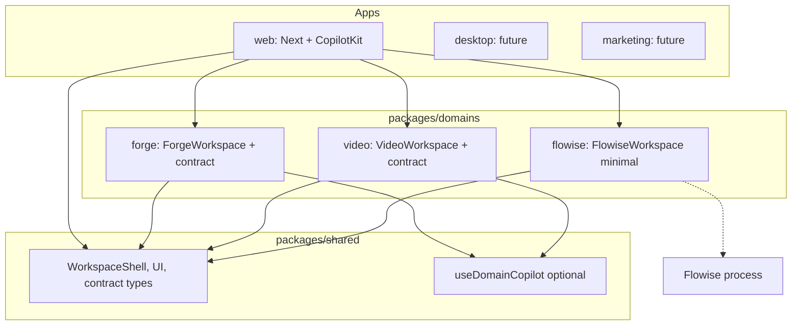

# Revised: Apps-first monorepo, domains, Flowise (minimal), CopilotKit per-workspace

## Why the previous structure was unsound

- **Single app assumption**: One `apps/web` made it seem like the whole product is "the web app." You want **multiple apps** (web, desktop, marketing); not everything is under one roof.
- **CopilotKit-centric**: Packaging suggested everything revolves around CopilotKit. In reality: **CopilotKit is one integration** that some apps (e.g. web) use to give workspaces sophisticated agents; other apps (e.g. marketing) may not use it at all.
- **Flowise over-scoped**: "AgentWorkspace" as a first-class workspace suggested Flowise is the main agent runtime. Your intent: **Flowise is the quickest path to help build agents** for workspaces; workspaces get **sophisticated agents via CopilotKit**. Flowise = authoring/helper; CopilotKit = runtime for workspace agents.
- **Naming**: "workspace-react-flow" / "workspace-video" / "workspace-agent" mixed UI and domain. Clearer: **domains** (forge, video, flowise) as the unit; each domain can expose a workspace component and a CopilotKit contract.

---

## 1. Design principles (from your constraints)

1. **Apps are first-class**: web, desktop, marketing (future). Each app is a deployable product; it chooses what to depend on (shared, domains, integrations).
2. **Shared is neutral**: Shell (WorkspaceShell, layout, toolbar, header), shared UI (design system), and **contract types** (domain contract interface). No app-specific or CopilotKit-specific logic required to use shared. CopilotKit integration (useDomainCopilot, provider) can live in shared as an **optional** layer that apps that want agents pull in, or in a separate integration package.
3. **Workspaces own sophisticated agents via CopilotKit**: Each workspace (Forge, Video, etc.) registers context, actions, and suggestions with CopilotKit when active. The **domain** (forge, video) owns its contract; the app provides the CopilotKit provider and mounts the workspace.
4. **Flowise = minimal, for building agents**: Run Flowise (e.g. `npx flowise start`). Use it to design flows that inform or proxy into CopilotKit domain actions. One lightweight workspace or dev panel to embed/call Flowise — not the center of the architecture. Quickest path: run it, embed or API, no heavy coupling.
5. **Careful organization**: So that (a) adding desktop or marketing doesn’t force CopilotKit on them, (b) each workspace can evolve its CopilotKit contract independently, (c) Flowise stays optional and simple.

---

## 2. Revised monorepo structure (apps-first, domains, integrations)

```
forge-agent/
├── pnpm-workspace.yaml
├── turbo.json
├── package.json
├── apps/
│   ├── web/                     # Next.js; uses shared + domains (forge, video, flowise) + CopilotKit
│   ├── desktop/                  # Future: Electron/Tauri; may use shared + subset of domains
│   └── marketing/                # Future: static/simple site; may use shared only, no CopilotKit
├── packages/
│   ├── shared/                  # Shell + UI + domain contract interface (no app/CopilotKit assumption)
│   │   └── src/
│   │       ├── components/      # app/, workspace/
│   │       ├── styles/
│   │       ├── workspace/       # capabilities, selection, overlays (contracts)
│   │       └── copilot/         # contract types + useDomainCopilot (optional integration)
│   ├── domains/
│   │   ├── forge/              # Graph editor workspace, React Flow, forge types + CopilotKit contract
│   │   ├── video/              # Video workspace, Twick, video types + CopilotKit contract
│   │   └── flowise/             # Minimal: embed or API client for building agents (no heavy deps)
│   └── integrations/
│       └── copilotkit/          # Optional: provider, route adapter, agent config (if we split out)
├── tooling/
└── docs/
```

**Differences from before**:

- **apps/** has three slots: web, desktop, marketing. Web is the main app today; desktop and marketing are placeholders or minimal stubs so the structure is clear.
- **packages/domains/** not **packages/workspace-***. Each domain (forge, video, flowise) owns its workspace UI and, when applicable, its CopilotKit contract. Naming is by **domain**, not by "workspace type."
- **packages/shared**: Shell and UI are app-agnostic. Copilot types and useDomainCopilot can stay in shared so that any app (web, desktop) that wants agents can use them without a separate package; alternatively move to `packages/integrations/copilotkit` for stricter separation. Plan assumes **keep in shared for now**; document that "CopilotKit is optional; apps that don’t use it don’t mount the provider."
- **packages/domains/flowise**: Minimal. Flowise API client or embed component; no full "agent runtime" here. Purpose: help build agents (design flows in Flowise, implement behavior in CopilotKit contracts).

---

## 3. What lives where


| Layer            | Location                                    | Responsibility                                                                                                                                                                                                                                                                             |
| ---------------- | ------------------------------------------- | ------------------------------------------------------------------------------------------------------------------------------------------------------------------------------------------------------------------------------------------------------------------------------------------ |
| **Apps**         | apps/web, apps/desktop, apps/marketing      | Entrypoints, layout, routing, providers (e.g. CopilotKit in web only). Each app depends only on packages it needs.                                                                                                                                                                         |
| **Shared**       | packages/shared                             | Workspace shell (WorkspaceShell, LayoutGrid, Header, Toolbar, etc.), design system (themes, UI primitives), workspace contracts (selection, capabilities types), and optional CopilotKit integration (domain contract interface, useDomainCopilot). No dependency on which app is running. |
| **Domains**      | packages/domains/forge, video, flowise      | Domain types, stores, operations; workspace component (ForgeWorkspace, VideoWorkspace, FlowiseWorkspace); CopilotKit contract implementation (useForgeContract, useVideoContract). Forge = graph + React Flow. Video = VideoDoc + Twick. Flowise = minimal embed/API.                      |
| **Integrations** | packages/integrations/copilotkit (optional) | If we split: CopilotKit provider, API route adapter, agent config. Else: this stays in apps/web or in shared.                                                                                                                                                                              |


**Dependency rules**:

- Apps → depend on shared and on the domain packages they use (web: shared, forge, video, flowise).
- Domains → depend on shared only (and on Twick/React Flow etc. in their own package). No domain depends on another domain.
- Shared → no dependency on any app or on Flowise/CopilotKit runtime (only types and optional hooks).

---

## 4. Flowise: quickest path (minimal)

**Goal**: Use Flowise to **help build** agents for workspaces; workspaces get **sophisticated agents via CopilotKit**. Flowise is not the main runtime.

**Minimal setup**:

1. **Run Flowise**: `npm install -g flowise` (or doc it); `npx flowise start` (default port 3000). Resolve port with Next (e.g. Next on 3001, or Flowise on 3001 via `flowise start --port 3001`).
2. **One place to use it**: A small **Flowise workspace** (or a "Dev" / "Agent builder" panel in the web app) that either:
  - **Embed**: Use `flowise-embed` or iframe to Flowise UI so you can design and test flows in the browser, or
  - **API**: Call Flowise REST (e.g. list chatflows, `POST /api/v1/prediction`) from a simple UI to run a flow and see responses.
3. **No heavy coupling**: No requirement that every workspace goes through Flowise. Domain contracts (forge, video) are implemented with CopilotKit (context, actions, suggestions); Flowise is for authoring and experimentation. When a flow in Flowise is useful, you implement or proxy that behavior in the domain’s CopilotKit contract.

**Package** `packages/domains/flowise`:

- Minimal surface: `FlowiseWorkspace` (shell + embed or simple chat UI), `useFlowiseApi` (list chatflows, create prediction). Optional dependency on `flowise-embed` or just `fetch` to Flowise API. Depends only on shared.

**Dev script**: Root or apps/web can have `dev:all` that runs Next + Flowise (e.g. `concurrently "pnpm --filter web dev" "flowise start"`) so that with one command you have both. Document in README.

---

## 5. CopilotKit: per-workspace agents (not "under" CopilotKit)

- **App (e.g. web)** wraps the tree in `CopilotKitProvider` and exposes the CopilotKit API route. Only apps that want agents do this; marketing app does not.
- **Shell** (in app): Registers shell-level context and actions (activeWorkspaceId, switchWorkspace, openWorkspace, closeWorkspace) via useCopilotReadable / useCopilotAction.
- **Each workspace** (Forge, Video): When mounted, registers its **domain contract** via useDomainCopilot(forgeContract) / useVideoContract. So Forge workspace has sophisticated graph-editing agents; Video workspace has timeline/editing agents. Flowise workspace does not need to register a CopilotKit contract unless we want it to (e.g. "run Flowise flow" as an action).
- **Agent sophistication** lives in the **domain contract** (context, actions, suggestions), not in a single "agent workspace." Flowise helps you build those contracts; CopilotKit runs them.

---

## 6. Domain separation (unchanged from prior plan)

- **Remove** graph→timeline conversion (`lib/forge-to-timeline.ts`). Forge domain owns graph + sequence (e.g. graphToSequence inside forge package for its own sequence strip). Video domain owns VideoDoc/tracks/elements only.
- **Types and logic** stay in their domain packages. Shared has only contract **interfaces** (e.g. DomainCopilotContract), not domain types.
- **AI** is domain-aware: each domain implements the contract; CopilotKit can be granular (per-workspace) or high-level (shell); no shared "graph→timeline" abstraction.

---

## 7. Migration / implementation order (high level)

1. **Monorepo skeleton**: Add pnpm-workspace.yaml, turbo.json, root package.json. Create `apps/web` (move current Next app), `apps/desktop` (placeholder), `apps/marketing` (placeholder). Create `packages/shared` and move `src/shared` into it. Fix imports and build.
2. **Domains as packages**: Create `packages/domains/forge`, move ForgeWorkspace + forge domain (lib/domains/forge) + graph types and operations; depend on shared. Create `packages/domains/video`, move VideoWorkspace + video domain; add Twick when ready; depend on shared. Create `packages/domains/flowise` with minimal FlowiseWorkspace + useFlowiseApi; depend on shared.
3. **Apps depend on domains**: apps/web depends on shared, forge, video, flowise. App shell imports workspace components by id (forge, video, flowise) and renders the right one. No "workspace-react-flow" naming; use workspace id `forge` for the graph workspace.
4. **Remove graph→timeline**: Delete lib/forge-to-timeline; keep graphToSequence inside forge package; ensure video has no Forge types.
5. **Flowise minimal**: Implement FlowiseWorkspace (embed or API UI); dev script to run Flowise + Next; document in README and STATUS.
6. **Docs and agent rules**: Update AGENTS.md (apps-first, shared neutral, domains own contracts, Flowise minimal). Update STATUS.md (current state reflects monorepo and domains). Update README (setup, apps, packages, Flowise optional). Add or update docs/architecture with this structure and the "agent graphs" / CopilotKit subgraphs note.

---

## 8. AGENTS.md, STATUS, README (what to reflect)

**AGENTS.md** (root):

- Monorepo: apps (web, desktop, marketing) are first-class; packages/shared is shell + UI + optional CopilotKit integration; packages/domains/forge, video, flowise own workspace UI and CopilotKit contracts.
- When touching workspaces: use shared shell; domain logic and contract live in the domain package. Flowise is minimal (help build agents); sophisticated agents are in CopilotKit per-workspace.
- Loop: Read STATUS → AGENTS (root + shared + workspace) → one vertical slice → update STATUS and AGENTS.

**STATUS.md**:

- Current: Describe apps/web as the main app; list packages (shared, domains/forge, domains/video, domains/flowise); note that Flowise is optional and runs separately; CopilotKit is used by web app and registers per-workspace contracts.
- Next: e.g. Twick in video domain, desktop app stub, etc.

**README.md**:

- Project overview: multi-app product (web now; desktop, marketing later). Monorepo with apps/ and packages/. Workspaces (Forge, Video, Flowise) live in domain packages; each workspace can have CopilotKit agents. Flowise: optional, run with `npx flowise start` to build agents; minimal integration in flowise domain.
- Setup: pnpm install, pnpm dev (and optionally run Flowise for agent building). Link to docs/architecture.

---

## 9. Diagram (revised)




---

## 10. Summary

- **Apps first**: web, desktop, marketing; each chooses what to use.
- **Shared neutral**: Shell + UI + contract interface; CopilotKit optional.
- **Domains**: forge, video, flowise (packages by domain, not "workspace-*").
- **Sophisticated agents**: In CopilotKit, per-workspace (domain contracts).
- **Flowise**: Minimal, quick path to build agents; one small workspace or panel; run and embed or API; no heavy architecture.
- **Organization**: Clear so that not everything is under CopilotKit and so Flowise stays a helper, not the center.

