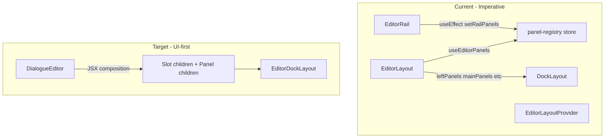

# UI-first dock layout refactor

## Goal

Replace the panel registry flow that causes "Maximum update depth exceeded" with a **UI-first declarative API**: multiple `EditorDockLayout.Panel` children per rail slot. No descriptors, no setRailPanels, no store-driven registration. Remove all `TODO: REVIEW THIS, MAX DEPTH RECURSION ISSUE` blocks and restore proper behavior.

## Architecture change




**Before:** EditorRail effect -> setRailPanels -> store -> EditorLayout subscribes -> DockLayout. Store updates cascade and cause recursion.

**After:** Parent composes `<EditorDockLayout.Left><EditorDockLayout.Panel id="left" title="Library">...</Panel></Left>`. DockLayout collects from children in render; no store, no effects for panel registration.

## Slices

### Slice 1: Add EditorDockLayout.Panel and multi-panel collection (shared)

**File:** [packages/shared/src/shared/components/editor/DockLayout.tsx](packages/shared/src/shared/components/editor/DockLayout.tsx)

1. Add `DockLayoutPanel` component: `{ id, title, icon?: React.ReactNode, children }`. Renders `null`; used only for collection. **Pass icon directly** (e.g. `icon={<BookOpen size={14} />}`), not iconKey — no SLOT_ICON_MAP.
2. Add `isDockLayoutPanelChild()` type guard.
3. Change `collectSlotsFromChildren` to support two modes per rail:
  - **Single child (not Panel):** `{ left: ReactNode }` — current behavior
  - **Multiple Panel children:** collect as `RailPanelDescriptor[]` for that rail
4. Extend `LayoutSlots` or add `leftPanelsFromSlots`, etc.: when a rail has Panel children, pass descriptors to `buildDefaultLayout`; when single node, use legacy `slots.left`, etc.
5. Wire `resolvedSlots` from collected panels (id -> content map) so SlotPanel renders correctly.

**Key logic:** In the collector, for each rail (Left, Main, Right, Bottom), iterate children. If a child is a slot component (Left, Main, etc.), look at *its* children. If they are Panel components, collect descriptors; else collect the single child as ReactNode. Handle both `<Left>{content}</Left>` and `<Left><Panel id="x">c1</Panel><Panel id="y">c2</Panel></Left>`.

### Slice 2: Restore slot content store and remove DockLayout TODO

**File:** [packages/shared/src/shared/components/editor/DockLayout.tsx](packages/shared/src/shared/components/editor/DockLayout.tsx)

1. Restore `setSlots: (slots) => set({ slots, version: Date.now() })` in `useSlotContentStore`.
2. Remove the TODO comment and the stubbed `setSlots: (slots) => set({})`.
3. Keep the existing `slotIdsKey` + `prevSlotsRef` shallow-compare guard (from rails_panel_rendering_fix) so we avoid redundant store updates. Ensure `resolvedSlots` is still derived from the new collected structure.

### Slice 3: Restore DockPanel ScrollArea and remove TODO

**File:** [packages/shared/src/shared/components/editor/DockPanel.tsx](packages/shared/src/shared/components/editor/DockPanel.tsx)

Per [errors-and-attempts](docs/agent-artifacts/core/errors-and-attempts.md): replacing Radix ScrollArea with native overflow is **forbidden**. Restore `<ScrollArea className="h-full">` and remove the TODO + native overflow workaround.

### Slice 4: Migrate DialogueEditor to slot children with Panel

**File:** [apps/studio/components/editors/DialogueEditor.tsx](apps/studio/components/editors/DialogueEditor.tsx)

1. Remove `EditorRail` and `EditorPanel` usage.
2. Replace with `EditorDockLayout` slot children:
  ```tsx
   <EditorDockLayout layoutId={DIALOGUE_LAYOUT_ID} viewport={{ viewportId, viewportType: 'react-flow' }}
     slots={{ left: { title: 'Library' }, main: { title: 'Dialogue Graphs' } }}>
     <EditorDockLayout.Left>
       <EditorDockLayout.Panel id="left" title="Library" icon={<BookOpen size={14} />}>{leftPanel}</EditorDockLayout.Panel>
     </EditorDockLayout.Left>
     <EditorDockLayout.Main>
       <EditorDockLayout.Panel id="main" title="Dialogue Graphs" icon={<LayoutDashboard size={14} />}>{mainPanel}</EditorDockLayout.Panel>
     </EditorDockLayout.Main>
     <EditorDockLayout.Right>
       <EditorDockLayout.Panel id="right" title="Inspector" icon={<ScanSearch size={14} />}>{inspectorContent}</EditorDockLayout.Panel>
       <EditorDockLayout.Panel id={CHAT_PANEL_ID} title="Chat" icon={<MessageCircle size={14} />}><DialogueAssistantPanel ... /></EditorDockLayout.Panel>
     </EditorDockLayout.Right>
   </EditorDockLayout>
  ```
3. **Skip layout persistence for now:** Omit `layoutJson`, `onLayoutChange`, `clearLayout` (or pass `undefined`). Reset layout will always rebuild default.
4. Keep `EditorLayoutProvider` wrapping only `EditorMenubarContribution` and the new `EditorDockLayout` — we need `editorId` for menus. Remove `EditorLayout` (DockLayout is rendered directly).

### Slice 5: Migrate CharacterEditor and StrategyEditor

**File:** [apps/studio/components/editors/CharacterEditor.tsx](apps/studio/components/editors/CharacterEditor.tsx)

Same pattern: replace EditorRail/EditorPanel with EditorDockLayout slot + Panel children. Skip layout persistence.

**File:** [apps/studio/components/editors/StrategyEditor.tsx](apps/studio/components/editors/StrategyEditor.tsx)

StrategyEditor uses EditorLayoutProvider but no EditorRail/EditorLayout — it has its own layout. Verify it only needs `editorId` from the provider; no changes if it does not use rails.

### Slice 6: Simplify EditorLayoutProvider and remove panel registry usage

**File:** [apps/studio/components/editor-layout/EditorLayoutProvider.tsx](apps/studio/components/editor-layout/EditorLayoutProvider.tsx)

1. Remove `usePanelRegistryStore`, `clearEditor`, `setRailPanels` from the provider.
2. Provide only `{ editorId }` via `PanelRegistrationContext` (or rename to `EditorContext`). `EditorMenubarContribution` needs `editorId`; `EditorRail` will be removed.
3. Remove the `clearEditor` / `setRailPanels` effect.

**File:** [packages/shared/src/shared/components/editor/PanelRegistrationContext.tsx](packages/shared/src/shared/components/editor/PanelRegistrationContext.tsx)

Simplify context value to `{ editorId: string }` only. `setRailPanels` no longer needed. Update `usePanelRegistration` return type.

### Slice 7: Restore EditorMenubarContribution effect and remove TODO

**File:** [apps/studio/components/editor-layout/EditorMenubarContribution.tsx](apps/studio/components/editor-layout/EditorMenubarContribution.tsx)

1. Restore the `React.useEffect` that registers/unregisters menus. The recursion was from the panel flow; menu registration should be safe once the panel registry is removed.
2. Remove the TODO comment.

### Slice 8: Deprecate/remove panel registry and EditorLayout

**Files:**

- [apps/studio/lib/editor-registry/panel-registry.ts](apps/studio/lib/editor-registry/panel-registry.ts): Restore original `setRailPanels` implementation (for any remaining consumers during transition), or remove if no consumers. `useEditorPanels` will return EMPTY_RAIL; `useEditorPanelVisibility` falls back to `EDITOR_PANEL_SPECS`.
- [apps/studio/components/editor-layout/EditorLayout.tsx](apps/studio/components/editor-layout/EditorLayout.tsx): Remove or make a thin passthrough. Editors will render `EditorDockLayout` directly.
- [packages/shared/src/shared/components/editor/EditorRail.tsx](packages/shared/src/shared/components/editor/EditorRail.tsx): Remove or deprecate. No longer used.

### Slice 9: Update useEditorPanelVisibility for registry-less flow

**File:** [apps/studio/lib/app-shell/useEditorPanelVisibility.ts](apps/studio/lib/app-shell/useEditorPanelVisibility.ts)

When `useEditorPanels` returns empty (no registry), it already falls back to `EDITOR_PANEL_SPECS`. Ensure `EDITOR_PANEL_SPECS` has correct entries for dialogue and character (left, right, chat, main). Panel visibility toggles and "Restore all panels" will use the static specs. Layout reset will call `ref.current?.resetLayout()` on the DockLayout ref; we need to pass that ref from the parent. Dialogue/Character already have `layoutRef`; wire it to the new EditorDockLayout.

**View menu panel toggles:** Visibility keys (`panel.visible.{editorId}-{panelId}`) control whether a panel is shown. For UI-first slots, we have two options: (a) Always show all panels (no filtering) — simplest; (b) DockLayout accepts optional `hiddenPanelIds` and skips building those panels. For scope control, start with (a); add filtering later if needed.

### Slice 10: Docs and agent artifacts

**Files:** STATUS.md, errors-and-attempts.md, decisions.md, packages/shared AGENTS.md, README, 18-agent-artifacts-index, editor-layout index.

1. **errors-and-attempts:** Add entry "Panel registry recursion fix": Replaced imperative EditorRail/setRailPanels/panel-registry with UI-first EditorDockLayout.Panel slot children. No store-driven registration; panels collected in render.
2. **decisions.md:** Update "Panel registry" section: panel layout is now UI-first (slot + Panel children); registry deprecated/removed for layout; useEditorPanelVisibility uses EDITOR_PANEL_SPECS fallback.
3. **README / AGENTS:** Document new API: EditorDockLayout.Left/Main/Right/Bottom with EditorDockLayout.Panel children. Remove or deprecate EditorRail/EditorPanel references.
4. **STATUS:** Ralph Wiggum Done entry for this refactor.

## Out of scope / do not do

- Replace Radix ScrollArea (forbidden per errors-and-attempts).
- Layout persistence — skip for now; always buildDefaultLayout.
- Panel visibility filtering from settings — start without; add later if needed.

### Slice 0 (DockviewSlotTab): Replace iconKey with direct icon prop

**File:** [packages/shared/src/shared/components/editor/DockviewSlotTab.tsx](packages/shared/src/shared/components/editor/DockviewSlotTab.tsx)

1. Change tab params from `{ slotId, iconKey, title }` to `{ slotId, icon?, title }` where `icon` is `React.ReactNode`.
2. Remove `SLOT_ICON_MAP` and `DockLayoutSlotIconKey`; render `params.icon` directly when present.
3. Keep a fallback (e.g. no icon or a minimal placeholder) when `icon` is omitted.

**File:** [packages/shared/src/shared/components/editor/DockLayout.tsx](packages/shared/src/shared/components/editor/DockLayout.tsx)

- Update `RailPanelDescriptor` (or equivalent) and `buildDefaultLayout` params to use `icon?: React.ReactNode` instead of `iconKey`.
- Remove `DockLayoutSlotIconKey` export if no longer used; update `DockLayoutSlotConfig` to use `icon?` where relevant.

## File summary


| File                          | Change                                                                         |
| ----------------------------- | ------------------------------------------------------------------------------ |
| DockviewSlotTab.tsx           | Replace iconKey/SLOT_ICON_MAP with params.icon (ReactNode)                     |
| DockLayout.tsx                | Add Panel (icon prop), multi-panel collection, restore setSlots, remove TODO   |
| DockPanel.tsx                 | Restore ScrollArea, remove TODO                                                |
| DialogueEditor.tsx            | Slot + Panel children, remove EditorRail/EditorLayout, skip layout persistence |
| CharacterEditor.tsx           | Same                                                                           |
| EditorLayoutProvider.tsx      | Simplify to editorId only                                                      |
| PanelRegistrationContext.tsx  | Simplify to editorId only                                                      |
| EditorMenubarContribution.tsx | Restore effect, remove TODO                                                    |
| EditorLayout.tsx              | Remove or thin passthrough                                                     |
| EditorRail.tsx                | Remove or deprecate                                                            |
| panel-registry.ts             | Restore setRailPanels or remove if no consumers                                |
| useEditorPanelVisibility.ts   | Rely on EDITOR_PANEL_SPECS fallback                                            |
| Docs                          | STATUS, errors-and-attempts, decisions, README, AGENTS                         |


