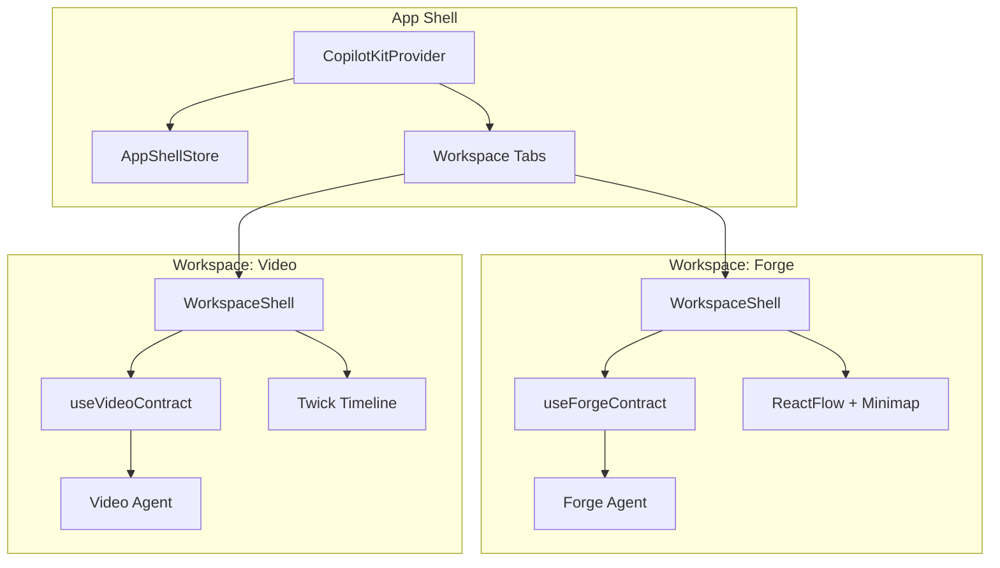
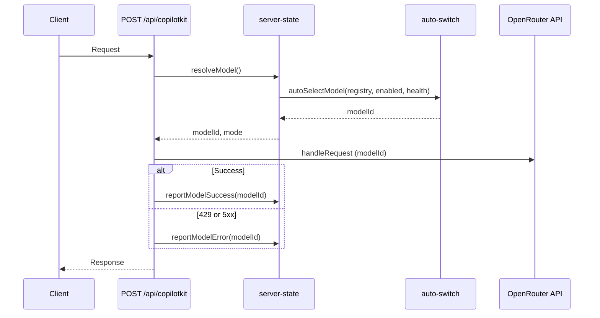
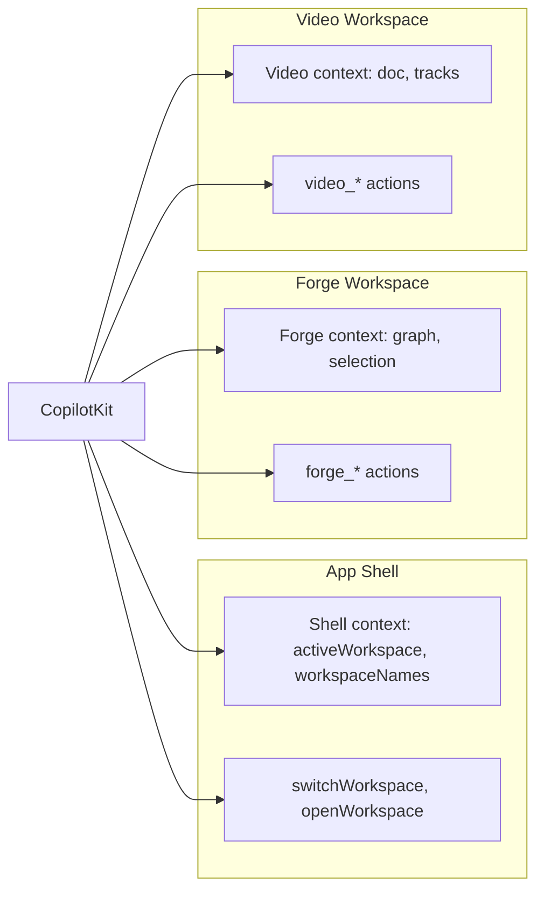

# Unified Workspace and Agent Architecture Plan

## 1. Current State Analysis

**Already in place**

- **Model routing**: [lib/model-router/](lib/model-router/) — auto-switch algorithm (cooldown, free-first sort, 429/5xx → `reportModelError`), [app/api/copilotkit/route.ts](app/api/copilotkit/route.ts) uses `resolveModel()` and reports success/error. [app/api/model-settings/route.ts](app/api/model-settings/route.ts) GET/POST. [components/model-switcher/ModelSwitcher.tsx](components/model-switcher/ModelSwitcher.tsx) has Auto/Manual, free/paid sections, health dots, enable checkboxes; positioned in Forge toolbar `WorkspaceToolbar.Right` before separator.
- **Domain Copilot contract**: [src/shared/copilot/](src/shared/copilot/) — `useDomainCopilot`, `useForgeContract`, context/actions/suggestions/highlights. Forge workspace wires one contract and uses shared WorkspaceShell.
- **Workspace UI**: [src/shared/components/workspace/](src/shared/components/workspace/) — WorkspaceShell, Header, Toolbar (Left/Center/Right + Separator), Panels, StatusBar, OverlaySurface. No App Shell; no workspace switcher.
- **Forge**: Single workspace on [app/page.tsx](app/page.tsx) (CopilotKitProvider → Workspace). No Video workspace UI yet (only [lib/domains/video/](lib/domains/video/) types, store, copilot contract).
- **OpenRouter**: [lib/openrouter-config.ts](lib/openrouter-config.ts) exposes `models.fast` / `models.reasoning` (paid defaults); CopilotKit route uses same API key/base URL but model ID comes from model-router, not from this config.

**Gaps**

- No **App Shell**: no layer above workspaces; no “unified workspace” with multiple sub-workspaces (Forge / Video) or switching.
- No **route state model**: no `WorkspaceRoute` / `AppShellRoute`, no editors/sessions, no central store (Zustand) for open workspaces, focused editor, modals.
- **Agents**: single CopilotKit instance; no per-workspace or per-editor agents; no **useCoAgent** or multiple **useAgent**; no clear abstraction for “agent per workspace” or delegation.
- **Video**: domain exists but no `VideoWorkspace` component or route; no Twick/timeline UI wrapped in workspace.
- **Styling**: [app/globals.css](app/globals.css) defines `:root` and `.dark` with raw oklch values for `--background`, `--foreground`, etc., while [src/shared/styles/themes.css](src/shared/styles/themes.css) defines the same tokens via `--color-df-*`. Import order can cause theme variables to be overridden — “styling is messed up” likely refers to this cascade conflict.
- **Free-only**: Registry in [lib/model-router/registry.ts](lib/model-router/registry.ts) includes paid models; [lib/openrouter-config.ts](lib/openrouter-config.ts) has paid default model IDs; no “free-only” code path or cleanup.
- **Context for chat**: Workspace/session/editor names are not explicitly exposed so users can say “switch to Video” or “add node in Forge graph editor”.
- **Docs/loop**: [docs/STATUS.md](docs/STATUS.md) and [AGENTS.md](AGENTS.md) exist; no dedicated workspace-design doc, no error/attempt log for agents, no AGENTS.md in a unified-workspace location.
- **Tests**: Only **[tests**/graph-operations.test.ts](__tests__/graph-operations.test.ts); no tests for model router, workspace store, or copilot contracts.

---

## 2. Architecture Overview

**Hierarchy (Unity-like)**

- **App Shell** (new): owns open workspaces, active workspace, global modals. Single CopilotKit provider; shell-level actions: `switchWorkspace`, `openWorkspace`, `closeWorkspace`.
- **Workspace** (Forge / Video): owns editors (for now Forge = one ReactFlow “editor”, Video = one Twick “editor”), overlays, domain contract. Per-workspace agent (or co-agent) gets context from that workspace only.
- **Editor**: Forge = GraphEditor (ReactFlow) with session/graph; Video = timeline + canvas (Twick). Each can expose viewport/reveal and session-scoped state for minimap/Copilot.

**Route state (minimal first iteration)**

- No need for full “editors with sessions” in v1 if we only have one editor per workspace. Introduce:
  - `AppShellRoute`: `activeWorkspaceId: 'forge' | 'video'`, `openWorkspaceIds: string[]`, `globalModals: []`.
  - Later: `WorkspaceRoute` per workspace with `editors[]`, `focusedEditorId`, `sessions` when we add multiple editor windows/tabs.

---

## 3. Design Decisions

| Topic                               | Decision                                                                                                                                                                                                                                                                                                                                                                                                |
| ----------------------------------- | ------------------------------------------------------------------------------------------------------------------------------------------------------------------------------------------------------------------------------------------------------------------------------------------------------------------------------------------------------------------------------------------------------- |
| **Name for “higher-level concept”** | **App Shell** (or **Unified Workspace** in docs). One store: `useAppShellStore`; one root component: `AppShell` that renders workspace tabs + active WorkspaceShell.                                                                                                                                                                                                                                    |
| **Agent model**                     | **Unified**: one main CopilotKit agent at App Shell. **Per-workspace**: register domain contract only when that workspace is active (current pattern: `useForgeContract` + `useDomainCopilot` inside Forge Workspace). **Co-agents**: add optional `useCoAgent` for workspace-specific sub-agents (e.g. “Forge editor agent”) so the main chat can delegate; document pattern in AGENTS.md.             |
| **Free-only**                       | Restrict to free models: (1) Registry: add `FREE_ONLY` flag or separate `FREE_MODEL_REGISTRY`; (2) Model switcher: hide paid section when free-only; (3) `openrouter-config`: remove or override `models.fast`/`reasoning` with a free model ID for non-CopilotKit use (if any); (4) Remove dead code that assumes paid defaults.                                                                       |
| **OpenRouter**                      | Keep using OpenRouter API (base URL + API key) for CopilotKit; model ID is already from model-router. Align registry with OpenRouter free models (e.g. [free-models-router](https://openrouter.ai/docs/guides/routing/routers/free-models-router)). No need to “use OpenRouter components” in the sense of their React components — our ModelSwitcher + API is sufficient; ensure API contract matches. |
| **Workspace switching**             | In-memory only (no URL in v1). AppShellStore holds `activeWorkspaceId`; clicking a tab or Copilot action `switchWorkspace` updates it; only the active workspace’s content is rendered (or all mounted with visibility toggled).                                                                                                                                                                        |
| **Context for chat**                | Include in global/system context: `workspaceNames: { forge: 'Forge', video: 'Video' }`, `activeWorkspace`, `editorNames` per workspace. Expose in instructions or useCopilotReadable so the agent (and user) can refer to “Forge”, “Video”, “graph editor”.                                                                                                                                             |
| **Styling**                         | Single source of truth for semantic tokens: either themes.css drives `:root` (and globals only adds layout/reset) or globals defines and themes only extends. Recommend: themes.css defines `--color-df-*` and maps to `--background`/`--foreground` etc.; globals.css does not redefine those in `:root`/`.dark` so theme wins.                                                                        |

---

## 4. Implementation Plan

### Phase A: Free-only model routing and cleanup

- **A.1** Add `FREE_ONLY` (or env) and `getFreeModels()` in [lib/model-router/registry.ts](lib/model-router/registry.ts); default `MODEL_REGISTRY` or a separate export to free-only list for the app.
- **A.2** In [lib/model-router/auto-switch.ts](lib/model-router/auto-switch.ts), ensure sort is free-first and registry order; no behavior change if registry is free-only.
- **A.3** Simplify [lib/openrouter-config.ts](lib/openrouter-config.ts): remove or replace paid `DEFAULT_MODEL_FAST`/`DEFAULT_MODEL_REASONING` with a free model ID when used outside CopilotKit; CopilotKit route already ignores these (uses resolveModel()).
- **A.4** [components/model-switcher/ModelSwitcher.tsx](components/model-switcher/ModelSwitcher.tsx): when free-only, show only one “Models” section (no Paid); optionally hide tier badge.
- **A.5** Verify [app/api/model-settings/route.ts](app/api/model-settings/route.ts) and [app/api/copilotkit/route.ts](app/api/copilotkit/route.ts) work with free-only registry; add unit tests for `autoSelectModel` and `resolveModel` (with mocked health/prefs).

### Phase B: Styling fix

- **B.1** Audit [app/globals.css](app/globals.css) vs [src/shared/styles/themes.css](src/shared/styles/themes.css): remove duplicate `:root`/`.dark` definitions of `--background`, `--foreground`, etc. from globals so themes.css (or a single theme entrypoint) is the source. Keep in globals: reset, `@theme inline`, and any app-specific overrides that do not conflict.
- **B.2** Ensure one theme is applied by default (e.g. `data-theme="dark-fantasy"` on `html` if that’s the design).

### Phase C: App Shell and route state

- **C.1** Add **AppShell store** (Zustand): e.g. `stores/appShellStore.ts` or under `lib/` — state: `activeWorkspaceId`, `openWorkspaceIds`; actions: `openWorkspace`, `closeWorkspace`, `setActiveWorkspace`. Type: `WorkspaceId = 'forge' | 'video'`.
- **C.2** Add **AppShell component**: layout with workspace tabs (Forge | Video), render active workspace only (or mount both and hide inactive). Use existing WorkspaceShell for each; Forge = current [components/Workspace.tsx](components/Workspace.tsx) content; Video = placeholder (WorkspaceShell + “Video workspace” + optional Twick wrapper later).
- **C.3** Update [app/page.tsx](app/page.tsx): CopilotKitProvider wraps AppShell; AppShell reads appShellStore and renders Forge Workspace or Video Workspace. ModelSwitcher stays in each workspace’s toolbar (or move to App Shell toolbar once we have one).
- **C.4** (Optional for v1) Extend route state: per-workspace `editors[]`, `focusedEditorId` when we add multiple editor windows; document in architecture doc.

### Phase D: CopilotKit context and shell actions

- **D.1** **Shell-level context**: In a provider or AppShell, call `useCopilotReadable` with `activeWorkspaceId`, `workspaceNames`, and short `editorSummary` (e.g. “Forge: graph editor”, “Video: timeline”) so the agent and user can refer to them.
- **D.2** **Shell-level actions**: Register `switchWorkspace(workspaceId)`, optionally `openWorkspace`/`closeWorkspace`. Implement via appShellStore.
- **D.3** Ensure Forge and Video domain contracts still register only when their workspace is mounted/active; document that context is layered (shell + domain).

### Phase E: Co-agents and multi-agent pattern

- **E.1** Document in [docs/](docs/) how to add a **co-agent** for a workspace (e.g. `useCoAgent` with workspace-specific instructions and actions). Keep main sidebar as the primary agent; co-agent can be invoked for “edit in Forge” sub-tasks.
- **E.2** (Optional) Implement one co-agent for Forge (e.g. “Forge Editor Agent”) that can be delegated to from the main agent; reference [CopilotKit useCoAgent](https://docs.copilotkit.ai/reference/hooks/useCoAgent) and [multiple agents](https://docs.copilotkit.ai/reference/hooks/useAgent#multiple-agents).
- **E.3** Add types/utilities in shared (e.g. `src/shared/copilot/agent-types.ts`) for agent config, delegation targets, and a declarative “agent registry” per workspace so new editors can plug in.

### Phase F: Video workspace (minimal)

- **F.1** Add **VideoWorkspace** component: same structure as Forge (WorkspaceShell, Header, Toolbar, Panels, StatusBar, OverlaySurface); canvas = placeholder or simple “Timeline” area; later replace with Twick. Use `domain="video"`, `workspaceId="video"`.
- **F.2** Wire **useVideoContract** + **useDomainCopilot** in VideoWorkspace (same pattern as Forge). Ensure video domain actions/context are registered only when Video is active.
- **F.3** Video toolbar: ModelSwitcher, minimal actions; no timeline implementation required in this plan beyond the slot.

### Phase G: Documentation and Ralph Wiggum loop

- **G.1** **docs/architecture/unified-workspace.md**: Describe App Shell, workspace list, route state (current and future with editors/sessions), how Copilot controls workspaces and editors; link to OpenRouter free-model behavior and auto-switch.
- **G.2** **docs/workspace-design.md** (or extend existing): Design patterns — extending AI (actions, context, delegation, prompts), what to expect with auto model (rotation, cooldown, manual override), how to add a workspace/editor and register agents.
- **G.3** **AGENTS.md** (root and/or `src/shared/AGENTS.md`): Add section on unified workspace, agent layers (unified vs per-workspace vs co-agent), and “do not repeat” — point to a **docs/errors-and-attempts.md** (or STATUS section) listing known failures and fixes so agents avoid repeating mistakes.
- **G.4** **docs/STATUS.md**: Update “Current” with App Shell, Forge + Video workspaces, free-only model, shell actions; “Next” with co-agent, full editor/session model; “What changed” with each iteration.
- **G.5** Create **docs/errors-and-attempts.md**: Log of errors and attempted fixes (e.g. “styling override”, “model 429”), updated as issues are found and resolved.

### Phase H: Unit tests

- **H.1** **Model router**: Tests for `autoSelectModel` (all available, all cooldown, free-first order), `recordError`/`recordSuccess`, cooldown duration; mock registry and health.
- **H.2** **Server state**: Tests for `resolveModel` with manual/auto, `getPreferences`/`updatePreferences` (in-memory).
- **H.3** **Domain contract**: Smoke test that `useForgeContract` returns contract with expected `domain`, `getContextSnapshot`, `createActions` (and optionally that actions have correct names).
- **H.4** **App shell store** (after C.1): Tests for setActiveWorkspace, openWorkspace, closeWorkspace.

### Phase I: Model switcher and toolbar position

- **I.1** Confirm ModelSwitcher is in `WorkspaceToolbar.Right` before `WorkspaceToolbar.Separator` in both Forge and Video workspaces (already in Forge; replicate in Video).
- **I.2** If App Shell gets its own toolbar, decide whether ModelSwitcher lives there (once) or in each workspace (current); recommend keeping in each workspace for now so each tab has consistent toolbar.

---

## 5. File and Location Summary

| Area          | New                                                                                                                                                                          | Modify                                                                                                                                                                                                         |
| ------------- | ---------------------------------------------------------------------------------------------------------------------------------------------------------------------------- | -------------------------------------------------------------------------------------------------------------------------------------------------------------------------------------------------------------- |
| **Stores**    | `stores/appShellStore.ts` (or `lib/app-shell/store.ts`)                                                                                                                      | —                                                                                                                                                                                                              |
| **App Shell** | `components/AppShell.tsx`, `components/workspaces/ForgeWorkspace.tsx` (rename/move from Workspace.tsx), `components/workspaces/VideoWorkspace.tsx`                           | [app/page.tsx](app/page.tsx)                                                                                                                                                                                   |
| **Model**     | —                                                                                                                                                                            | [lib/model-router/registry.ts](lib/model-router/registry.ts), [lib/openrouter-config.ts](lib/openrouter-config.ts), [components/model-switcher/ModelSwitcher.tsx](components/model-switcher/ModelSwitcher.tsx) |
| **Styling**   | —                                                                                                                                                                            | [app/globals.css](app/globals.css), possibly [src/shared/styles/themes.css](src/shared/styles/themes.css)                                                                                                      |
| **Copilot**   | Shell context/actions in AppShell or provider                                                                                                                                | [lib/domains/forge/copilot/](lib/domains/forge/copilot/) (no change), [lib/domains/video/copilot/](lib/domains/video/copilot/) (wire in VideoWorkspace)                                                        |
| **Docs**      | `docs/architecture/unified-workspace.md`, `docs/workspace-design.md`, `docs/errors-and-attempts.md`                                                                          | [docs/STATUS.md](docs/STATUS.md), [AGENTS.md](AGENTS.md), [src/shared/AGENTS.md](src/shared/AGENTS.md)                                                                                                         |
| **Tests**     | `__tests__/model-router/auto-switch.test.ts`, `__tests__/model-router/server-state.test.ts`, `__tests__/domains/forge-contract.test.ts`, `__tests__/app-shell-store.test.ts` | —                                                                                                                                                                                                              |

---

## 6. Diagrams

**Data flow: model resolution and CopilotKit**

**Agent and context layering**

---

## 7. Risks and Mitigations

- **Styling**: Changing globals.css can affect all pages; test light/dark and one theme after B.1.
- **Multiple workspaces mounted**: If both Forge and Video are mounted and only one is “visible”, ensure only the active workspace’s useDomainCopilot runs (e.g. conditional on `activeWorkspaceId`) so we don’t double-register actions.
- **Free-only**: If we remove paid models entirely, keep the registry type and health logic unchanged so we can re-enable paid later with a flag.

---

## 8. Out of Scope (for this plan)

- Full **editor sessions** (tabs, multiple ReactFlow instances per workspace) and session-scoped minimap — document as next step; implement when adding multiple editor windows.
- **Persistence** of AppShell route (localStorage/Supabase) — add in a follow-up.
- **URL routing** (e.g. `/forge`, `/video`) — keep in-memory only for now.
- Twick timeline implementation — only the Video workspace shell and contract wiring; Twick UI wrap later.

