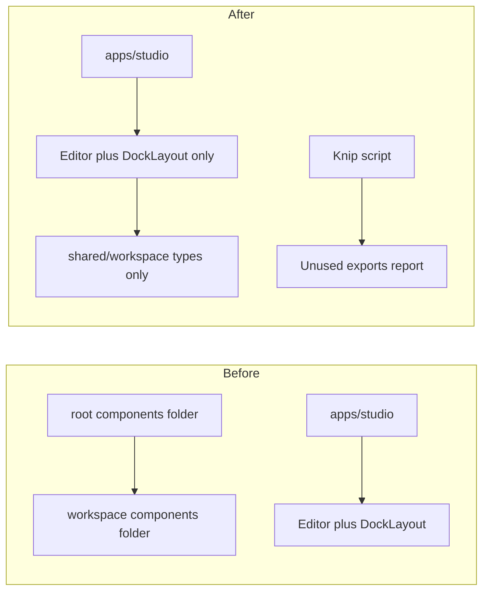

# Workspace dead code audit, Knip, and tech-debt update

## 1. Naming clarification (optional doc tweak)

**"Workspace" in this codebase has two meanings:**

- **pnpm workspaces** — Monorepo feature (root `pnpm-workspace.yaml`, `apps/`, `packages/`). Unchanged.
- **Workspace UI (legacy)** — The old editor chrome in `packages/shared/src/shared/components/workspace/` (WorkspaceShell, WorkspaceLayoutGrid, WorkspaceMain, etc.) and the **types** in `packages/shared/src/shared/workspace/` (Selection, ToolbarGroup, etc.). td-3 and AGENTS refer to this second meaning.

**Recommendation:** Add one sentence to [technical-debt-roadmap.md](docs/agent-artifacts/core/technical-debt-roadmap.md) or [AGENTS.md](AGENTS.md): “In tech-debt and editor docs, ‘workspace’ means the legacy shared workspace UI/types, not pnpm workspaces.”

---

## 2. Workspace component usage (findings)

**Consumers:**

- **apps/studio** uses **Editor** + **DockLayout** (Dockview) only. It does **not** import any component from `packages/shared/.../components/workspace/`. Studio’s [ModelSwitcher](apps/studio/components/model-switcher/ModelSwitcher.tsx) uses **EditorButton** from `@forge/shared`.
- **Root** [components/model-switcher/ModelSwitcher.tsx](components/model-switcher/ModelSwitcher.tsx) is the **only** file that imports a workspace component (`WorkspaceButton` from `@/shared/components/workspace`). That root `components/` folder is **legacy** (referenced in old .cursor plans); no app in the repo imports from it (Studio resolves `@/components/model-switcher` to `apps/studio/components/model-switcher`).

**Conclusion:** The entire [packages/shared/src/shared/components/workspace/](packages/shared/src/shared/components/workspace/) tree is **dead** for layout/shell/panels. Only WorkspaceButton/WorkspaceTooltip are referenced, and only by the legacy root ModelSwitcher. The shared package’s main export does **not** re-export `shared/components/workspace` ([packages/shared/package.json](packages/shared/package.json) only exposes `"."` and `"./copilot/next/runtime"`), so workspace components are only reachable via direct path or legacy alias.

---

## 3. Add a repeatable way to find dead code: Knip

**Tool:** [Knip](https://knip.dev/) — finds unused exports, unused dependencies, unlisted dependencies, and dead files. Supports monorepos and has Next.js/TypeScript plugins. ts-prune/unimported are archived; Knip is the recommended successor.

**Implementation:**

- **Install:** Add `knip` as a devDependency at repo root (or in the apps/packages that need it). Use a single root config so the whole monorepo is analyzed.
- **Config:** Add `knip.json` or `knip.jsonc` at root. Configure:
  - **Workspaces:** Include `apps/studio`, `packages/shared`, `packages/ui`, and other entry points.
  - **Ignore/entry:** Mark `shared/workspace` (types) and `shared/components/workspace` as deprecated so Knip can report them as “unused exports” rather than break the build; or exclude them from “unused files” until after removal.
  - **Ignore patterns:** `.tmp/`, `vendor/`, generated files, `.source/`, docs that reference code by path.
- **Script:** Add a root script, e.g. `"lint:dead": "knip"` or `"knip": "knip"`, so agents and humans can run `pnpm knip` (or `pnpm lint:dead`).
- **Docs:** Document in [tool-usage.md](docs/agent-artifacts/core/tool-usage.md) (or a short “Dead code” subsection): “Run `pnpm knip` to find unused exports and dead code. See knip.json for scope and ignores.” Optionally add a one-line mention in [19-coding-agent-strategy.mdx](docs/19-coding-agent-strategy.mdx) under “Before a slice” or “After a slice”: run Knip when cleaning up or before claiming “no dead code.”

**Alternative (if you prefer a lighter step first):** Use Knip in “report only” mode (no CI failure) until the first cleanup is done; then tighten config and enable strict rules.

---

## 4. Fix: Remove or isolate dead code (per agent strategy)

Follow [AGENTS.md](AGENTS.md) and [technical-debt-roadmap.md](docs/agent-artifacts/core/technical-debt-roadmap.md) (td-5: “Remove or isolate deprecated components”).

**Option A — Remove workspace components (recommended):**

1. **Root legacy folder:** Delete or archive [components/](components/) (root): [Workspace.tsx](components/Workspace.tsx), [components/model-switcher/ModelSwitcher.tsx](components/model-switcher/ModelSwitcher.tsx). Confirm no build or script references this path (only .cursor plans and docs reference it).
2. **Shared workspace UI:** Remove [packages/shared/src/shared/components/workspace/](packages/shared/src/shared/components/workspace/) entirely. Editor* components already use types from `shared/workspace` (not from `components/workspace`); [EditorToolbar](packages/shared/src/shared/components/editor/EditorToolbar.tsx), [EditorInspector](packages/shared/src/shared/components/editor/EditorInspector.tsx), [EditorOverlaySurface](packages/shared/src/shared/components/editor/EditorOverlaySurface.tsx) import types from `../../workspace`. So only the **components** folder is removed; keep `shared/workspace` (types) and the main export `export * from './shared/workspace'` in [packages/shared/src/index.ts](packages/shared/src/index.ts).
3. **Index:** Remove any export of `shared/components/workspace` if it exists (currently the main index does **not** export it; verify no subpath export in package.json).
4. **Docs/AGENTS:** Update [packages/shared/src/shared/AGENTS.md](packages/shared/src/shared/AGENTS.md) and editor README to state that Workspace* UI components have been removed; Editor* + DockLayout are the only shell. Update [packages/shared/src/shared/components/workspace/README.md](packages/shared/src/shared/components/workspace/README.md) by deleting it or replacing with a one-line deprecation pointer to the editor README.

**Option B — Isolate (if you want to keep code for reference):**

- Move `packages/shared/src/shared/components/workspace/` to e.g. `packages/shared/src/shared/components/_deprecated/workspace/` (or `.deprecated`), remove it from any public export, and add a README there: “Deprecated. Use Editor* from shared/components/editor.” Root `components/` can still be deleted or moved to `docs/archive/legacy-components` as reference.

**Recommendation:** Option A (remove) so Knip and future refactors don’t keep tripping over unused code. If anything external depended on workspace components, the package.json export already didn’t expose them.

---

## 5. Tech-debt and STATUS updates

- **td-5:** Set to **done** with note: “Removed deprecated Workspace* UI components and root legacy components; Editor* + DockLayout only.”
- **New tech-debt item (optional):** “Add Knip (or similar) for dead-code detection and document in tool-usage / run `pnpm knip` periodically.” Either as a small ongoing item or as “done” once Knip is in place and documented.
- **STATUS.md:** Add a Ralph Wiggum “Done” line for the workspace cleanup and for introducing Knip (with date).

---

## 6. Summary diagram

---

## 7. Order of operations

1. Add Knip (config + script + short doc) so you can run it and, if needed, ignore workspace folder until removal.
2. Remove root `components/` (or move to archive) and remove `packages/shared/.../components/workspace/` (or isolate per Option B).
3. Run Knip again and fix any new issues (e.g. stray references).
4. Update technical-debt roadmap (td-5 done, optional new item for Knip) and STATUS.md.

