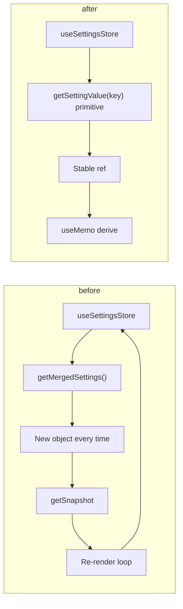

# Fix getSnapshot/update-depth errors, add Zustand DevTools and docs

## Root cause summary

**1. "The result of getSnapshot should be cached to avoid an infinite loop"**

- Triggered in [CopilotKitProvider](apps/studio/components/providers/CopilotKitProvider.tsx) (stack: `useSyncExternalStore` → `useStore` / `useBoundStore` → `CopilotKitProvider`).
- React’s `useSyncExternalStore` requires `getSnapshot` to return the **same reference** when state has not changed. Returning a new object every time causes React to treat it as a change → re-render → getSnapshot again → loop.
- In `CopilotKitProvider`, `useSettingsStore` is used with selectors that return **new references every time**:
  - `useSettingsStore(React.useCallback((state) => state.getMergedSettings({ workspaceId: activeWorkspaceId, editorId }), [...]))` — [getMergedSettings](apps/studio/lib/settings/store.ts) returns a new object (`{ ...appSettings, ... }`) on every call (lines 123–131).
- So the selector’s return value is never referentially stable → getSnapshot is not “cached” → infinite loop. The same component also uses `useModelRouterStore()` (whole store); if that or CopilotKit’s internal store expose unstable snapshots, they can contribute, but the main fix is our settings selectors.

**2. "Maximum update depth exceeded" (setRef)**

- Stack points to Radix UI `setRef` and `WorkspaceTab` / `WorkspaceTooltip` / `AppShell` (tabs rendered in a `.map()`).
- [WorkspaceTab](packages/shared/src/shared/components/workspace/tabs/WorkspaceTab.tsx) wraps a **div** in `WorkspaceTooltip` → Radix `TooltipTrigger asChild` merges a ref into that div. There is also a **nested** `WorkspaceTooltip` around the close button inside the same div.
- Radix’s ref merging (e.g. `mergeRefs` over an array) can call ref callbacks that trigger `setState`; if that causes a re-render and the ref is invoked again in a way that triggers another update, you get a loop. Nested tooltips (outer tab + inner close button) and refs on composite content can exacerbate this.

---

## 1. Fix getSnapshot loop (CopilotKitProvider + settings store)

**Goal:** Ensure no Zustand selector used in `CopilotKitProvider` returns a new object/array reference when the underlying data has not changed.

**Approach (recommended):** Stop selecting “merged settings” directly. Select only **stable primitives or stable references**, and derive the rest in the component with `useMemo`.

- In [apps/studio/components/providers/CopilotKitProvider.tsx](apps/studio/components/providers/CopilotKitProvider.tsx):
  - **Remove** the selector that returns `state.getMergedSettings({ workspaceId, editorId })`.
  - **Replace** with:
    - Either: multiple `useSettingsStore(selector)` calls where each selector returns a **primitive** (e.g. `(s) => s.getSettingValue('ai.agentName', ids)` etc.) and keep `ids` in a `useMemo` so the selector is stable, **or**
    - Select a minimal stable slice (e.g. `(s) => ({ appSettings: s.appSettings, workspaceSettings: s.workspaceSettings, editorSettings: s.editorSettings })` — but that still returns a new object; so prefer selecting by key).
  - Best: for each key you need from merged settings (`ai.agentName`, `ai.instructions`, `ai.toolsEnabled`, `ai.temperature`, `ai.model`, etc.), use a separate `useSettingsStore(selector)` with a selector that returns **only that primitive** (e.g. `(s) => s.getSettingValue('ai.agentName', ids)`), and pass `ids` from a `useMemo([activeWorkspaceId, editorId])`. Then build any object you need for CopilotKit (e.g. `mergedSettings`) in a `useMemo` in the component from those primitive values. That way getSnapshot never returns a new object from the store.
  - Keep `getSettingSource` usage: it returns a string; ensure the selector is stable (same `ids` in dependency array).

**Optional (store-level):** If you want to keep a single “merged settings” selector in the future, the store would need to **cache** the result of `getMergedSettings` per `(workspaceId, editorId)` and return the same reference when the underlying app/workspace/editor settings have not changed (e.g. in a small cache keyed by `workspaceId:editorId`). Not required for the minimal fix.

---

## 2. Fix maximum update depth (WorkspaceTab + WorkspaceTooltip)

**Goal:** Stop ref-related setState from causing a re-render loop when Radix merges refs into the tab/trigger.

**Options (in order of preference):**

- **A. Single trigger, no nested tooltip for close button**  
  - In [WorkspaceTab](packages/shared/src/shared/components/workspace/tabs/WorkspaceTab.tsx): When `onClose` exists, avoid wrapping the close **button** in a second `WorkspaceTooltip`. Use a native `title` attribute for the close button, or a single tooltip that describes the tab (and optionally the close action in its content). That removes one level of ref merging and often eliminates the loop.
- **B. Stable ref target for the outer tooltip**  
  - Wrap the tab’s root in a `React.forwardRef` component that renders the same `div` and forwards the ref. So: `WorkspaceTooltip` → `TooltipTrigger asChild` → `ForwardRefTabRoot` → `div`. This keeps a single ref target with stable identity.
- **C. Conditional tooltip**  
  - When `!tooltip || tooltipDisabled`, you already return `children` in `WorkspaceTooltip`. In `WorkspaceTab`, when there is no tooltip, **don’t wrap the tab in `WorkspaceTooltip` at all** (render the `tab` div directly). That avoids ref merging when no tooltip is needed.

Implement A and/or C first; add B if the loop persists.

---

## 3. Add Redux DevTools for Zustand stores

**Goal:** Allow developers (and document for agents) to inspect and time-travel our Zustand state via Redux DevTools.

- **Stores to wire:** All stores created with `create()` in the studio app that hold UI/domain state:
  - [apps/studio/lib/app-shell/store.ts](apps/studio/lib/app-shell/store.ts)
  - [apps/studio/lib/settings/store.ts](apps/studio/lib/settings/store.ts)
  - [apps/studio/lib/model-router/store.ts](apps/studio/lib/model-router/store.ts)
  - [apps/studio/lib/entitlements/store.ts](apps/studio/lib/entitlements/store.ts)
  - [apps/studio/lib/domains/video/store.ts](apps/studio/lib/domains/video/store.ts)
  - Any other `create()` store under `apps/studio/lib` (e.g. [apps/studio/lib/store.ts](apps/studio/lib/store.ts) if still used).
- **How:** Use Zustand’s `devtools` middleware from `zustand/middleware`. Wrap the store creator (e.g. the `immer` or `persist` callback) with `devtools(..., { name: 'AppShell' })` (and a distinct `name` per store). Use a **single** middleware order that matches your current pattern (e.g. `devtools(immer(...))` or `devtools(persist(immer(...), ...))`). Keep `enabled` default (dev only) so production is unaffected.
- **No extra dependency:** `zustand/middleware` includes devtools; Redux DevTools is the browser extension. Optional: document that the Redux DevTools browser extension should be installed for time-travel and state inspection.

---

## 4. Documentation

**4.1. errors-and-attempts.md**

- Add two entries to [docs/agent-artifacts/core/errors-and-attempts.md](docs/agent-artifacts/core/errors-and-attempts.md):
  - **"getSnapshot should be cached" / useSyncExternalStore loop**
    - Problem: Selectors (especially those calling `getMergedSettings` or any getter that returns a new object) cause infinite re-renders when used with Zustand in a component that’s part of a tree using `useSyncExternalStore`.
    - Fix: Do not select “merged” or derived objects from the store in components. Select primitives or stable refs only; derive objects in the component with `useMemo`. Optionally cache merged result in the store by key.
  - **"Maximum update depth exceeded" with setRef in WorkspaceTab/WorkspaceTooltip**
    - Problem: Nested Radix Tooltips and ref merging on the tab/close button can trigger setState in ref callbacks and cause an update loop.
    - Fix: Avoid nested tooltips (e.g. use `title` for close button or a single tooltip); optionally don’t wrap tab in tooltip when no tooltip is needed; if needed, use a forwardRef wrapper for the tab root so the ref target is stable.

**4.2. Debugging guide (Redux DevTools + Zustand)**

- **Location:** Add a new doc, e.g. [docs/agent-artifacts/core/debugging-zustand-devtools.md](docs/agent-artifacts/core/debugging-zustand-devtools.md) (or under `docs/` if you prefer it user-facing).
- **Contents:**
  - **Purpose:** Use Redux DevTools to inspect and time-travel Zustand store state when debugging state-related bugs (e.g. loops, wrong UI).
  - **Setup:** Install the Redux DevTools browser extension. Run the app in development; our Zustand stores are connected with the devtools middleware and appear in the DevTools store dropdown (list the store names: e.g. `AppShell`, `Settings`, `ModelRouter`, `Entitlements`, `Video`, etc.).
  - **How to use:** Open DevTools → Redux tab → select a store → inspect state and actions; use time-travel to step back and see what changed.
  - **For agents:** State and actions are not easily machine-readable from the extension. When debugging:
    1. Check [errors-and-attempts.md](docs/agent-artifacts/core/errors-and-attempts.md) for known errors and fixes.
    2. Follow this doc to suggest **human** steps: reproduce the issue, open Redux DevTools, note which store(s) and actions lead to the bug, and share that (screenshots, exported state, or a short description) so the agent can target fixes (e.g. selector stability, ref usage).
  - **For humans:** Short step-by-step: reproduce → open Redux → pick store → inspect state/actions/time-travel; when reporting, include store name, last actions, and (if possible) exported state or screenshot.

---

## Implementation order

1. **Fix getSnapshot:** Update `CopilotKitProvider` to use primitive-only (or stable) selectors and derive `mergedSettings` (and any other objects) in `useMemo`. Verify the getSnapshot warning and loop are gone.
2. **Fix setRef loop:** Adjust `WorkspaceTab`/`WorkspaceTooltip` (no nested tooltip for close button and/or no tooltip wrapper when not needed; add forwardRef only if needed). Verify max update depth is gone.
3. **Add devtools:** Add `devtools` middleware to each of the listed Zustand stores with a distinct `name`. Confirm they appear in Redux DevTools in dev.
4. **Document:** Add the two entries to `errors-and-attempts.md` and create the debugging guide; link from the agent-artifacts index if one exists.

---

## Diagram (conceptual)

No code edits will be made until you confirm this plan.