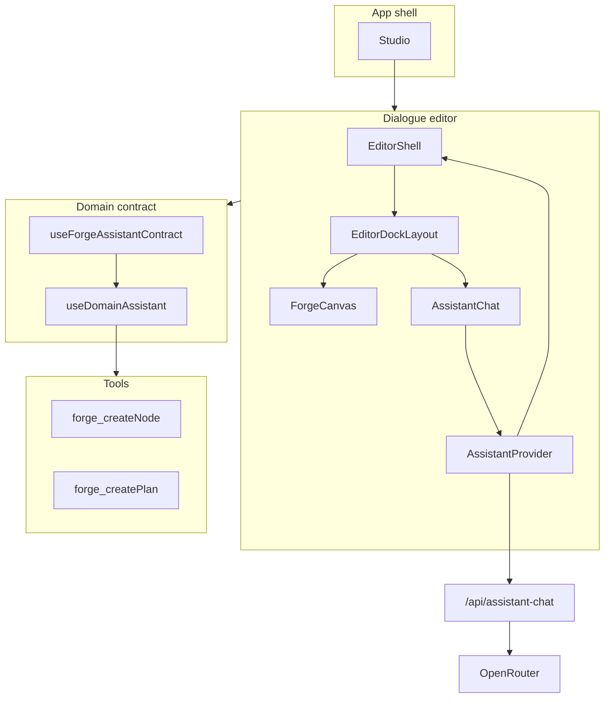

# Architecture overview

Package structure, core principles, and data flow for the Assistant UI–based AI system.

---

## Package structure

### @forge/assistant-runtime

Core Assistant UI integration:

```
packages/assistant-runtime/
├── src/
│   ├── runtime/
│   │   ├── forge-runtime.ts          # OpenRouter adapter for Assistant UI
│   │   ├── streaming.ts              # SSE streaming handler
│   │   └── types.ts
│   ├── agents/
│   │   ├── agent-registry.ts         # Global agent registry
│   │   ├── base-agent.ts             # Base agent class
│   │   └── types.ts
│   ├── tools/
│   │   ├── tool-registry.ts          # Tool registration system
│   │   ├── tool-executor.ts          # Tool execution with context
│   │   └── types.ts
│   ├── components/
│   │   ├── AssistantProvider.tsx     # Root provider
│   │   ├── AssistantChat.tsx         # Chat UI (sidebar/panel modes)
│   │   ├── PlanReviewCard.tsx        # Plan review with approve/reject
│   │   └── ToolMessage.tsx           # Tool result rendering
│   └── hooks/
│       ├── use-tool-registration.ts  # Register tools hook
│       └── use-plan-workflow.ts      # Plan workflow orchestration
```

### packages/shared/src/shared/assistant/

Domain integration layer:

```
assistant/
├── domain-contract.ts            # DomainAssistantContract interface
├── use-domain-assistant.ts       # Main integration hook (replaces useDomainCopilot)
├── tool-builder.ts               # Helper to build tools
└── types.ts
```

### packages/mcp-studio/

MCP server for external host control:

```
mcp-studio/
├── src/
│   ├── server.ts                 # MCP server implementation
│   ├── editors/
│   │   ├── forge-mcp.ts          # Forge editor MCP app
│   │   ├── character-mcp.ts      # Character editor MCP app
│   │   └── index.ts
│   └── auth/
│       └── token-provider.ts     # API token auth
```

---

## Flow diagram



---

## Key references

| Purpose | File |
|--------|------|
| Existing workflow contract (plan/patch/review) | [packages/shared/src/shared/copilot/workflows/domain-contract.ts](../../packages/shared/src/shared/copilot/workflows/domain-contract.ts) |
| Source for tool migration (Forge) | [packages/domain-forge/src/copilot/actions.ts](../../packages/domain-forge/src/copilot/actions.ts) |
| CopilotKit contract (migration source) | [packages/shared/src/shared/copilot/types.ts](../../packages/shared/src/shared/copilot/types.ts) |

---

## Next

- [02 - Domain integration](02-domain-integration.mdx) — Contract interface and hook
