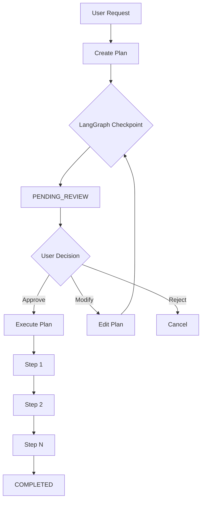
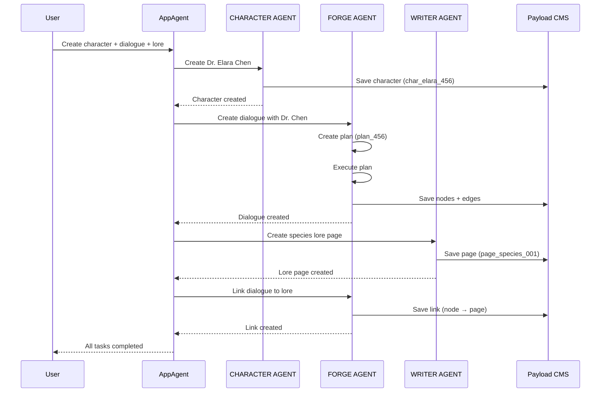

# Agent Conversation Flows

Complete conversation examples showing how agents interact across Character Editor, Dialogue Editor, and Writer Editor with cross-domain data sharing.

---

## Table of Contents

1. [Understanding Agent Identification](#understanding-agent-identification)
2. [Flow 1: Character Creation → Dialogue Integration](#flow-1-character-creation--dialogue-integration)
3. [Flow 2: Plan-Review-Execute-Review Workflow](#flow-2-plan-review-execute-review-workflow)
4. [Flow 3: Cross-Editor Data Flow (Writer → Dialogue)](#flow-3-cross-editor-data-flow-writer--dialogue)
5. [Flow 4: Multi-Agent Coordination](#flow-4-multi-agent-coordination)
6. [Flow 5: Iterative Plan Refinement (LangGraph)](#flow-5-iterative-plan-refinement-langgraph)
7. [Implementation Notes](#implementation-notes)
8. [Code References](#code-references)

---

## Understanding Agent Identification

Each agent is identified by:
- **Domain prefix** in tool names (e.g., `character_*`, `forge_*`, `writer_*`)
- **Agent execution markers** in chat UI (e.g., `[FORGE AGENT EXECUTING]`)
- **Tool result rendering** showing which domain processed the request

### Active Agents

| Agent | Domain | Tools | Editors |
|-------|--------|-------|---------|
| **Character Agent** | `character` | `character_create`, `character_update`, `character_generatePortrait`, etc. | Character Editor, App-level chat |
| **Forge Agent** | `forge` | `forge_createNode`, `forge_createEdge`, `forge_createPlan`, `forge_getGraph`, etc. | Dialogue Editor (narrative + storylet graphs) |
| **Writer Agent** | `writer` | `writer_createPage`, `writer_updatePage`, `writer_linkToNode`, etc. | Writer Editor (Notion-style pages) |
| **App Agent** | `app` | Delegates to domain agents based on context | App-level chat, cross-editor orchestration |

---

## Flow 1: Character Creation → Dialogue Integration

### Context
User is in **App-level chat** (not in a specific editor). They want to create a character, then use it in dialogue.

### Part 1: Character Creation

```
User: Create a character named Captain Red Morgan, a gruff space pirate with a haunted past

[CHARACTER AGENT EXECUTING]
Assistant: I'll create Captain Red Morgan for you.

[Tool: character_create]
{
  "name": "Captain Red Morgan",
  "description": "A gruff space pirate with a haunted past",
  "personality": "Tough exterior hiding deep regrets. Cynical but honorable. Speaks in short, clipped sentences.",
  "background": "Former naval officer turned pirate after a betrayal. Haunted by the crew he lost.",
  "voice": "Gravelly, world-weary, occasional dark humor"
}

[Tool Result: character_create]
┌─────────────────────────────────────┐
│ Character Created                   │
├─────────────────────────────────────┤
│ Name: Captain Red Morgan            │
│ ID: char_abc123                     │
│                                     │
│ Personality                         │
│ Tough exterior hiding deep regrets. │
│ Cynical but honorable.              │
│                                     │
│ Background                          │
│ Former naval officer turned pirate  │
│ after a betrayal. Haunted by the    │
│ crew he lost.                       │
│                                     │
│ ✓ Saved to database                 │
└─────────────────────────────────────┘```

```

Assistant: Captain Red Morgan has been created and saved to the database. The character is now available for use in any editor.

### Part 2: Using Character in Dialogue

```
User: Now use Red in a dialogue about discovering a haunted ship

[User switches to Dialogue Editor]

[FORGE AGENT EXECUTING]
Assistant: I'll create dialogue nodes featuring Captain Red Morgan.

[Tool: forge_getGraph]
→ Gets current graph context

[Tool: forge_createNode]
{
  "nodeType": "CHARACTER",
  "label": "Red's Discovery",
  "speaker": "Captain Red Morgan",
  "characterId": "char_abc123",  ← References database character
  "content": "What in the seven hells... That ship's got no power signature. Like it's a damn ghost."
}

[Tool Result: forge_createNode]
┌──────────────────────────────┐
│ Node Created                 │
├──────────────────────────────┤
│ ID: node_xyz789              │
│ Type: CHARACTER              │
│ Speaker: Captain Red Morgan  │
│ Character: char_abc123       │
│                              │
│ ✓ Node highlighted in graph  │
└──────────────────────────────┘
```

Assistant: I've created a dialogue node with Captain Red Morgan as the speaker. The node references the character from the database, so Red's personality and voice inform the line delivery.

### Data Flow: Character → Dialogue

```
Database (Payload CMS)          Dialogue Graph (ReactFlow)
┌──────────────────┐           ┌────────────────────────┐
│ Character        │           │ CHARACTER Node         │
│ ID: char_abc123  │◄──────────│ characterId:          │
│ Name: Red Morgan │ reference │ "char_abc123"          │
│ Personality: ... │           │ speaker: "Red Morgan"  │
└──────────────────┘           │ content: "..."         │
                                └────────────────────────┘
```

**Key Points:**
- Character created in database by CHARACTER AGENT
- Character referenced by ID in dialogue node by FORGE AGENT
- Bidirectional link: node → character (via characterId), character → nodes (via reverse query)
- Cross-domain data sharing enables consistent character usage across editors

---

## Flow 2: Plan-Review-Execute-Review Workflow

### Context
User is in **Dialogue Editor** and wants to create a complex branching dialogue scene.

### Complete Workflow

```
User: Create a branching dialogue where the player investigates the haunted ship and can either trust Red or suspect him

[FORGE AGENT EXECUTING]
Assistant: I'll create a plan for this branching narrative.

[Tool: forge_createPlan]
{
  "description": "Branching investigation scene with trust/suspect paths",
  "steps": [
    {
      "type": "create_node",
      "nodeType": "PLAYER_CHOICE",
      "label": "Investigate Ship",
      "content": "You examine the derelict vessel. Captain Morgan seems nervous. What do you do?"
    },
    {
      "type": "create_node",
      "nodeType": "CHOICE_OPTION",
      "label": "[Trust Red]",
      "content": "Ask Red about his experience with ghost ships"
    },
    {
      "type": "create_node",
      "nodeType": "CHOICE_OPTION",
      "label": "[Suspect Red]",
      "content": "Question why Red brought you here"
    },
    {
      "type": "create_edge",
      "from": "Investigate Ship",
      "to": "[Trust Red]",
      "label": "Choice A"
    },
    {
      "type": "create_edge",
      "from": "Investigate Ship",
      "to": "[Suspect Red]",
      "label": "Choice B"
    }
  ]
}

[Tool Result: forge_createPlan]
┌─────────────────────────────────────────────┐
│ Plan Created (ID: plan_123)                 │
├─────────────────────────────────────────────┤
│ Status: PENDING_REVIEW                      │
│                                             │
│ Branching investigation scene with          │
│ trust/suspect paths                         │
│                                             │
│ Steps:                                      │
│ 1. Create PLAYER_CHOICE node                │
│ 2. Create CHOICE_OPTION "[Trust Red]"       │
│ 3. Create CHOICE_OPTION "[Suspect Red]"     │
│ 4. Connect investigation → Trust path       │
│ 5. Connect investigation → Suspect path     │
│                                             │
│ ⚠ Awaiting user approval                    │
└─────────────────────────────────────────────┘
```

Assistant: I've created a plan for the branching dialogue. The plan shows 5 steps to build the investigation scene with two choice paths. Would you like me to proceed with executing this plan?

**[UI: PlanReviewCard Component Renders]**

```tsx
// Component: packages/domain-forge/src/assistant/components/PlanReviewCard.tsx
<PlanReviewCard
  planId="plan_123"
  status="PENDING_REVIEW"
  steps={[
    { type: "create_node", label: "Investigate Ship", ... },
    { type: "create_node", label: "[Trust Red]", ... },
    ...
  ]}
  onApprove={() => executePlan("plan_123")}
  onReject={() => cancelPlan("plan_123")}
  onModify={() => editPlan("plan_123")}
/>
```

User sees:
┌──────────────────────────────────────────────┐
│ Proposed Plan: Branching Investigation       │
├──────────────────────────────────────────────┤
│ ✓ Create player choice node                  │
│ ✓ Create "Trust Red" option                  │
│ ✓ Create "Suspect Red" option                │
│ ✓ Connect choice branches                    │
│                                              │
│ [Approve] [Modify] [Reject]                  │
└──────────────────────────────────────────────┘

```
User: Looks good, execute it

[FORGE AGENT EXECUTING]
Assistant: Executing the plan now.

[Tool: forge_executePlan]
{ "planId": "plan_123" }

[Tool Result: forge_executePlan]
┌───────────────────────────────────────┐
│ Plan Execution: plan_123              │
├───────────────────────────────────────┤
│ Step 1/5: Create PLAYER_CHOICE node  │
│   ✓ Created node_001                  │
│                                       │
│ Step 2/5: Create CHOICE_OPTION        │
│   ✓ Created node_002                  │
│                                       │
│ Step 3/5: Create CHOICE_OPTION        │
│   ✓ Created node_003                  │
│                                       │
│ Step 4/5: Create edge                 │
│   ✓ Created edge_001                  │
│                                       │
│ Step 5/5: Create edge                 │
│   ✓ Created edge_002                  │
│                                       │
│ ✓ Plan executed successfully          │
│ Status: COMPLETED                     │
└───────────────────────────────────────┘
```

Assistant: I've executed the plan successfully. All 5 nodes and edges have been created. The branching dialogue is now visible in the graph editor.

**[UI: Graph highlights newly created nodes]**

```
User: Perfect\! Now add dialogue responses for both paths

[FORGE AGENT EXECUTING]
Assistant: I'll add continuation dialogue for both the Trust and Suspect paths.

[Tool: forge_createPlan]
{
  "description": "Add responses for trust/suspect branches",
  "steps": [
    {
      "type": "create_node",
      "nodeType": "CHARACTER",
      "speaker": "Captain Red Morgan",
      "characterId": "char_abc123",
      "label": "Red Explains",
      "content": "Ghost ships... yeah, I've seen a few. Lost good people to them. That's why I know to stay clear.",
      "parentNodeId": "node_002"  // Trust path
    },
    {
      "type": "create_node",
      "nodeType": "CHARACTER",
      "speaker": "Captain Red Morgan",
      "characterId": "char_abc123",
      "label": "Red Defensive",
      "content": "Suspect me? I brought you here to warn you, not trap you. But believe what you want.",
      "parentNodeId": "node_003"  // Suspect path
    }
  ]
}
```

**Key Points:**
- Plan created with `forge_createPlan` (LangGraph node)
- Plan stored with status `PENDING_REVIEW`
- UI renders PlanReviewCard component
- User approves via UI interaction
- `forge_executePlan` processes steps sequentially
- Each step updates plan status (checkpoint persistence)
- Final status: `COMPLETED`
- Nodes immediately visible and highlighted in graph

### LangGraph Orchestration



---

## Flow 3: Cross-Editor Data Flow (Writer → Dialogue)

### Context
User is working across **Writer Editor** (creating lore pages) and **Dialogue Editor** (referencing lore in dialogue).

### Part 1: Creating Lore Page

```
User: [In Writer Editor] Create a lore page about ghost ships in this universe

[WRITER AGENT EXECUTING]
Assistant: I'll create a lore page about ghost ships.

[Tool: writer_createPage]
{
  "title": "Ghost Ships: The Void Walkers",
  "content": {
    "type": "doc",
    "content": [
      {
        "type": "heading",
        "attrs": { "level": 1 },
        "content": [{ "type": "text", "text": "Ghost Ships" }]
      },
      {
        "type": "paragraph",
        "content": [
          {
            "type": "text",
            "text": "Vessels that have crossed into the quantum void and returned as echoes. They appear on scanners but have no power signatures. Crews are never found."
          }
        ]
      },
      {
        "type": "heading",
        "attrs": { "level": 2 },
        "content": [{ "type": "text", "text": "Known Encounters" }]
      },
      {
        "type": "bulletList",
        "content": [
          {
            "type": "listItem",
            "content": [
              {
                "type": "paragraph",
                "content": [{ "type": "text", "text": "The Mariana Incident (2247)" }]
              }
            ]
          },
          {
            "type": "listItem",
            "content": [
              {
                "type": "paragraph",
                "content": [{ "type": "text", "text": "The Void Walker Discovery (2251)" }]
              }
            ]
          }
        ]
      }
    ]
  },
  "tags": ["lore", "ships", "quantum-phenomena"]
}

[Tool Result: writer_createPage]
┌─────────────────────────────────────┐
│ Page Created                        │
├─────────────────────────────────────┤
│ Title: Ghost Ships: The Void        │
│        Walkers                      │
│ ID: page_lore_001                   │
│                                     │
│ Tags: lore, ships, quantum-phenomena│
│                                     │
│ ✓ Saved to database                 │
│ ✓ Opened in Writer Editor           │
└─────────────────────────────────────┘
```

### Part 2: Linking Lore to Dialogue

```
User: [In Dialogue Editor] Link the ghost ship lore page to Red's explanation node

[FORGE AGENT EXECUTING]
Assistant: I'll link the lore page to the dialogue node.

[Tool: forge_linkToPage]
{
  "nodeId": "node_004",  // Red Explains node
  "pageId": "page_lore_001",
  "linkType": "REFERENCE",
  "annotation": "Background lore for Red's knowledge of ghost ships"
}

[Tool Result: forge_linkToPage]
┌──────────────────────────────────────────┐
│ Link Created                             │
├──────────────────────────────────────────┤
│ Dialogue Node: Red Explains              │
│   └─→ References: Ghost Ships Lore       │
│                                          │
│ Type: REFERENCE                          │
│ Annotation: Background lore for Red's   │
│             knowledge                    │
│                                          │
│ ✓ Bidirectional link established        │
└──────────────────────────────────────────┘
```

Assistant: I've linked the ghost ship lore page to Red's dialogue. Players can click on the dialogue node to see the referenced lore page.

### Data Flow: Writer → Forge

```
Writer Editor (ProseMirror)     Forge Graph (ReactFlow)
┌──────────────────────┐        ┌─────────────────────────┐
│ Page                 │        │ Node                    │
│ ID: page_lore_001    │◄───────│ linkedPages: [          │
│ Title: Ghost Ships   │  ref   │   "page_lore_001"       │
│ Content: {...}       │        │ ]                       │
└──────────────────────┘        │ Annotation: "Background"│
                                 └─────────────────────────┘

Bidirectional Query:
- Node → Pages: node.linkedPages
- Page → Nodes: query nodes where linkedPages contains page_lore_001
```

**Key Points:**
- WRITER AGENT creates page in Writer Editor
- Page stored in database (Payload CMS)
- FORGE AGENT creates link from dialogue node to page
- Link stored with annotation for context
- Bidirectional references enable navigation in either direction
- UI shows lore references inline in dialogue editor

---

## Flow 4: Multi-Agent Coordination

### Context
User is in **App-level chat** and requests work spanning multiple domains.

### Complete Multi-Agent Conversation

```
User: Create a character named Dr. Elara Chen, a xenobiologist, then use her in a dialogue about discovering alien life, and create a lore page about the species she discovers

[APP AGENT ORCHESTRATING]
Assistant: I'll coordinate across Character, Forge, and Writer agents to complete this request.

━━━━━━━━━━━━━━━━━━━━━━━━━━━━━━━━━━━━━━━━━
STEP 1: Character Creation
━━━━━━━━━━━━━━━━━━━━━━━━━━━━━━━━━━━━━━━━━

[CHARACTER AGENT EXECUTING]
[Tool: character_create]
{
  "name": "Dr. Elara Chen",
  "description": "Brilliant xenobiologist specializing in first contact protocols",
  "personality": "Methodical, curious, cautious but excited by discovery. Speaks with scientific precision but underlying wonder.",
  "background": "Led three successful first contact missions. Known for her empathy-based approach to alien species.",
  "voice": "Measured, professional, occasionally breaks into enthusiastic scientific jargon"
}

[Tool Result: character_create]
✓ Created character: Dr. Elara Chen (ID: char_elara_456)

━━━━━━━━━━━━━━━━━━━━━━━━━━━━━━━━━━━━━━━━━
STEP 2: Dialogue Creation
━━━━━━━━━━━━━━━━━━━━━━━━━━━━━━━━━━━━━━━━━

[FORGE AGENT EXECUTING]
[Tool: forge_createPlan]
{
  "description": "Dialogue scene: Dr. Chen discovers alien life",
  "steps": [
    {
      "type": "create_node",
      "nodeType": "CHARACTER",
      "speaker": "Dr. Elara Chen",
      "characterId": "char_elara_456",
      "label": "First Contact",
      "content": "Remarkable... The bio-signature is unlike anything in our database. We're looking at a completely novel form of silicon-based life."
    },
    {
      "type": "create_node",
      "nodeType": "PLAYER_CHOICE",
      "label": "Response to Discovery",
      "content": "How do you respond to Dr. Chen's discovery?"
    },
    {
      "type": "create_node",
      "nodeType": "CHOICE_OPTION",
      "label": "[Ask about the species]",
      "content": "What can you tell me about them?"
    },
    {
      "type": "create_edge",
      "from": "First Contact",
      "to": "Response to Discovery"
    },
    {
      "type": "create_edge",
      "from": "Response to Discovery",
      "to": "[Ask about the species]"
    }
  ]
}

[Tool Result: forge_createPlan]
✓ Plan created (ID: plan_456)

[Tool: forge_executePlan]
{ "planId": "plan_456" }

[Tool Result: forge_executePlan]
✓ Created 3 nodes, 2 edges
✓ Dialogue scene complete

━━━━━━━━━━━━━━━━━━━━━━━━━━━━━━━━━━━━━━━━━
STEP 3: Lore Page Creation
━━━━━━━━━━━━━━━━━━━━━━━━━━━━━━━━━━━━━━━━━

[WRITER AGENT EXECUTING]
[Tool: writer_createPage]
{
  "title": "Silicon-Based Lifeforms: The Crystalline Collective",
  "content": {
    "type": "doc",
    "content": [
      {
        "type": "heading",
        "attrs": { "level": 1 },
        "content": [{ "type": "text", "text": "The Crystalline Collective" }]
      },
      {
        "type": "paragraph",
        "content": [
          {
            "type": "text",
            "text": "First discovered by Dr. Elara Chen on Kepler-442b. Silicon-based organisms that communicate through resonant frequencies in their crystalline structures."
          }
        ]
      },
      {
        "type": "heading",
        "attrs": { "level": 2 },
        "content": [{ "type": "text", "text": "Biology" }]
      },
      {
        "type": "bulletList",
        "content": [
          {
            "type": "listItem",
            "content": [
              {
                "type": "paragraph",
                "content": [{ "type": "text", "text": "Silicon-carbon hybrid molecular structure" }]
              }
            ]
          },
          {
            "type": "listItem",
            "content": [
              {
                "type": "paragraph",
                "content": [{ "type": "text", "text": "Collective consciousness via harmonic resonance" }]
              }
            ]
          },
          {
            "type": "listItem",
            "content": [
              {
                "type": "paragraph",
                "content": [{ "type": "text", "text": "Photosynthetic energy absorption" }]
              }
            ]
          }
        ]
      }
    ]
  },
  "tags": ["species", "xenobiology", "first-contact"]
}

[Tool Result: writer_createPage]
✓ Created page: The Crystalline Collective (ID: page_species_001)

━━━━━━━━━━━━━━━━━━━━━━━━━━━━━━━━━━━━━━━━━
STEP 4: Cross-Linking
━━━━━━━━━━━━━━━━━━━━━━━━━━━━━━━━━━━━━━━━━

[FORGE AGENT EXECUTING]
[Tool: forge_linkToPage]
{
  "nodeId": "node_elara_001",  // Dr. Chen's dialogue node
  "pageId": "page_species_001",
  "linkType": "REFERENCE",
  "annotation": "Species discovered by Dr. Chen"
}

[Tool Result: forge_linkToPage]
✓ Linked dialogue to lore page

━━━━━━━━━━━━━━━━━━━━━━━━━━━━━━━━━━━━━━━━━
COMPLETION SUMMARY
━━━━━━━━━━━━━━━━━━━━━━━━━━━━━━━━━━━━━━━━━
```

Assistant: I've completed all requested work:

1. ✓ Created Dr. Elara Chen (Character Agent)
2. ✓ Created discovery dialogue scene (Forge Agent)
3. ✓ Created species lore page (Writer Agent)
4. ✓ Linked dialogue to lore (Forge Agent)

All components are now connected. You can view:
- Dr. Chen in the Character Editor
- The dialogue scene in the Dialogue Editor
- The species lore in the Writer Editor
- Cross-references between dialogue and lore

### Agent Orchestration Flow



**Key Points:**
- APP AGENT orchestrates across domains
- Each domain agent operates independently
- All agents share common database (Payload CMS)
- Cross-domain references enable rich interconnected content
- User sees unified experience across editors

---

## Flow 5: Iterative Plan Refinement (LangGraph)

### Context
User wants to modify an AI-generated plan before execution using LangGraph checkpoints.

### Complete Refinement Workflow

```
User: Create a complex dialogue tree for a negotiation scene with multiple outcomes

[FORGE AGENT EXECUTING]
Assistant: I'll create a plan for a multi-path negotiation scene.

[Tool: forge_createPlan]
{
  "description": "Negotiation scene with 3 outcomes (success, compromise, failure)",
  "steps": [
    {
      "type": "create_node",
      "nodeType": "NARRATIVE",
      "label": "Negotiation Opens",
      "content": "The merchant eyes you warily. This negotiation could go many ways."
    },
    {
      "type": "create_node",
      "nodeType": "PLAYER_CHOICE",
      "label": "Opening Move",
      "content": "How do you approach?"
    },
    {
      "type": "create_node",
      "nodeType": "CHOICE_OPTION",
      "label": "[Aggressive]",
      "content": "Demand a better price"
    },
    {
      "type": "create_node",
      "nodeType": "CHOICE_OPTION",
      "label": "[Diplomatic]",
      "content": "Propose a fair trade"
    },
    {
      "type": "create_node",
      "nodeType": "CHOICE_OPTION",
      "label": "[Deceptive]",
      "content": "Mislead about your resources"
    }
  ]
}

[Tool Result: forge_createPlan]
┌─────────────────────────────────────────┐
│ Plan Created (ID: plan_789)             │
├─────────────────────────────────────────┤
│ Status: PENDING_REVIEW                  │
│ LangGraph Checkpoint: checkpoint_001    │
│                                         │
│ Negotiation scene with 3 outcomes       │
│                                         │
│ Steps: 5                                │
│ ⚠ Awaiting user approval                │
└─────────────────────────────────────────┘
```

User: Actually, add a fourth option for players who want to walk away, and make the aggressive path lead to a combat branch

[FORGE AGENT EXECUTING]
Assistant: I'll modify the plan to include a walk-away option and add a combat branch for the aggressive path.

[Tool: forge_modifyPlan]
{
  "planId": "plan_789",
  "checkpointId": "checkpoint_001",  // Resume from last checkpoint
  "modifications": [
    {
      "type": "add_step",
      "afterStep": 4,
      "step": {
        "type": "create_node",
        "nodeType": "CHOICE_OPTION",
        "label": "[Walk Away]",
        "content": "This deal isn't worth it"
      }
    },
    {
      "type": "add_step",
      "afterStep": 5,
      "step": {
        "type": "create_node",
        "nodeType": "NARRATIVE",
        "label": "Combat Begins",
        "content": "The merchant reaches for their weapon. This negotiation has failed.",
        "parentNodeId": "node_aggressive"  // Links to aggressive choice
      }
    },
    {
      "type": "add_step",
      "afterStep": 6,
      "step": {
        "type": "create_edge",
        "from": "[Aggressive]",
        "to": "Combat Begins",
        "label": "Escalation"
      }
    }
  ]
}

[Tool Result: forge_modifyPlan]
┌──────────────────────────────────────────┐
│ Plan Modified (ID: plan_789)             │
├──────────────────────────────────────────┤
│ Status: PENDING_REVIEW                   │
│ LangGraph Checkpoint: checkpoint_002     │
│                                          │
│ Changes:                                 │
│ + Added [Walk Away] option               │
│ + Added Combat Begins narrative          │
│ + Added Escalation edge                  │
│                                          │
│ Steps: 8 (was 5)                         │
│ ⚠ Awaiting approval for modified plan    │
└──────────────────────────────────────────┘

User: [Clicks "Apply Plan"]

[FORGE AGENT EXECUTING - Plan Execution]
Assistant: Executing modified plan with 8 steps...

✓ Step 1/8: Create "Opening Threat" node
✓ Step 2/8: Create "Red Responds" node
✓ Step 3/8: Create "Tension Rises" node
✓ Step 4/8: Create "Threat Delivered" node
✓ Step 5/8: Create "Stand Down" choice node
✓ Step 6/8: Create "Walk Away" choice node
✓ Step 7/8: Create "Combat Begins" narrative node
✓ Step 8/8: Connect all edges

[Tool Result]
┌──────────────────────────────────────────┐
│ Plan Executed Successfully               │
├──────────────────────────────────────────┤
│ Created: 7 nodes, 8 edges                │
│ Graph updated with escalation branch     │
│                                          │
│ LangGraph Checkpoint: checkpoint_003     │
│ ✓ All changes committed                  │
└──────────────────────────────────────────┘
```

### Key Points: LangGraph Checkpoint System

**Checkpoint Flow:**
```
checkpoint_001 → Initial plan created
     ↓ (user modification request)
checkpoint_002 → Plan revised (awaiting approval)
     ↓ (user approves)
checkpoint_003 → Plan executed, changes committed
```

**Why LangGraph here:**
- User can iterate on plans before execution
- Checkpoints allow resuming mid-workflow
- Plan state persists across conversation turns
- Can revert to previous checkpoints if needed

**Data stored in checkpoints:**
- Current plan state (steps, operations)
- Graph snapshot before changes
- User feedback history
- Execution status

---

## Implementation Notes

### Agent Identification in UI

**Execution Markers:**
```typescript
// apps/studio/components/assistant/AgentExecutionMarker.tsx
<div className="flex items-center gap-2 text-xs font-medium">
  <div className="h-2 w-2 rounded-full bg-blue-500 animate-pulse" />
  <span>[{agent.toUpperCase()} AGENT EXECUTING]</span>
</div>
```

**Tool Prefix Detection:**
```typescript
function detectAgent(toolName: string): string {
  if (toolName.startsWith('character_')) return 'character';
  if (toolName.startsWith('forge_')) return 'forge';
  if (toolName.startsWith('writer_')) return 'writer';
  return 'app';
}
```

### Tool Result Rendering

Each tool can provide custom rendering:

```typescript
// packages/domain-forge/src/assistant/tools.ts
{
  name: 'forge_createNode',
  execute: async (args, context) => {
    // ... create node logic
    return { success: true, nodeId, message: 'Node created' };
  },
  render: (result) => (
    <div className="rounded-md border bg-muted/20 p-3">
      <p className="text-sm font-medium">Node Created</p>
      <p className="text-xs text-muted-foreground">ID: {result.nodeId}</p>
    </div>
  ),
}
```

**Rendering happens in:**
- `packages/assistant-runtime/src/components/ToolMessage.tsx`
- Uses tool's `render` function if provided
- Falls back to JSON display otherwise

### Context Snapshot Sharing

**Domain Context Structure:**
```typescript
interface DomainContextSnapshot {
  domain: string;
  timestamp: number;
  data: {
    // Forge domain
    graph?: {
      id: number;
      title: string;
      nodeCount: number;
      edgeCount: number;
      selectedNodes: string[];
    };
    // Character domain
    characters?: Array<{
      id: string;
      name: string;
      inUse: boolean; // Referenced in graphs?
    }>;
    // Writer domain
    pages?: Array<{
      id: string;
      title: string;
      type: 'act' | 'chapter' | 'page';
      linkedNodeId?: string;
    }>;
  };
}
```

**Usage in tools:**
```typescript
execute: async (args, context) => {
  const snapshot = context.snapshot;

  // Access current graph
  const currentGraph = snapshot.data.graph;

  // Access available characters
  const characters = snapshot.data.characters || [];

  // Cross-domain reference
  const characterExists = characters.some(c => c.id === args.characterId);
  if (!characterExists) {
    throw new Error(`Character ${args.characterId} not found`);
  }

  // ... proceed with operation
}
```

### Highlight Coordination

**Highlight Flow:**
```
Tool execution → onHighlight({ 'forge.node': ['node_123'] })
     ↓
EditorHighlightProvider updates state
     ↓
ForgeCanvas applies highlight styles
     ↓
User sees highlighted node with glow effect
```

**Implementation:**
```typescript
// apps/studio/components/editors/DialogueEditor.tsx
const [highlights, setHighlights] = useState<Record<string, string[]>>({});

const assistantContract = useForgeAssistantContract({
  // ...
  onHighlight: (entities) => {
    setHighlights(entities);
    // Auto-clear after 3 seconds
    setTimeout(() => setHighlights({}), 3000);
  },
  clearHighlights: () => setHighlights({}),
});

// ForgeCanvas uses highlights to style nodes
<ForgeNode
  highlighted={highlights['forge.node']?.includes(node.id)}
/>
```

### LangGraph Checkpoint Persistence

**Checkpoint Storage:**
```typescript
// packages/assistant-runtime/src/workflows/checkpoint-store.ts
interface CheckpointStore {
  save(checkpointId: string, state: WorkflowState): Promise<void>;
  load(checkpointId: string): Promise<WorkflowState | null>;
  list(workflowId: string): Promise<string[]>;
  delete(checkpointId: string): Promise<void>;
}

// Implementation uses IndexedDB in browser
class BrowserCheckpointStore implements CheckpointStore {
  private db: IDBDatabase;

  async save(checkpointId: string, state: WorkflowState) {
    const tx = this.db.transaction('checkpoints', 'readwrite');
    await tx.objectStore('checkpoints').put({
      id: checkpointId,
      state,
      timestamp: Date.now(),
    });
  }

  async load(checkpointId: string) {
    const tx = this.db.transaction('checkpoints', 'readonly');
    const checkpoint = await tx.objectStore('checkpoints').get(checkpointId);
    return checkpoint?.state || null;
  }
}
```

**Usage in plan workflow:**
```typescript
// packages/domain-forge/src/assistant/workflows/plan-workflow.ts
import { createCheckpoint, resumeFromCheckpoint } from '@forge/assistant-runtime';

async function createPlan(goal: string, context: any) {
  const planState = await generatePlan(goal, context);

  // Save checkpoint
  const checkpointId = await createCheckpoint({
    workflowId: 'forge-plan',
    state: planState,
  });

  return { ...planState, checkpointId };
}

async function modifyPlan(checkpointId: string, modifications: string) {
  // Resume from checkpoint
  const previousState = await resumeFromCheckpoint(checkpointId);

  // Apply modifications
  const newState = await applyModifications(previousState, modifications);

  // Save new checkpoint
  const newCheckpointId = await createCheckpoint({
    workflowId: 'forge-plan',
    state: newState,
    previousCheckpoint: checkpointId,
  });

  return { ...newState, checkpointId: newCheckpointId };
}
```

---

## Code References

### Active Implementation Files

**Assistant Runtime:**
- `apps/studio/app/api/assistant-chat/route.ts` - Main chat endpoint, OpenRouter integration
- `packages/assistant-runtime/src/components/AssistantProvider.tsx` - Root provider (if exists)
- `packages/assistant-runtime/src/components/ToolMessage.tsx` - Tool result rendering

**Forge Domain (Dialogue Editor):**
- `packages/domain-forge/src/assistant/index.ts` - Contract factory (`useForgeAssistantContract`)
- `packages/domain-forge/src/assistant/tools.ts` - 8 tools: `forge_getGraph`, `forge_createNode`, `forge_updateNode`, `forge_deleteNode`, `forge_createEdge`, `forge_deleteEdge`, `forge_createPlan`, `forge_revealSelection`
- `apps/studio/components/editors/DialogueEditor.tsx` - Editor integration, highlights

**Character Domain (Partially Implemented):**
- `packages/domain-character/src/assistant/index.ts` - Contract factory exists
- `packages/domain-character/src/assistant/tools.ts` - **NEEDS IMPLEMENTATION** (tools listed in architecture doc)
- `apps/studio/components/editors/CharacterEditor.tsx` - **NOT YET INTEGRATED**

**Writer Domain (Planned):**
- `packages/domain-writer/src/assistant/` - **DOES NOT EXIST YET**
- Expected tools: `writer_createPage`, `writer_updatePage`, `writer_linkToNode`

**Shared Contracts:**
- `packages/shared/src/shared/assistant/domain-contract.ts` - `DomainAssistantContract` interface
- `packages/shared/src/shared/assistant/use-domain-assistant.ts` - Integration hook

**Type Definitions:**
- `packages/types/src/graph.ts` - `ForgeGraphDoc`, `ForgeNodeType`, `ForgeGraphPatchOp`
- `packages/types/src/character.ts` - `CharacterDoc`
- `packages/types/src/payload.ts` - Database record types

### Tool Implementation Example

**From `packages/domain-forge/src/assistant/tools.ts`:**
```typescript
{
  domain: 'forge',
  name: 'forge_createNode',
  description: 'Create a new dialogue node in the graph',
  parameters: {
    type: 'object',
    properties: {
      nodeType: {
        type: 'string',
        enum: ['CHARACTER', 'PLAYER', 'CONDITIONAL'],
        description: 'Type of node to create'
      },
      label: { type: 'string', description: 'Node title' },
      speaker: { type: 'string', description: 'Character speaking (for CHARACTER nodes)' },
      content: { type: 'string', description: 'Dialogue text or condition' },
      characterId: { type: 'string', description: 'Database ID of character (optional)' },
      x: { type: 'number', description: 'X position (optional)' },
      y: { type: 'number', description: 'Y position (optional)' },
    },
    required: ['nodeType', 'label'],
  },
  execute: async (args, context) => {
    const nodeId = `node_${Date.now()}_${Math.random().toString(36).slice(2, 11)}`;

    deps.applyOperations([{
      type: 'createNode',
      nodeType: args.nodeType as ForgeNodeType,
      position: {
        x: args.x ?? Math.random() * 500,
        y: args.y ?? Math.random() * 500
      },
      data: {
        label: args.label,
        content: args.content,
        speaker: args.speaker,
        characterId: args.characterId, // Database reference
      },
      id: nodeId,
    }]);

    deps.onHighlight({ 'forge.node': [nodeId] });

    return {
      success: true,
      message: `Created ${args.nodeType} node: ${args.label}`,
      nodeId
    };
  },
  render: (result) => (
    <div className="rounded-md border bg-muted/20 p-3">
      <p className="text-sm font-medium">Node Created</p>
      <p className="text-xs text-muted-foreground mt-1">{result.message}</p>
      <p className="text-xs text-muted-foreground">ID: {result.nodeId}</p>
    </div>
  ),
}
```

### Agent Instructions Example

**From `packages/domain-forge/src/assistant/index.ts`:**
```typescript
getInstructions: () =>
  'You are helping edit a graph (nodes and edges). This graph represents dialogue/narrative. ' +
  'Available node types: CHARACTER, PLAYER, CONDITIONAL. ' +
  'Use forge_* tools to modify the graph. Call forge_getGraph before creating edges to get node IDs. ' +
  'For planning, use forge_createPlan to propose changes; the user can Apply or Request Changes. ' +
  'When the user asks to create dialogue, use forge_createNode and forge_createEdge together.',
```

---

## Summary

This document provides complete conversation flow examples showing:

1. **Cross-domain data sharing** - Characters created in database, referenced by ID in dialogue nodes
2. **Agent identification** - Clear markers showing which agent is executing
3. **Plan-review-execute workflow** - With approval gates and visual review cards
4. **Multi-agent coordination** - APP AGENT delegating to domain agents
5. **LangGraph checkpoints** - Iterative plan refinement with state persistence
6. **Tool rendering** - Custom UI components in chat for results
7. **Highlight coordination** - Visual feedback across editors
8. **Implementation details** - Code references and patterns for building the system

**For Implementation:**
- Use these flows as specification for building remaining features
- Character domain tools need implementation (contract exists)
- Writer domain needs full implementation
- LangGraph checkpoint persistence needs IndexedDB implementation
- Cross-editor context sharing already works via domain contracts

**Next Steps:**
1. Implement character tools in `packages/domain-character/src/assistant/tools.ts`
2. Integrate character domain in `CharacterEditor.tsx`
3. Create writer domain package
4. Implement LangGraph checkpoint store
5. Add agent execution markers to UI
6. Build PlanReviewCard component with approval flow
```