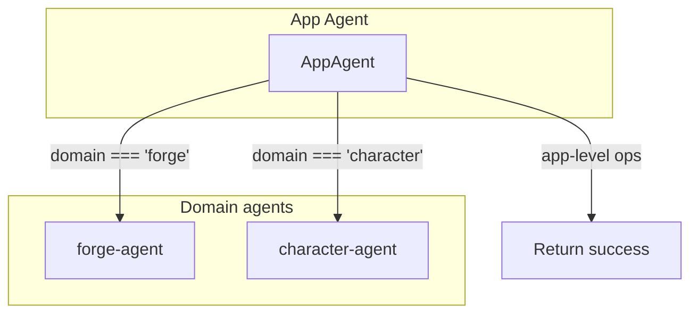

# Agent system

BaseAgent, AgentRegistry, ForgeAgent, and AppAgent with domain delegation.

---

## Agent delegation flow



---

## BaseAgent

```typescript
export interface AgentConfig {
  id: string;
  name: string;
  description: string;
  instructions: string;
  tools: DomainTool[];
  scopes: string[];
  maxSteps?: number;
}

export abstract class BaseAgent {
  constructor(protected config: AgentConfig) {}

  get id() { return this.config.id; }
  get name() { return this.config.name; }
  get instructions() { return this.config.instructions; }
  get tools() { return this.config.tools; }

  canHandleScope(scope: string): boolean {
    return this.config.scopes.includes(scope) || this.config.scopes.includes('*');
  }

  abstract execute(context: AgentContext): Promise<AgentResult>;
}
```

---

## AgentRegistry

```typescript
export class AgentRegistry {
  private agents = new Map<string, BaseAgent>();

  register(agent: BaseAgent) {
    this.agents.set(agent.id, agent);
  }

  get(id: string): BaseAgent | undefined {
    return this.agents.get(id);
  }

  findForScope(scope: string): BaseAgent[] {
    return Array.from(this.agents.values())
      .filter(agent => agent.canHandleScope(scope));
  }

  getAllTools(scope?: string): DomainTool[] {
    const agents = scope
      ? this.findForScope(scope)
      : Array.from(this.agents.values());
    return agents.flatMap(agent => agent.tools);
  }
}

export const globalAgentRegistry = new AgentRegistry();
```

---

## ForgeAgent

```typescript
import { BaseAgent } from '@forge/assistant-runtime';

export class ForgeAgent extends BaseAgent {
  constructor(tools: DomainTool[]) {
    super({
      id: 'forge-agent',
      name: 'Forge Dialogue Editor Agent',
      description: 'Assists with dialogue graph editing',
      instructions:
        'You help edit dialogue graphs. Use forge_* tools. ' +
        'For complex changes, use forge_createPlan first.',
      tools,
      scopes: ['forge'],
      maxSteps: 10,
    });
  }

  async execute(context: AgentContext) {
    // Custom orchestration logic
    return { success: true, message: 'Agent execution completed' };
  }
}
```

---

## AppAgent

```typescript
import { BaseAgent, globalAgentRegistry } from '@forge/assistant-runtime';

export class AppAgent extends BaseAgent {
  constructor(tools: DomainTool[]) {
    super({
      id: 'app-agent',
      name: 'Forge Studio App Agent',
      description: 'Top-level workspace management',
      instructions:
        'You help navigate Forge Studio. Delegate to domain agents when needed.',
      tools,
      scopes: ['*'],
    });
  }

  async execute(context: AgentContext) {
    const { domain } = context;

    if (domain === 'forge') {
      const forgeAgent = globalAgentRegistry.get('forge-agent');
      return await forgeAgent?.execute(context);
    }

    if (domain === 'character') {
      const characterAgent = globalAgentRegistry.get('character-agent');
      return await characterAgent?.execute(context);
    }

    return { success: true, message: 'App operation completed' };
  }
}
```

File: [apps/studio/lib/agents/app-agent.ts](../../apps/studio/lib/agents/app-agent.ts) (to create).

---

## Next

- [06 - MCP integration](06-mcp-integration.mdx) — MCP server, editor apps
